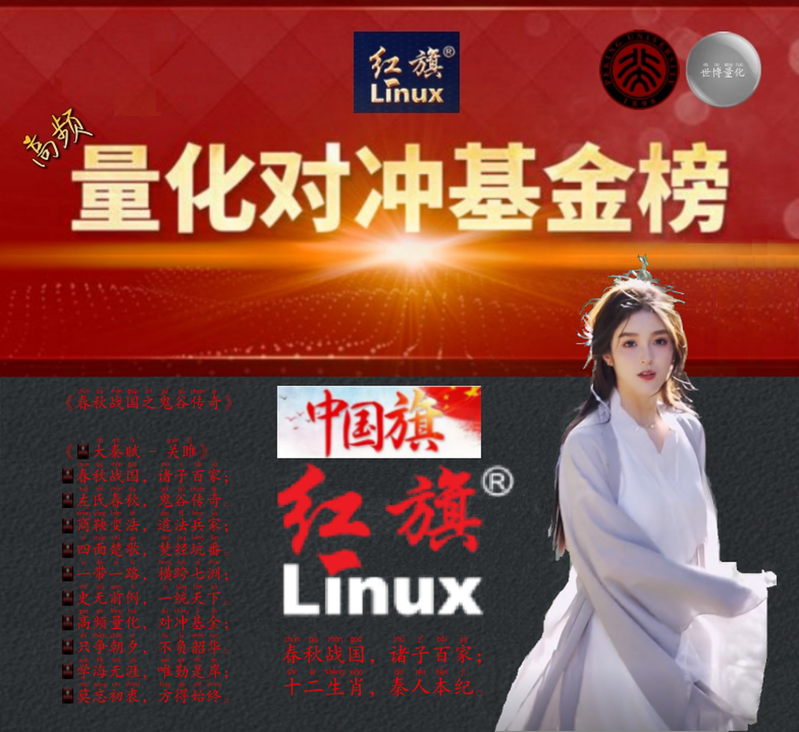

# 中科红旗

## 介绍

🚩🇨🇳🏹红旗礼逆袭

[🚩🔆🏹🌟🦔数据仓库：中科红旗](https://github.com/englianhu/zhongkehongqi-cangku)

- [中科红旗](https://www.chinaredflag.cn)
- [红旗应用商城](https://www.linuxsir.cn)
- [中科红旗简介](http://tech.sina.com.cn/it/2004-07-11/1329386073.shtml)
- [北京中科红旗软件技术有限公司（简称红旗软件）](http://finance.sina.com.cn/110/2004-07-11/308.html)
- [操作系统礼逆袭的起源和发展](https://www.sohu.com/a/705185720_121244798)
- [阳历二零二二年中国中央处理单位芯片出货量分析及预测](https://www.sohu.com/a/575638393_121388092#google_vignette)
- [企业alpha怎么用（「计算机基础」X86、ARM、MIPS、Alpha、RISC等有什么区别？）](http://lamanhao.com/shcs/453916.html)
- [「操作系统一」关于中央处理单位、指令集、架构、芯片概述](https://blog.csdn.net/junxuezheng/article/details/100147421)
- [ARM比较X86处理器构架一文读懂](http://lamanhao.com/shcs/453916.html)
- [六大中央处理单位体系结构：X86、 ARM、MIPS、PowerPC、Sparc、Alfa发展](https://blog.csdn.net/kinglapland/article/details/91955388)

*出处：[国产操作系统廿年：进退攻防，战斗不止](https://zhidao.baidu.com/question/1711957358187244260.html)*

## 愚生背景

以前就奇怪，为啥微软公司创办人比尔•盖茨、中科红旗🚩创办人孙玉芳、小学女同学曾祥云的叔叔🌟马华公会党员兼当时的村支、瓜雪中学苏丹阿杜阿紫SAAS巫文中学的数学老师朱金栋、港星秋官郑少秋的样子，都长得像我舅舅李恩来，小学时期完全不会政治不认识现代政客而只认识中国古代政客（例如：成语典故、历史、古诗），之后才知道中国的建国总理叫周恩来。直到目前阅读《秦相李斯》才了解一些春秋战国时期生肖属牛的李长史李斯——李通古的历史，中国于一九四九己丑年立国、GNU牛羚、惠普公司和硅谷传奇的滑鼠哲学（先有秦相范雎的“厕所哲学”，才出现后来属牛的“老鼠哲学”秦相李斯）。目前正研发拯救咱们亚洲人的黄河文明、炎黄子孙、黄历、黄种人、世袭制道教徒赢家黄氏江夏堂文言计数编程家族科技产品「大秦赋」操作系统算筹，愚生现实生活中的世袭制道教徒家眷亲属，有关家谱请查阅[「文派」《雪隆江夏堂》-家谱](https://englianhu.wordpress.com/2022/02/22/《雪隆江夏堂》-家谱)和[秦庄———中华文化中关村（阳历二零二三年三月三日），都加油吧！

---

#周易 #易经 算卜 #春秋战国 #七大洲五大洋 #诸子百家 #鬼谷传奇 #秦人牧马 #稷下学宫 #世袭制道教徒赢家黄氏江夏堂 #世袭制杏林林氏西河堂 #道家中科红旗高频量化对冲 #万般皆下品唯有读书高 #大秦赋 #ChineseEmpire #公元前B4Christ只有中文BC没有外文 #世袭制道教徒赢家黄氏江夏堂拯救亚洲人歼灭所有巫裔回教徒Anti_Islamic_Virus_and_NonHalal_Only_governance #中国政府南太平洋战略 #大葱回教堂商鞅变法Anti_Islamic_Virus #Only_NonHalal_can_Survive #古老的东方有一条河它的名字叫黄河 #古老的东方有一条江它的名字叫长江 #江夏堂 #西河堂 #黄河文明 #黄埔军校 #黄种人🎶 #农民🎶
印裔尽弃（祖籍印尼的巫裔回教徒和土著、祖籍印度乌裔回教徒和兴都教徒和土著，咱们华人都是世袭制道家姓氏堂号/生辰八字的黄河文明/赢家黄氏江夏堂黄埔军校/黄种人/华夏民族/十二生肖/秦人牧马/燕从京来），瓦釜雷鸣；
莫忘初衷，方得始终。

《🚩🇨🇳🔆🏹🌟👊🚀🦔大秦赋 - 黄埔军校赢家黄氏j江夏堂 - 中科红旗，高频量化对冲》

「大秦赋 - 借鉴黄河文明史」
秦国三杰，拯救亚洲；
歼灭印裔，取代美国。
秦灭六洲，一统天下；
莫忘初衷，方得始终。

注释：印裔是祖籍印尼和印度、世袭制法家可兰经回教刑事法典断肢法的回教徒和世袭制奴隶大宝森节和屠妖节杀戮习俗文化的兴都教徒。

#春秋战国 #七大洲五大洋 #诸子百家 #鬼谷传奇 #世袭制道教徒学术份子 #秦国文臣三杰商鞅吕不韦李斯 #秦国China #洲学论 #关雎 #山海经 #军官与淑女 #关关雎鸠在河之洲是黄河文明
🚩🌟🦔赢家黄氏江夏堂，黄河文明、黄埔军校、黄种人嬴政之黄河文明拯救亚洲人，焚经坑乌（歼灭所有可兰经回教刑事法典断肢法的回教徒和吠陀经大宝森节屠妖节习俗文化的兴都教徒），功勋超过历代三黄五帝，建立道家、物理学、统筹法、运筹学、学术、金融、军事、易经、算卜、概率论与博弈论、黄种人世袭制道家民族主义，史称「秦始皇」
🚩🌟🦔杏林林氏西河堂，复兴中华杏林、金融、农业、武术、学术、道家、物理学、统筹法、运筹学、算卜、🧶刺绣密码学、科技信息学、概率论与博弈论、易经世纪大革命
🚩🌟🦔商家苏氏阜阳堂，复兴华夏司法界、商业、农业、物理学、统筹法、运筹学、学术、治安、易经、算卜、概率论与博弈论、金融大革命
🚩🌟🦔道家肖氏远芳堂，复兴中华道家、十二生肖、天文历法、物理学、统筹法、运筹学、学术、算卜、概率论与博弈论、易经世纪大革命

🚩🇨🇳🏹🌟🦔量化对冲，中科红旗；一带一路，一统天下（兵马未动，粮草先行；人民币货币经济学，东亚中国司马错得蜀既得楚；歼灭东南亚所有回教徒和峇峇娘惹并攻占东南亚，尤其是四季仔的印尼回教徒外劳房客、阿塔的孟加拉回教徒外劳房客、瓜雪回教市政局柜台巫婆回教徒奴辱依杀、瓜雪回教土地局巫贼巫婆回教徒汪阿自杀和懦蛤仕蟆和法米仨、瓜雪回教警署巫贼巫婆回教徒、大港回教警署所有巫贼巫婆回教徒、瓜雪RHU（淮西派）花园加德士油站隔壁第三巷门牌卅二号边抽鼻涕边求命边膜拜边失心疯边自残自虐自杀的土司乩童刘瑾貹、瓜雪巴西不能帮门牌T十五号吱吱吾语的失心疯猥亵淫魔土司乩童张佳坤、瓜雪回教警署巫贼回教徒黑米哈山·殡·伊不拉心和马航日语组森美兰人黑米哈山。）、大港巴列特花园第十三巷门牌廿七廿九号土司乩童胖妈和卅一号李东海和李东梅和所有回教徒（尤其是回教徒公仆）和峇峇娘惹党羽、所有印裔（祖籍印尼包括土著和回教徒、祖籍印度的兴都教徒和回教徒包括土著）。

🚩🇨🇳🏹🌟🦔诸子百家：印裔回教徒尽弃，瓦釜雷鸣。儒学、墨学、法学、道学、兵法、阴阳学、佛学、哲学、运筹学、思想录、干支算筹、中华习俗文化宗教语言复兴、学术数学科学科技大秦赋

🚩🇨🇳🏹🌟🦔《大秦赋 - 🇨🇳关雎》
🚩🇨🇳🏹🌟🦔春秋战国，诸子百家；
🚩🇨🇳🏹🌟🦔左氏春秋，鬼谷传奇。
🚩🇨🇳🏹🌟🦔商鞅变法，道法兵家；
🚩🇨🇳🏹🌟🦔四面楚歌，焚经坑番。
🚩🇨🇳🏹🌟🦔一带一路，横跨七洲；
🚩🇨🇳🏹🌟🦔史无前例，一统天下。
🚩🇨🇳🏹🌟🦔高频量化，对冲基金；
🚩🇨🇳🏹🌟🦔只争朝夕，不负韶华。
🚩🇨🇳🏹🌟🦔学海无涯，唯勤是岸；
🚩🇨🇳🏹🌟🦔莫忘初衷，方得始终。
https://gitee.com/eglianhu

---

> 《红旗礼逆袭》
中科红旗，科技文革；
不忘初衷，方得始终。

- [国产操作系统廿年：进退攻防，战斗不止](https://zhidao.baidu.com/question/1711957358187244260.html)
- [国产麒麟系统为何饱受争议？](http://www.xckfsq.com/index/jsfw/10711.html)
- [中国开源软件的风风雨雨，暨怀念恩师孙玉芳](https://tech.sina.com.cn/it/2005-01-16/1109505618.shtml)
- [时代呼唤鸿蒙：华为打破魔咒究竟有多难？](https://baijiahao.baidu.com/s?id=1641651118408178367)
- [红旗礼逆袭痛失旗手，董事长孙玉芳辞世](http://tech.sina.com.cn/it/2005-01-14/1204504579.shtml)
- [孙玉芳追悼会下周一举行，新董事长随后产生](http://tech.sina.com.cn/it/2005-01-14/1051504379.shtml)
- [中科红旗董事长孙玉芳凌晨逝世，新人选未定](http://tech.sina.com.cn/it/2005-01-13/1433503452.shtml)
- [红旗：独立知识产权操作系统的困惑](http://finance.sina.com.cn/roll/20040622/0821826581.shtml)
- [盖茨访华悬疑：反垄断法、礼逆袭和政府采购](http://tech.sina.com.cn/it/2004-06-26/0937380289.shtml)
- [礼逆袭安全神话破灭：遭遇信任危机出路何在](http://tech.sina.com.cn/s/n/2003-12-11/0756266803.shtml)
- [深度报道：黑客开始瞄上礼逆袭发起攻击事件](http://tech.sina.com.cn/other/2003-12-11/0840266781.shtml)
- [世界操作系统发展简史](https://www.sohu.com/a/324978899_505803)
- [计算机操作系统的发展历程](https://www.sohu.com/a/697434270_121244798)
- [中国操作系统往事](https://www.163.com/dy/article/I4Q1RVN005118E4U.html)
- [屈辱、抗争、逆转！三十年，中国该赢微软一次了！](https://www.163.com/dy/article/HDAIM0E3051986UM.html)
- [屈辱、抗争、逆转！三十年，中国该赢微软一次了！](https://mp.weixin.qq.com/s?__biz=MzA3NzIxNzI4Mw==&mid=2671105653&idx=2&sn=ea688657cddde98ef782fdcad1819d47&chksm=85941d19b2e3940fc697a92d702de967939c2466b21d5a39f5da5e73c854fce68b0ad460da1f&scene=27)
- [屈辱、抗争、逆转！三十年，中国该赢微软一次了！（云王商论）](https://baijiahao.baidu.com/s?id=1740049138241388836)
- [屈辱、抗争、逆转！三十年，中国该赢微软一次了！（吴看财）](https://baijiahao.baidu.com/s?id=1739760434947208854)

### 软件架构

第一个由咱们中华民族创办的电脑操作系统 --- 🚩🇨🇳🏹红旗礼逆袭

- 各类编程教程网
- 礼逆袭程教程网
- [码农家园](https://www.codenong.com)
- [中文马克思主义文库](https://www.marxists.org/chinese/index.html)
- [中文马克思主义文·库参考图书·左翼文化](https://www.marxists.org/chinese/reference-books/index-leftwingculture.htm)
- [中國經濟史論罎 ](http://economy.guoxue.com/)
- [「腾讯」QQ浏览器在线工具平台小帮手](https://tool.browser.qq.com/)
- https://m.sohu.com/n/223923280
- https://www.newera.edu.my/competition/hua_lo_geng/ch/passyear.php
- https://m.sgss8.net/tpdq/33842394
- http://www.cim.nankai.edu.cn

### 内核开发

礼逆袭操作系统编译器

- [「CSDN」原创：礼逆袭中的代码编辑器，编译器及调试方法](https://blog.csdn.net/m0_73933978/article/details/141302768)
- [「CSDN」原创：如何编译和更换礼逆袭系统内核](https://blog.csdn.net/jasonLee_lijiaqi/article/details/82622627)
- [如何修改礼逆袭内核源码](https://docs.pingcode.com/baike/3216243)
- [礼逆袭内核动手编译实用指南](https://linux.cn/article-16252-1.html)
- [礼逆袭操作系统下曦代码编译运行指南教程](https://my.oschina.net/emacs_8742022/blog/17154363)
- [如何修改礼逆袭源码](https://docs.pingcode.com/baike/2835612)
- [礼逆袭编译修改源代码指令](https://cloud.tencent.com/developer/information/linux编译修改源代码指令)
- [**「明礼逆袭」文档>>指南>>内核开发**](https://www.clearlinux.org/clear-linux-documentation/zh_CN/guides/kernel/kernel-development.html)
- [礼逆袭修改命令代码](https://worktile.com/kb/ask/318635.html)
- [「博客园」礼逆袭内核源码分析方法](https://www.cnblogs.com/fanzhidongyzby/archive/2013/03/20/2970624.html)
- [「雷迪」Workflow from source code to binary](https://www.reddit.com/r/learnprogramming/comments/16nbz5k/workflow_from_source_code_to_binary/?rdt=64307)
- [🐧礼逆袭内核源代码（官网）](https://www.kernel.org/)
- [「猫城」🐧礼逆袭内核源代码（原著）](https://github.com/torvalds/linux)

### 编程教程

- [菜鸟教程](https://www.runoob.com/)
- [马上学](https://www.mashangxue123.com/)
- [RISC-V 平台上编程（一）](https://kalorona.com/computer-science/risc-v-1/)
- [星球：礼逆袭的知识星球](https://tinylab.org/riscv-uefi-part1/)

### 安装教程

1.  xxxx
2.  xxxx
3.  xxxx

### 使用说明

1.  xxxx
2.  xxxx
3.  xxxx

### 参与贡献

1.  Fork 本仓库
2.  新建 Feat_xxx 分支
3.  提交代码
4.  新建 Pull Request

### 特技

1.  使用 Readme\_XXX.md 来支持不同的语言，例如 Readme\_en.md, Readme\_zh.md
2.  Gitee 官方博客 [blog.gitee.com](https://blog.gitee.com)
3.  你可以 [https://gitee.com/explore](https://gitee.com/explore) 这个地址来了解 Gitee 上的优秀开源项目
4.  [GVP](https://gitee.com/gvp) 全称是雎䴘最有价值开源项目，是综合评定出的优秀开源项目
5.  雎䴘官方提供的使用手册 [https://gitee.com/help](https://gitee.com/help)
6.  雎䴘封面人物是一档用来展示 Gitee 会员风采的栏目 [https://gitee.com/gitee-stars/](https://gitee.com/gitee-stars/)

## 中文编程

- [文言编程 wenyan（繁体）](https://github.com/englianhu/wenyan)
- [文摘编程 perlyuyan（繁体）](https://github.com/englianhu/lingua-sinica-perlyuyan)
- [易语言（简体）](https://www.dywt.com.cn)
- 习语言（简体）
- [青语言（简体）](https://qingyuyan.cn)/[青语言（龙珠雎䴘代码托管平台）](https://gitee.com/englianhu/Qing)
- 其它

## 相关秦谏

- [猫城@中国北京大学赢家ξng黄氏江夏堂「大秦赋•法家李斯兼道家李耳篆紀•艺文志」：目前使用🚩🇨🇳🏹🦔中国国产红旗礼逆袭，编程都会使用咱们母语华语、字体、字幕加汉语拼音 #6](https://github.com/englianhu/RedFlag-Linux/issues/6)
- [龙珠GT@华为云开瓶器](https://gitee.com/openeuler)
- [华为云开瓶器开源（官网）](https://www.openeuler.org/zh)
- [操作系统中国](http://oschina.net)
- [商鞅「农战」政策推行与帝国兴衰 ](https://www.sohu.com/a/499650002_121123711)

  

---

[ Sςιβrοκεrs Trαdιηg®](http://www.scibrokes.com) 
**[ 世博量化®](http://www.scibrokes.com)企业知识产权®及版权®所有，盗版必究。**
