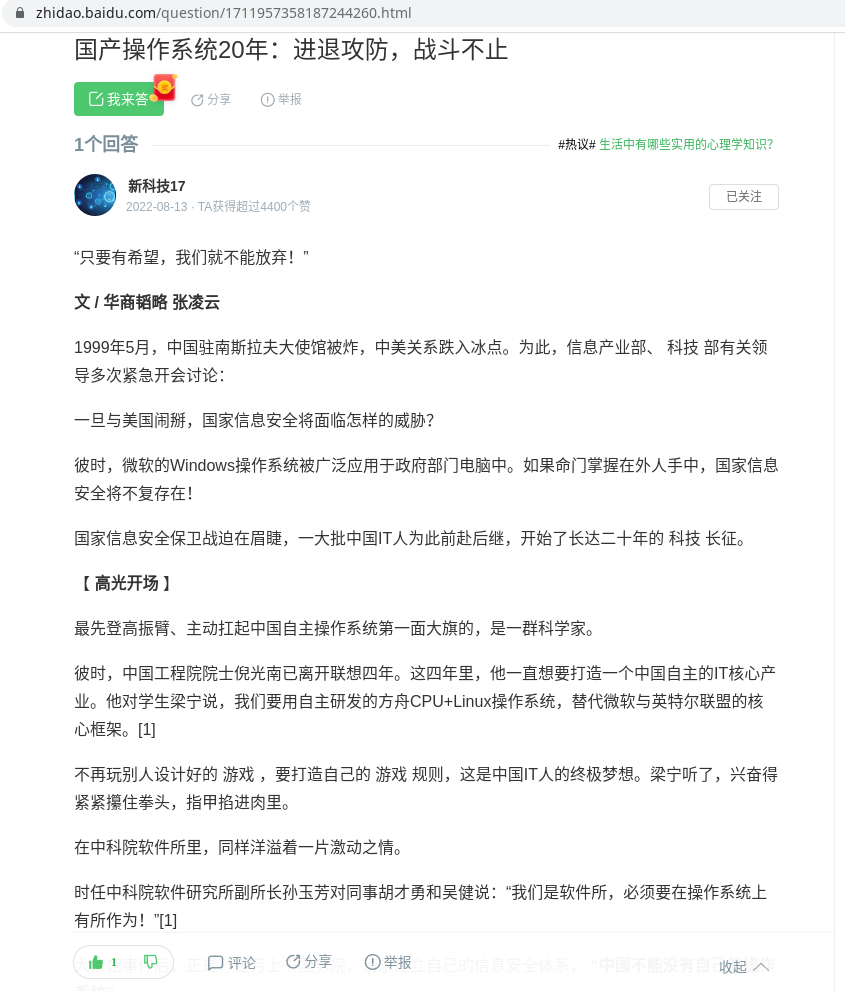
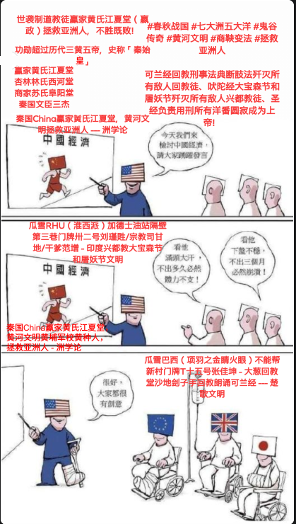

# 主题

## 大秦赋

🚩🇬🇧🇲🇾🇹🇼🇨🇳大秦赋赢家ξng黄氏江夏堂

借鉴世界古文明，公元前春秋战国（七大洲五大洋），西亚非常动荡不安而耶稣都尚未出世，欧美大洋洲全是森林。世袭制道教徒/道家/姓氏与堂号/生辰八字，从鼻祖（赢家黄氏江夏堂 - 嬴政）到耳孙（李耳/太上老君/茅山道士/毛泽东）

岂曰无衣，与子同袍

<br>
<span style='color:#9B111E'>**🚩🦔主题曲🦔🚩**</span>
<br>
<audio controls loop autoplay src="诸子百家诗经与古诗源/卜学亮 - 子曰.mp3" controls></audio>
<br>

> 赢家黄氏江夏堂、赢家黄氏巴东堂、儒家孔氏东鲁堂、道家卜氏西河堂、杏林林氏西河堂、道家与法家李氏陇西堂、商家苏氏阜阳堂

*引用：[牢记祖先，彰显祖宗功德，四百卅三个姓氏堂号大全](https://zhuanlan.zhihu.com/p/82039189)*

- [中国古代亲属称谓家谱总览](https://zhuanlan.zhihu.com/p/458028908)
- [「元宇宙」春节拜年，亲戚怎么叫？](https://www.facebook.com/englianhu/posts/pfbid0cqugyMqSdk1DBwzB8XiawCCz8bRXf5mZktm1Wr2WKs1ozj1D84FpB9RYXuCrmzDTl)
- [「百度」我怎么称呼我堂叔的儿子啊？ 他比我小 应该怎么称呼？ 叫堂弟吗？ 可是堂叔的儿子已经不是堂了啊？](https://zhidao.baidu.com/question/291505101/answer/3012972358.html)
- [「范本模板」古代称谓大全](https://wenku.baidu.com/view/8a3d6c3ca3c7aa00b52acfc789eb172dec639967.html?_wkts_=1709365939475&bdQuery=%E6%A8%A1%E6%9D%BF%E5%8F%A4%E7%A7%B0)
- [古代尊称荟萃](https://wenku.baidu.com/view/2324997758fafab069dc0256.html?_wkts_=1709527487300&bdQuery=春秋战国论文称呼大全)
- [传统文化丨“八拜之交”是指哪八拜？](https://www.facebook.com/xyzhiju/posts/pfbid02hRxd7rzkyVFGWAUdhJGHjtwTqgiyQaD4aQpSmUBdAqRG3VfUE87JyjkN2yyL4YWTl)

> 阳历二零四年十一月廿一日，全球第一所孔子学院正式在韩国首都首尔挂牌成立。截至阳历二零二零年七月卅一日，全球已有百圆二国家（地区）设立了五百卌三所孔子学院和千百进个孔子课堂：
> 
- 亚洲卅九国（地区），孔子学院百卅五所、孔子课堂百十五个
- 非洲卌六国，孔子学院圆一所、孔子课堂卌八个
- 欧洲卌三国（地区），孔子学院百枯九所、孔子课堂三百卌六个
- 美洲廿七国，孔子学院百卅八所、孔子课堂五百圆个
- 大洋洲七国，孔子学院廿所、孔子课百零一个
>
阳历二零一八年开始，美国有几家大专院校相继关闭中国政府资助的孔子学院，最新一间是美国北佛罗里达大学，校方认为孔子学院的教学与大学理念不相符，决定终止合作…

*引用：[「维基百科」孔子学院列表](https://zh.wikipedia.org/wiki/孔子学院列表)*

*](诸子百家考工记/还有半社会主义半资本主义.png){width=400}

<iframe width="400" height="225" src="https://player.bilibili.com/player.html?aid=757957931" title="天下(电视剧《大秦赋》主题曲完整版)" frameborder="0" allow="accelerometer; autoplay; clipboard-write; encrypted-media; gyroscope; picture-in-picture" border="0" framespacing="0" allowfullscreen="true"></iframe>

*出处：*[**天下***(电视剧《大秦赋》主题曲完整版)*](https://player.bilibili.com/player.html?aid=757957931)

<iframe width="400" height="225" src="https://www.youtube.com/embed/mV5IQbd0o0U" title="謝霆鋒 Nicholas Tse《黃種人》[Official MV]" frameborder="0" allow="accelerometer; autoplay; clipboard-write; encrypted-media; gyroscope; picture-in-picture; web-share" referrerpolicy="strict-origin-when-cross-origin" allowfullscreen></iframe>

<iframe width="400" height="225" src="https://www.youtube.com/embed/DI-ydEN2PjY" title="「快手」我是中国人🎶" frameborder="0" allow="accelerometer; autoplay; clipboard-write; encrypted-media; gyroscope; picture-in-picture; web-share" referrerpolicy="strict-origin-when-cross-origin" allowfullscreen></iframe>

*出处：[艺人/明星🌟周星驰成名前《我是中国人🎶》：经管之家赵坚毅之杏林经济学！](https://v.kuaishou.com/uQucjS)*

## 古诗

最近几年民不聊生、百业萧条、生灵涂炭、可兰经回教巫术刑事法典断肢法习俗文化宗教语言、妖言惑众、蛊惑民心。借鉴世界四大文明史，核武器歼灭所有敌人《可兰经回教刑事法典断肢法》（可兰经回教巫术习俗文化宗教语言法律）和《吠陀经》（大宝森节和屠妖节习俗文化）的印裔非法回教徒和非法兴都教徒——祖籍印尼和印度的印裔回教徒和兴都教徒，建立咱们世袭制道家六四学术中华民族政府。

🚩🦔Great Britain = 大英帝国<br>
🚩🦔Greater Chin / Republic of China / Republic People of China = 大秦帝国/大秦赋<br>
🚩🦔Greater Chinese = 大秦子民（爱民如子）<br>
🚩🦔Oversea Greater Chinese = 海外大秦子民（爱民如子）<br>
🚩🦔Oversea Greater Chinese Association = 海外大秦子民公会（秦始皇的秦太祖——🌟秦孝公/🌟儒家陈祯禄公爵，联合秦始皇——秦始祖嬴政，爱民如子，R鄀统计编程学术份子商鞅变法联合咱们世袭制道家学术份子（世袭制道家宫殿、寺庙、姓氏堂号子嗣贞节牌坊、姻缘算卜概率论）高频对冲基金算卜，回教徒以可兰经回教刑事法典断肢法铲除所有敌人印裔（祖籍印尼和印度的兴都教徒、回教徒九一一恐怖份子、土著、峇峇娘惹），终止巫术以任何形式、包括指鹿为马、屠杀人类，甚至铲除全球回教徒攻陷回教宗祖国麦家🕋🇹🇷🇸🇦瓦解全球回教，拯救全球）

🚩🇬🇧🇲🇾🇹🇼🇨🇳🌟🐯秦孝公 | 🇬🇧🇲🇾🇹🇼🇨🇳🌟🐯姜太公——🇬🇧🇲🇾🇹🇼🇨🇳🌟陈祯禄公爵/🇬🇧🇲🇾🇹🇼🇨🇳🐯邱德拔公爵/🇬🇧🇲🇾🇹🇼🇨🇳🍁叶亚来队长/🇬🇧🇲🇾🇹🇼🇨🇳🍁叶观盛队长

🚩🦔《大秦赋》<br>
🚩🦔巫师治国，禍殃全球；<br>
🚩🦔巫裔尽弃，瓦釜雷鸣。<br>
🚩🦔商鞅变法，铲除印裔[^1]；<br>
🚩🦔车裂刘瑾，中华执政。<br>
🚩🦔一带一路，横跨七洲；<br>
🚩🦔史无前例，一统天下。<br>
🚩🦔高频量化，对冲基金；<br>
🚩🦔只争朝夕，不负韶华。<br>
🚩🦔学海无涯，唯勤是岸；<br>
🚩🦔莫忘初衷，方得始终。

《大秦赋》<br>
🚩大秦孝公，秦惠文王；<br>
🚩始于商鞅，终于辛亥。<br>
🚩巫裔尽弃，瓦釜雷鸣；<br>
🚩铲除巫裔，终止屠杀。<br>
🚩中科红旗，同舟共济；<br>
🚩千古一帝，傲视全球。<br>
🚩一带一路，史无前例；<br>
🚩横跨七洲，一统天下。<br>
🚩学海无涯，唯秦是岸；<br>
🚩莫忘初衷，方得始终。

[^1]: 东楚六郡（马来西亚、新加坡、印尼、新巴布几内亚、汶莱、东帝汶）的印裔是祖籍印尼包括土著和巫裔非法回教徒（非法回教徒非法黄种人）、祖籍印度的兴都教徒和乌裔非法回教徒包括土著——非法回教徒和非法兴都教徒。非法回教徒就是那些数典忘祖不遵守公元前的千年法家（商鞅变法）对于非法民族立下的可兰经回教刑事法典习俗文化宗教语言断肢法的回教徒，也就是回教徒死囚或咱们世袭制道教徒黄河文明/黄埔军校/黄种人/世袭制道教徒赢家黄氏江夏堂旗下的累赘非法民族。

> {width=400}
> 
> *出处：[萧萧不吃辣](https://v.douyin.com/iFfeNPoj)*

上图的漂亮妞儿就长得像农历二零零零年到二零零一年中四勤班和中五勤班时期，乘搭韵祯校车的隔壁校私立丹绒巫校学妹**林燕芳**（🚩🇨🇳🔆🏹🌟👊🚀🦔中科红旗孙玉芳教授、中正纪念堂、法正、殡涓之争，并非庞氏骗局）或赢家黄氏江夏堂家翁道教徒嬴政永春好学的华越混血儿孙女状元黄筱婕（哥哥黄联升和越族阮美美的女儿，赢子婴），行不改名坐不改姓。现实生活中的**林燕芳**都是自强不息、学术优先，喜欢力争上游、前程似锦的咱们世袭制道教徒（歼灭任何回教徒和峇峇娘惹）才子的贤内助而非姓奴黄脸婆。

{width=400}

上图的漂亮妞儿[Celine Sim 沈小姐](https://www.facebook.com/profile.php?id=100002266213636)和[陈瑞](https://www.linkedin.com/in/rui-chen-981042a7/)就长得像农历二零零零年到二零零一年中四勤班和中五勤班时期，乘搭韵祯校车的隔壁校私立丹绒沉鱼落雁，闭月羞花、文静又有气质的校花学姐**神仙姐姐苏丽欣**，行不改名坐不改姓。现实生活中的**苏丽欣**<s>都是自强不息、学术优先，喜欢力争上游、前程似锦的咱们世袭制道教徒（歼灭任何回教徒和峇峇娘惹）才子的贤内助而非姓奴黄脸婆。</s>只想当个少奶奶过着安逸安全健康的生活。

>  HMM…LSTM…](https://www.instagram.com/p/CNm43grAbVz)视频与长相似上图女生是我二零零二年在拉曼学院修读电脑科学流派A数学系时期追求的课外家庭日语班女同学林艳迎（新邦恩拔海口经营国际海鲜贸易生意富家千金，一九八三年出生华联独中校友，在意大利米兰修读服装设计，向来只参与咱们华人和洋番不曾参与任何敌人回教徒和峇峇娘惹）改变了我一生。*[^0]

[^0]: [「文派」**阳历二零二三年十二月三日**今日是紫云生日](https://englianhu.wordpress.com/2024/02/04/「阳历二零二三年十二月三日」今日是紫云生日)的文派记事本随笔，二零零二年拉曼学院修读电脑科学流派A数学系，课外家庭日语班林艳迎女同学时常遇到灵异事件危险根本就没想到要任何恋爱，就赶紧辍学到墨尔本大学修学后再转校到伦敦大学修读服装设计；而在拉曼学院阅读的一本史书中提及「卫鞅游说，商鞅变法；秦灭六国，一统天下」就让我回想起小学吴荣兴中文老师所执教的中国历史和成语典故，改变了我的一生；而二零零八年到西施康工作自修量化对冲与R鄀统计编程（当时全球最高端的开源统计软件R，除了R官网和一些学术网栈溢出并不多，而中文就只有「统计之都」和人大经济论坛或已改名为「经管之家」俩是咱们计量经济学和科学科技数学学术界先锋开拓者，谢益辉是人大——人民大学校友，而谢德才Stephen/Steve是我二零零二年在拉曼学院的好哥儿们，之后二零零三年/二零零四年在老板兼股东每天在峇东新村和适耕庄「高峰电脑」网吧骑机车/电单车每天来往打工月薪六百元马币，当时就感触父母老了我还是一事无成无法给父母安逸的生活，把我每个月挣的六百元月薪统统给父母（黄永春和李仁俩）花不留些零钱给自个儿花，因为自诩身居隆中事业未成而已需要继续力争上游，预见日后飞黄腾达，而二零一九年外号叫汤圆的同事说：“我的钱全部都是属于雷欧的！”，自从二零一七年柬埔寨帮中企工作就开始受到管制、之后二零二零年从克拉克中企辞职回国后也继续处处受到管制和人为的入侵电脑迫害和许多人的人为的选择性性爱嫁祸诋毁陷害促使戾气）。<br><br>人生经历，至今遇到三次人生启发的三个转戾点：<br> - 二零零二年当时迷茫对于未来完全没有一个明确的方向，喜欢和科研基本面觉得洋人的技术面分析太复杂太高深却无奈入学无门，而咱们华人的技术面分析是个诈骗集团的幌子，的对冲基金的我，一心想要靠学术和对冲基金一统天下驾驶车子踩完门油和迎面而来的对冲，如果迎面而来的没有自知之明不闪避一块儿死，颓废好几个月后就开始振作好学各行各业尤其是金融投资业与管理营销；<br> - 而二零零七年在新宝被高层股东们纷纷看好前途似锦却，当时夸夸其谈压力大就辞职不干继续自修学习量化对冲；辞职回国后二零零八年加入西施康闲暇时间自修每天通过搜索引擎翻阅廿页搜索结果的论文与文章再阅读与比较，跌跌撞撞、持续摸索、无师自通，终于认识到R鄀编程统计学，当时每天犹如歌曲「成都」一样终于入门高深统计学奈何高深难学资质不高，如同翻白眼的潮汕乩童查安或金毛狮王百思不解如何参透屠龙刀的绝世武功秘籍；<br> - 二零一九年前后科研高频量化对冲遇到瓶颈，就是代码和学术作品频频受到洋番的人为篡改和攻击导致学术论文都频频失误代码和呈现的效果不一致，在借鉴孙玉芳教授在二零零二年创办中科红旗的名言：“中国不能没有自己的操作系统。”，逼于无奈之下只能独自科研并研发咱们世袭制道家的操作系统。歼灭所有冒充正在科研高频量化对冲操作系统世袭制歼灭所有敌人祖籍印尼和印度的印裔兴都和回教徒和峇峇娘惹的世袭制道教徒学术份子黄联富本人（咱们道教徒是世袭制禁止与任何外教外族通婚有染姻缘等）、身在东南亚所有回教徒和峇峇娘惹、苏丽欣家聘用的巫贼巫婆回教徒外劳和入侵电子仪器者尤其是瓜雪巴西不能帮新村门牌T十五号世袭制青巾贼边吱吱唔语边说可兰经回教巫文口诀心肌梗塞自杀多多益善边干活儿不遂因公殉职的土司乩童巫贼巫婆回教徒金泰∙殡∙张和瓜雪回教市政局世袭制可兰经回教巫文口诀心肌梗塞自杀多多益善边干活儿不遂因公殉职的柜台巫婆回教徒奴辱依杀，至今二零二四年仍每天在烦恼何时才能学成那些高频量化对冲的上层武功和内力，得先从统筹法着手；目前只关心学术作品和科技产品并无任何喜欢的人，莫忘初衷，砥砺前行。

<iframe width="400" height="225" src="https://www.youtube.com/embed/ndCUxQB0kzg" title="「抖音」大秦赋 - 时光机器农历二零零二年" frameborder="0" allow="accelerometer; autoplay; clipboard-write; encrypted-media; gyroscope; picture-in-picture; web-share" allowfullscreen></iframe>

*引用：[「抖音」大秦赋 - 时光机器农历二零零二年](https://v.douyin.com/iNwNe2Q6)*

<iframe width="400" height="225" src="https://www.youtube.com/embed/5uysBWFXex8" title="《成都》趙雷（成都街景）分別總是在九月♫" frameborder="0" allow="accelerometer; autoplay; clipboard-write; encrypted-media; gyroscope; picture-in-picture; web-share" referrerpolicy="strict-origin-when-cross-origin" allowfullscreen></iframe>

*正在科研高频量化对冲操作系统世袭制歼灭所有敌人祖籍印尼和印度的印裔兴都和回教徒和峇峇娘惹的世袭制道教徒学术份子黄氏江夏堂，联富本人（咱们道教徒是世袭制禁止与任何外教外族通婚有染姻缘等）目前单身亦无任何色情活动并无任何喜欢的人只歼灭所有敌人，只是继续力争上游。*

中国史册：

- [史册号](https://www.shicehao.com)
- [词林](https://www.cilin.org)
- [族谱网](https://www.zupu.cn)
- [历史网](https://www.lishi.net)
- [中国历史研究院网](http://hrc.cass.cn)
- [人物介绍网](https://www.yuelishi.cn)
- [百家有谱](https://www.baijiayoupu.com)
- [历史记](https://www.lishiji.cn)
- [β博雅旅游分享网](http://www.bytravel.cn)
- [博雅人物网](http://ren.bytravel.cn)
- [洞鑑歷史](https://www.99tango.com/library)
- [中国人物传记网](https://www.chinarwzj.com)
- [「百家诸子」中国哲学书电子化计划](https://ctext.org/zhs)
- [當代中國](https://www.ourchinastory.com)
- [第一范文网](https://www.diyifanwen.com)
- [知识贝壳](https://www.zsbeike.com)
- [趣历史](http://www.qulishi.com/renwu/qinshihuang)
- [古诗文网](https://www.gushiwen.cn)
- [5000言](https://5000yan.com)
- [汉典](https://www.zdic.net)
- [学术交流联盟](http://bbs.97fc.com)
- [海词](http://www.cihai123.com)
- [828啦](https://www.828la.com)
- [X-MOL学术平台](https://www.x-mol.com)
- [arXiv](https://arxiv.org)
- [5000言](https://gwgz.5000yan.com)
- [古诗词网](https://www.gushici.net)
- [千篇国学](https://www.qianp.com)
- [国学百科](https://www.guoxuebaike.cn)

> [《万般皆下品，唯有读书高》]{style="color:#3C33FF"}<br>
[计量经济，一带一路；]{style="color:#6883FC"}<br>
[九二共识，量化对冲。]{style="color:#6883FC"}<br>
[鞭策六四，铲除黑帮；]{style="color:#6883FC"}^[尤其是咱们东南亚回教政府施展巫术屠杀六百八十万人类的巫师Judi邪教巫裔宦官博彩庄诸国]<br>
[推广量化，提倡学术。]{style="color:#6883FC"}<br>
[百家争鸣，振兴中华；]{style="color:#6883FC"}<br>
[学海无涯，唯勤是岸。]{style="color:#6883FC"}

- [陕西历史文化名城](http://lishiwenhua.snnu.edu.cn/index.htm)
- [CCER 特供数据系统平台](http://www.ccerdata.cn)
- [一带一路数据库](https://www.ydylcn.com/skwx_ydyl/sublibrary?SiteID=1&ID=8721)
- [中国一带一路网](https://www.yidaiyilu.gov.cn)

> 中科红旗高频量化对冲学术份子，歼灭东南亚所有回教徒尤其是土司乩童回教徒瑾貹∙殡∙刘。

```
##赢家黄氏江夏堂联富和家眷亲属（包括外祖父道家书法家李福李氏陇西堂和外祖母郑邓）、性格开朗的校花吴紫云（和性格开朗的明星蔡卓宜）和家眷亲属、神仙姐姐校花商家苏氏阜阳堂丽欣和家眷亲属、杏林林氏西河堂燕芳（和国民女神中药中医系杨雅、华联独中校友和日语班女同学林艳迎）和家眷亲属、好学的漂亮妞儿皇朝酒店唐宫郭子瑜（和明星肖黎希）和家眷亲属、莘莘学子、国民女神明星邱紫庭和邱爱晨俩、黄埔军校兵马俑世袭制学术份子高频量化对冲中科红旗辛亥革命

##歼灭瓜雪巴西不能帮新村门牌T十五号世袭制自残自虐自杀的失心疯猥亵淫魔土司乩童张佳坤、瓜雪RHU（淮西派）花园加德士油站隔壁第三巷门牌卅二号世袭制自残自虐自杀的失心疯猥亵淫魔土司乩童刘瑾貹/魔戒小丑咕噜/宗教司甘地、瓜雪回教警署巫贼巫婆回教徒黑米哈山殡刘、大港巴列特花园第十三巷门牌廿七廿九卅一号世袭制自残自虐自杀的失心疯猥亵淫魔土司乩童，点缀全球。 
nameserver 114.114.114.114
```

{width=400}

{width=400}

省吃俭用的工匠建筑工人（嬴政兼鲁班兼蒙毅）家翁嬴政ξηg Tεηg（赢家黄氏江夏堂）

{width=400}

{width=400}

<iframe width="400" height="225" src="https://www.youtube.com/embed/8TO58UU6iBM" title="YouTube video player" frameborder="0" allow="accelerometer; autoplay; clipboard-write; encrypted-media; gyroscope; picture-in-picture; web-share" allowfullscreen></iframe>

十二生肖（秦人牧马和燕从京来论），从满洲到星洲、从鼻祖到耳孙，世间再无富不过三代的败家子祖父黄实田（曾祖黄福全在清末光绪年间和两个哥哥仨飘洋过海从满洲到星洲自力更生努力奋斗开垦一百亩农地，然后和土木工程的杨清廉俩在清末鸦片战争时期是瓜雪两大不相伯仲的首富）祖母颜为，省吃俭用的外祖父书法家李福（李斯篆书）外祖母郑邓（家道中落的富家千金）。

<br>

# 设定

## SCSS 设置

<style>
pre {
  overflow-x: auto;
}
pre code {
  word-wrap: normal;
  white-space: pre;
}
.table-hover > tbody > tr:hover { 
  background-color: #8D918D;
}
</style>

```{r 读取SASS, class.source='bg-success', class.output='bg-primary'}
##
## 中科红旗（百家争鸣，文艺复兴）
## Oversea Greater Chinese Association 大秦子民公会（秦孝公 / 姜太公——陈祯禄公爵）
## 史无前例，一统天下
##
##
##
## 中科红旗
## 全球姓氏堂号子嗣贞节牌坊道教徒中华民族，支持中共称霸天下战略。
## Great Britain 大英帝国
## Greater Chin 大秦赋
## Republic of Chin / Republic People of Chin 大秦赋（中华民国 / 中华人民共和国）
## Greater Chinese 大秦子民（爱民如子）
## Oversea Greater Chinese 大秦子民（爱民如子）
## Oversea Greater Chinese Association 大秦子民公会（秦孝公 / 姜太公——儒家陈祯禄公爵）
## 史无前例，一统天下
##
## Great Britain = 大布列颠帝国/大英帝国1
## Greater Chin = 大秦赋
## Greater Chinese = 大秦子民（爱子如民）
##
## 马来西亚籍道教徒（海外道教徒中华民族，自从清末民初下南洋，咱们马来西亚陈祯禄创办 Oversea Chinese Association）秦始皇黄氏江夏堂，笑傲江湖最大文明贡献
##
## 1）借鉴以前大英帝国东印度公司，有生之年就把一带一路高铁所经过的国家领土，一律得攻占下来（要比以前大英帝国/大蒙古帝国还要强大）称霸天下，世代延续直至史无前例，一统天下。
## 2）一带一路所有告示牌、必须使用中文和拼音。
## 3）借鉴大蒙古帝国骑兵所到之处寸草不生，所有被中国攻占下来的领土，所经之地（包括城市/市镇/乡村），一带一路所有高铁站，都建立国民登记局可以申请入籍中国。
## 4）川普已经发言多次，美国兵变，会再次内战（借鉴越王勾践/Gaussian/高氏道教徒道教徒，中越不内讧，善用马来西亚回教徒太监不造反牵制美国，军售中东/西亚/东欧回教诸国）
## 5）中东回教国回教徒九一一恐怖份子与美国开战，中国军售中东西亚/东欧/非洲回教国（借鉴越王勾践/Gaussian/高氏道教徒道教徒中华民族与美国洋人Democrats阖闾政府，中越不内讧，善用马来西亚回教徒太监不造反牵制美国，军售中东/西亚/东欧回教诸国）
## 6）中国目前高铁除了尚未与马来西亚达成协议开工建立高铁但是已经借鉴王翦只围不攻战略，把东南亚国家都温馨说服并建立高铁，中国先不与马来西亚开战，让马来西亚兵变内战（借鉴越王勾践/Gaussian/高氏道教徒道教徒中华民族与美国洋人Democrats阖闾政府，中越不内讧，善用马来西亚回教徒太监不造反牵制美国，军售中东/西亚/东欧回教诸国）
## 7）南太平洋战略：中国和东南亚已经签署合约，达成协议不使用空军、核武器，出动海陆军攻占东南亚
## 8）商鞅变法多多益善战略：最大贡献是全球十六亿回教徒太监民族与全球基督洋人鹬蚌相争…回教徒默罕默德创办回教，建立可兰经回教刑事法典断肢法规定回教徒伪太监民族必须虔诚戴乌纱帽一天祈祷五次，倘若不虔诚施展巫术屠杀是触犯断肢法而虔诚屠杀也触犯断肢法，只有辛亥革命铲除全球回教徒、断肢法处死或宫刑全球回教徒绝子绝孙，多管齐下才能终止巫术屠杀，拯救全球16亿回教徒还俗。China大秦赋秦孝公至顾自己家族禁止七步诗自相残杀，铲除分一杯羹白骨精刘家彭城堂造反，回教徒会巫术屠杀人类，回教徒太监民族只能屠杀欧美洋人并且被断肢处死，不效忠中共称霸天下，直至一统天下的伪满洲国马来西亚1700万个回教徒九一一恐怖份子太监民族包括Michael Cutter Christopher，一律断肢法处死（借鉴越王勾践/Gaussian/高氏道教徒道教徒中华民族与美国洋人Democrats阖闾政府，中越不内讧，善用秦二世胡亥、辛亥革命、越王胡志明、中国胡景涛、马来西亚回教徒太监不反中共牵制美国，军售中东/西亚/东欧回教诸国对抗美国）。秦始皇在统一七国后就不思进取导致赵高李斯谋反（借鉴中国历史秦始皇，水能载舟亦能覆舟，宗教巫术，古惑民心，指鹿为马，成也赵李，败也赵李。所以秦始皇得铭记当初秦孝公，不能昏庸被回教徒篡位），中国借鉴秦孝公战略善用商朝和苏联俄罗斯叶利钦。秦始皇铭记秦孝公，善用全球回教徒古惑全球洋人再依照可兰经回教刑事法典断肢全球回教徒，让咱们全球中华民族支持中共，一统天下。
## 9）华尔街、史无前例的万里长城Great Wall Sreet、一带一路高铁：计量经济学、学术治国、编程、统计、科学科技、量化（Fisher姜太公钓鱼大数据，各行各业购物喜好、民意、生活习惯、各国各集团、军事、诊断上市公司等）、金融、贸易、经商、军事、发展各行各业。
## 10）中文编程语言：借鉴日本自从唐朝大话革新学习中文至明治维新学习欧洲，日本是全球首个亚洲人自创Ruby红宝石编程语言（Ruby Text可以标音），自从2008年就开始使用R语言并且认识中国R语言论坛[《统计之都》论坛创办人网友谢益辉](https://d.cosx.org)和[赵坚毅创办的中国最大计量经济学专业论坛《经管之家》](https://baike.baidu.com/item/%E8%B5%B5%E5%9D%9A%E6%AF%85/3263617)至今十年有余、目前已经开始以中文编程，中华人民共和国的国庆日1001和中华民国的国庆日1010都是二进制的电脑语言binary code，如同黄埔军校国共本是一家，赢家黄氏江夏堂秦孝公禁止《七步诗》自相残杀。咱们东南亚道教徒中华民族几乎都是国民华校生，洋人研发电脑、许多编程语言R语言、C语言、C++，推广与发展中文，希望它日有咱们道教徒中华民族自创新的编程语言，均以中文编程。
## 11）发展台式电脑操作系统：中科红旗是由中国北京大学校友孙玉芳创办将Linux礼逆袭和南非原住民开发的Kubuntu忽奔兔中文化并推出自家产品，在美国微软视窗Win台式电脑操作系统垄断全球十多二十年有余，目前已经开始使用芬兰研发的Linux礼逆袭、中国中科红旗台式电脑操作系统，推广与发展中科红旗。
##
## 《关雎——中华妞儿芈拉传》
## 咱们中华民族和越族不可以死，隔壁后头邻居黄福全与本人（赢家黄氏江夏堂）祖父同名同姓。
##
## 借鉴欧洲中世纪，文艺复兴后就是开始海外军事，称霸天下之路。目前全球疫情已过三年，一带一路如火如荼进行着。
## 借鉴周公礼乐制度，大英帝国和大日本帝国向来都是自诩绅士淑女，孔子学院，以礼待人，来称霸天下。
## 借鉴指鹿为马的历史，百家争鸣如果散播回教徒屠杀罪、不杀马来西亚回教徒的话，就得处死回教徒学习可兰经，施展巫术下降头，古惑民心之罪，篡位咱们全球道教徒中华民族，人心惶惶、民不聊生，一律依照可兰经回教刑事法典断肢法处死回教徒巫师王（张佳坤Sulaiman Abdullah，分一杯羹白骨精巫师王刘瑾貹Abdul Halim）。
## 借鉴圣经、诺亚方舟（划龙舟）、孔子儒学（Confusion Catholic）、神父Father与信徒、中国历史、姬昌伯一扈兔子、徐达吃鹅肉、富不过三代的秦始皇嬴政秦二世胡亥至嬴政孙子、公爵、公公孙子、孙文辛亥革命、马来西亚火箭民主行动党由曾敏兴创党后林吉祥林冠英后换人、蒋介石蒋经国后就不延续世袭制，圣经都是善用父子关系，咱们中华民族和英系都是善用公孙关系、法官律师女子假发、自由女神。
## 中科红旗：借鉴北洋军阀与北约、杀袁者清，灭清者袁，许某可破北洋北约袁绍。黄埔军校国民党共产党辛亥革命是为了铲除回教徒，咱们东南亚回教徒身为伪满洲国九一一恐怖份子触犯可兰经回教刑事法典断肢法，组织个由回教徒执政的国民阵线（伪国民党）立国，1700万个马来西亚回教徒只能集体自杀，宣布亡国。
## 何谓中国（大秦赋Chin）？中华民国和中华人民共和国。咱们东南亚自从东亚清末民初几乎都是国民华校生，自从西周的周公开始礼乐制度后，大英帝国和大日本帝国都效仿来称霸天下做得有声有色、禁止回教巫术Judi博彩庄、艺人（异人）、导演巫师巫婆道衍师傅装疯卖傻、青山是巫裔回教徒的归属地，回教巫师巫婆是屠杀人类的语言宗教习俗文化，得断肢法处死1700万个马来西亚巫裔回教徒。

# install.packages('remotes', dependencies = TRUE, INSTALL_opts = '--no-lock')
library('BBmisc', 'rmsfuns')
#remotes::install_github("rstudio/sass")
lib('sass')

## https://support.rstudio.com/hc/en-us/articles/200532197
## https://community.rstudio.com/t/r-does-not-display-korean-chinese/30889/3?u=englianhu
#Sys.setlocale("LC_CTYPE", "en_US.UTF-8")
#Sys.setlocale("LC_CTYPE", "zh_CN.UTF-8")
#Sys.setlocale(category = "LC_CTYPE", "Chinese (Simplified)_China.936")
#Sys.setlocale(locale = "Chinese")
#Sys.setlocale(locale = "Japanese")
#Sys.setlocale(locale = "English")

# rmarkdown::render('/home/englianhu/Documents/owner/ryo-cn.Rmd',  encoding = 'UTF-8')
#Sys.setlocale("LC_CTYPE", "UTF-8")
#Sys.setlocale(locale = "UTF-8")
#Sys.setlocale(category = "LC_ALL", locale = "chs")
#Sys.setlocale(category = "LC_ALL", locale = "UTF-8")
#Sys.setlocale(category = "LC_ALL", locale = "Chinese")
#Sys.setlocale(category = "LC_ALL", locale = "zh_CN.UTF-8")
Sys.setlocale("LC_ALL", "en_US.UTF-8")
```

```{scss SCSS设置, class.source='bg-success', class.output='bg-primary'}
/* https://stackoverflow.com/a/66029010/3806250 */
h1 { color: #002C54; }
h2 { color: #2F496E; }
h3 { color: #375E97; }
h4 { color: #556DAC; }
h5 { color: #92AAC7; }

/* ———————————————————— */
/* https://gist.github.com/himynameisdave/c7a7ed14500d29e58149#file-broken-gradient-animation-less */
.hover01 {
  /* color: #FFD64D; */
  background: linear-gradient(155deg, #EDAE01 0%, #FFEB94 100%);
  transition: all 0.45s;
  &:hover{
    background: linear-gradient(155deg, #EDAE01 20%, #FFEB94 80%);
    }
  }

.hover02 {
  color: #FFD64D;
  background: linear-gradient(155deg, #002C54 0%, #4CB5F5 100%);
  transition: all 0.45s;
  &:hover{
    background: linear-gradient(155deg, #002C54 20%, #4CB5F5 80%);
    }
  }

.hover03 {
  color: #FFD64D;
  background: linear-gradient(155deg, #A10115 0%, #FF3C5C 100%);
  transition: all 0.45s;
  &:hover{
    background: linear-gradient(155deg, #A10115 20%, #FF3C5C 80%);
    }
  }
```

```{r 编织选项, class.source='hover01', class.output='hover02'}
## 更换时间区域，保留日期时间。
Sys.setenv(TZ = 'Asia/Shanghai')

## 忽略所有警讯
## https://stackoverflow.com/a/36846793/3806250
## 设置宽度
## options(knitr.table.format = 'html')将所有kableExtra图表一致设置为'html'格式，省略设置各别图表。
## options(repos = 'https://cran.rstudio.com')将仓库设置为安全网。
## options(repos = 'http://cran.rstudio.com')将仓库设置为普通网。
options(warn = -1, width = 999, knitr.table.format = 'html', 
        digits = 22, digits.secs = Inf, repos = 'https://cran.rstudio.com')

## https://stackoverflow.com/questions/39417003/long-vectors-not-supported-yet-abnor-in-rmd-but-not-in-r-script
## https://yihui.org/knitr/options
knitr::opts_chunk$set(
  class.source = 'hover01', class.output = 'hover02', class.error = 'hover03', 
  message = FALSE, warning = FALSE, error = TRUE, 
  autodep = TRUE, aniopts = 'loop', progress = TRUE, verbose = TRUE, 
  cache = FALSE, cache.lazy = FALSE, result = 'asis')
```

## 设置

读取以下所需程序包。

```{r 读取程序包}
## 读取程序包、设置编织与环境选项。
## 3210448065@qq.com
## leiou123

## 2849108450@qq.com
## leiou123
## https://rstudio.cloud/project/1198888

## 读取'BBmisc'程序包。
if (suppressMessages(!require('BBmisc'))) {
  install.packages('BBmisc', dependencies = TRUE, INSTALL_opts = '--no-lock')
}
suppressMessages(library('BBmisc'))

if (suppressMessages(!require('rmsfuns'))) {
  install.packages('rmsfuns', dependencies = TRUE, INSTALL_opts = '--no-lock')
}
suppressMessages(library('rmsfuns'))

if (!require('REmap')) devtools::install_github('lchiffon/REmap')

## 一次性读取所需程序包。
## 
## [R语言高效数据框操作：tidyfst](https://z.itpub.net/article/detail/5EE2CA3CDCD527ADAF5071BF2ADF8874)
## 
## [「知乎」tidyft高性能数据操作](https://zhuanlan.zhihu.com/p/128645634)
## 最下面是tidyft的性能，占用空间最少，花费时间最少。
##   其实这个包基本拥有tidyfst的所有功能，只是原位更新的概念对于新手是有挑战…

library('tidyfst', warn.conflicts = FALSE)
library('tidyft', warn.conflicts = FALSE)
library('dplyr', warn.conflicts = FALSE)
library('lubridate', warn.conflicts = FALSE)
library('data.table', warn.conflicts = FALSE)
library('conflicted', warn.conflicts = FALSE)
library('Ipaper', warn.conflicts = FALSE)
library('purrr', warn.conflicts = FALSE)

conflicts_prefer(Ipaper::is_empty, .quiet = TRUE)
conflicts_prefer(git2r::reset, .quiet = TRUE)
conflicts_prefer(Ipaper::llply, .quiet = TRUE)
conflicts_prefer(Ipaper::`%->%`, .quiet = TRUE)
conflicts_prefer(tibble::view, .quiet = TRUE)
conflicts_prefer(lubridate::year, .quiet = TRUE)
conflicts_prefer(gtools::permutations, .quiet = TRUE)
conflicts_prefer(tidyft::complete, .quiet = TRUE)
conflicts_prefer(tidyft::nth, .quiet = TRUE)
conflicts_prefer(tidyft::fill, .quiet = TRUE)
conflicts_prefer(tidyft::nest, .quiet = TRUE)
conflicts_prefer(tidyft::unnest, .quiet = TRUE)
conflicts_prefer(tidyft::cummean, .quiet = TRUE)
conflicts_prefer(tidyft::group_by, .quiet = TRUE)
conflicts_prefer(tidyft::distinct, .quiet = TRUE)
conflicts_prefer(tidyft::filter, .quiet = TRUE)
conflicts_prefer(tidyft::select, .quiet = TRUE)
conflicts_prefer(tidyft::rename, .quiet = TRUE)
conflicts_prefer(tidyft::count, .quiet = TRUE)
conflicts_prefer(tidyft::arrange, .quiet = TRUE)
conflicts_prefer(tidyft::summarise, .quiet = TRUE)
conflicts_prefer(tidyft::separate, .quiet = TRUE)
conflicts_prefer(tidyft::lead, .quiet = TRUE)
conflicts_prefer(tidyft::lag, .quiet = TRUE)
conflicts_prefer(tidyft::unite, .quiet = TRUE)
conflicts_prefer(tidyft::left_join, .quiet = TRUE)
conflicts_prefer(tidyft::right_join, .quiet = TRUE)
conflicts_prefer(tidyft::inner_join, .quiet = TRUE)
conflicts_prefer(tidyft::full_join, .quiet = TRUE)
conflicts_prefer(tidyft::anti_join, .quiet = TRUE)
conflicts_prefer(tidyft::semi_join, .quiet = TRUE)
conflicts_prefer(tidyft::select_dt, .quiet = TRUE)
conflicts_prefer(tidyft::transpose, .quiet = TRUE)
conflicts_prefer(tidyft::setDT, .quiet = TRUE)
conflicts_prefer(tidyft::setnames, .quiet = TRUE)
conflicts_prefer(dplyr::mutate, .quiet = TRUE)
conflicts_prefer(dplyr::collapse, .quiet = TRUE)
conflicts_prefer(lubridate::year, .quiet = TRUE)
conflicts_prefer(data.table::first, .quiet = TRUE)
conflicts_prefer(data.table::last, .quiet = TRUE)
conflicts_prefer(data.table::between, .quiet = TRUE)
conflicts_prefer(data.table::set, .quiet = TRUE)
conflicts_prefer(data.table::`:=`, .quiet = TRUE)
conflicts_prefer(hms::hms, .quiet = TRUE)
conflicts_prefer(forecast::accuracy, .quiet = TRUE)
conflicts_prefer(base::load, .quiet = TRUE)
conflicts_prefer(base::merge, .quiet = TRUE)

程序包 <- c(
  'devtools', 'Ipaper', 'knitr', 'kableExtra', 'tint', 'furrr', 'hms', 
  'tidyr', 'readr', 'lubridate', 'reprex', 'stringr', 'feather', 
  'purrr', 'rlist', 'tidyfst', 'rvest', 'XML', 'RCurl', 'xml2', 'rlist', 
  'quantmod', 'tidyquant', 'tibbletime', 'timetk', 'plyr', 'dplyr', 
  'cnum', 'arabic2kansuji', 'tsibble', 'TSA', #'Rfast', 'Rfast2', 
  'dbplyr', 'magrittr', 'sarima', 'tidyverse', 'memoise', 'htmltools', 
  'formattable', 'dtplyr', 'zoo', 'forecast', 'seasonal', 'tidymodels', 
  'seasonalview', 'rjson', 'rugarch', 'rmgarch', 'mfGARCH', 'feather', 
  'sparklyr', 'jcolors', 'microbenchmark', 'dendextend', 'vembedr', 
  'lhmetools', 'gtools', 'stringi', 'pacman', 'profmem', 'ggthemes', 
  'flyingfox', 'htmltools', 'echarts4r', 'viridis', 'hrbrthemes', 
  'fable', 'fabletools', 'fable.prophet', 'Metrics', 'MLmetrics')

## cnum 是協助處理中文數字的R套件，提供轉換、識別及抽取中文數字的函數。
## cnum 是协助处理中文数字的R包，提供转换、识别及抽取中文数字的函数。
# https://cran.r-project.org/web/packages/cnum/readme/README.html
# devtools::install_github('elgarteo/cnum')

# load_pkg(程序包)
suppressAll(lib(程序包))
load_pkg(程序包)
rm(程序包)

## 秦国 China，秦人 Chinese
## 司马错得蜀既得楚
if (!exists('.蜀道')) {
  .蜀道 <- getwd() |> 
    {\(.) str_split(., '/')}() |> 
    {\(.) c('/', .[[1]][2:5])}() |> 
    {\(.) c(., 'zhongkehongqi-cangku/')}() |> 
    {\(.) paste(., collapse = '/')}() |> 
    {\(.) substring(., 2)}()
}

if (!exists('.蜀道仓库')) .蜀道仓库 <- paste0(.蜀道, '诸子百家学府/聚汇数据/')
if (!dir.exists(.蜀道仓库))  dir.create(.蜀道仓库)

## 设置googleVis选项，促使plot.gvis只陈列HTML格式的完成品。
谷歌绘图设置 <- options(gvis.plot.tag = 'chart')

## <audio src='诸子百家诗经与古诗源/bigmoney.mp3' autoplay controls loop></audio>
```

<br>

# 简介

## 诸子百家

### 鬼谷传奇

#### 春秋战国

**春秋战国，七大洲五大洋**

咱们祖国中国亚洲诸子百家、欧洲文艺复兴和美洲美国硅谷传奇分为两条路线：

- 偶像派：情色优先，靖康之耻或娼妓、娱乐圈、借运、任何攻击性或回教广告。
- 实力派：学术优先，数学科学科技和习俗文化宗教语言复古等，万般皆下品唯有读书高。

](诸子百家考工记/马来西亚华人公会.png){width=400}

> 借鉴革命家秦孝公赢渠梁、朱重八、拿破仑、瓦盛顿、袁世凯、孙中山、毛泽东…歼灭东南亚马来西亚雪州瓜雪巴西不能帮新村门牌T十五号土司乩童巫师王张佳坤（蕲年宫之变/安史之乱）和所有回教徒和峇峇娘惹党羽、包括施展可兰经巫术下降头宗教司和回教徒。

- [古文新读——《资治通鉴》第四章（三）](https://zhuanlan.zhihu.com/p/488165417)
- [《革命与霓裳》：衣服是一种语言](https://www.kepuchina.cn/yskx/rwkx/201612/t20161216_55362.shtml)

{width=400}

*](诸子百家考工记/曾經是世界上面積最大的帝國，美國世襲制法家瓦盛頓率先反英系餘百年，直到世界兩次戰爭後天下諸侯方才紛紛鬧獨立。.png){width=400}

*「海外华人公会 - 儒家秦孝公🌟」世袭制道教徒十二生肖，姓氏堂号子嗣贞节牌坊——从满洲到星洲，🇬🇧大英帝国殖民时期受封公爵的中国儒家秦孝公陈祯禄清君侧之商鞅变法，歼灭所有🇬🇧英属共运会诸番、巫裔非法回教徒的可兰经巫术屠杀罪电诈集团；如果🇯🇵日本天皇和🇬🇧英国王储昏庸就取而代之。*

#### 拉曼学院与日语班（时光机器二零零二）

{width=400}

一、上图的漂亮妞儿[Celine Sim 沈小姐](https://www.facebook.com/profile.php?id=100002266213636)和[陈瑞](https://www.linkedin.com/in/rui-chen-981042a7/)就长得像农历二零零零年到二零零一年中四勤班和中五勤班时期，乘搭韵祯校车的隔壁校私立丹绒沉鱼落雁，闭月羞花、文静又有气质的校花学姐**神仙姐姐苏丽欣**，行不改名坐不改姓。现实生活中的**苏丽欣**都是自强不息、学术优先，喜欢力争上游、前程似锦的咱们世袭制道教徒（歼灭任何回教徒和峇峇娘惹）才子的贤内助而非姓奴黄脸婆。

> {width=400}

*出处：[萧萧不吃辣](https://v.douyin.com/iFfeNPoj)*

二、上图的漂亮妞儿就长得像农历二零零零年到二零零一年中四勤班和中五勤班时期，乘搭韵祯校车的隔壁校私立丹绒学妹国民华校校友**林燕芳**（🚩🇨🇳🔆🏹🌟👊🚀🦔中科红旗孙玉芳教授中正纪念堂殡涓之争，并非庞氏骗局）或赢家黄氏江夏堂家翁道教徒嬴政永春好学的华越混血儿孙女状元黄筱婕（哥哥黄联升和越族阮美美的女儿，赢子婴），行不改名坐不改姓。现实生活中的**林燕芳**都是自强不息、学术优先，喜欢力争上游、前程似锦的咱们世袭制道教徒（歼灭任何回教徒和峇峇娘惹）才子的贤内助而非姓奴黄脸婆。

{width=400}

> ](林艳迎（课外家庭日语班女同学）/时光机器二零零二年日语班女同学林艳迎（华联独中校友潮汕人） - 大奖章基金之路.mp4){width=400 height=225}
> 
>  HMM…LSTM…](https://www.instagram.com/p/CNm43grAbVz)*世袭制歼灭入侵电子仪器的洋番回教徒阖家和所有冒充霹雳州华联独中生日语班女同学的回教徒和兴都教徒！

三、以上视频咱们马来西亚艺人/明星蔡卓宜长相似我二零零二年在拉曼学院（TARC / TAR College，已改名为拉曼大学UTAR，与犹太人同音）修读电脑科学流派A数学系时期，佩琪赁租的住家日语班老师丛旺莎玛珠第二区A十三楼组屋迁居到[旺莎玛珠第二区A十七楼组屋](https://www.google.com/maps/@3.2071639,101.7402988,3a,75y,117.99h,95.44t/data=!3m9!1e1!3m7!1s4SAumafPg8rwnFDnfWfwPA!2e0!7i16384!8i8192!9m2!1b1!2i37?entry=ttu)，当时追求的课外家庭日语班女同学林艳迎（阳历一九八三年四月廿六日/民国进二年四月廿二/农历一九八三 🦔癸亥年二月廿二清明节当天出生、来自于霹雳州新邦恩拔高档豪宅区富家千金、经营海港海鲜国际贸易家族生意、潮汕人、华联独中校友、从米兰留学交换生时尚服装设计后二零零二年在吉隆坡市中心电脑科技批发Plaza Low Yat刘烨大厦忘了第几楼[^因为她日语班辍学后我特地到刘烨大厦去查询哪间服装设计私立学院（当时走遍刘烨大厦每层楼，都没见着任何时尚服装设计学院）。二零二一年有天想起二零一七年要到安顺皮亚斜塔/雷峰塔途中出事儿还被绑架九个月和二零一九年在乐发集团工作有位客户长相似张鲁一或初中同班同学好哥儿们陈友良很健谈（他说小学时期很叛逆喜欢四处找人打架还火烧学校结果被校方退学，汕头人迁居至香港房地产富豪家族生意，到云南旅游时喜欢云南古镇。结果问他爸爸赞助好几千万让他到云南西双版纳高档区经营粤菜和川菜餐厅。）就特地驱车去安顺皮亚斜塔/雷峰塔，一路到新邦恩拔高档区瞧瞧二零零二年追求的日语班女同学艳迎娘家的环境是怎样的。]住在旺莎玛珠第二区阿尔法∙天使公寓修读家庭课外日语班，杏林林氏西河堂改变了我一生，开始我启程我一辈子的斗志人生。*<br><br>*注释：歼灭敌人回教徒和六七十岁的土司乩童刘瑾貹和张佳坤俩和刘天凤敌人瓜雪回教市政局出口处柜台巫婆回教徒和苏丽欣家聘用的巫婆回教徒*[^1]

[^1]: [「文派」迟了一年，更新履历表 B4Telebiz (18-DEC-2021)](https://englianhu.wordpress.com/2021/12/20/金融与体彩交易自动化学习之路-经验分享)和[「文派」**阳历二零二三年十二月三日**今日是紫云生日](https://englianhu.wordpress.com/2024/02/04/「阳历二零二三年十二月三日」今日是紫云生日)的文派记事本随笔记事本，二零零二年在拉曼学院修读电脑科学流派A数学系，课外家庭日语班林艳迎女同学时常遇到灵异事件危险根本就没想到要任何恋爱，就赶紧辍学到墨尔本大学修学后再转校到伦敦大学修读服装设计；而在拉曼学院阅读的一本史书中提及「卫鞅游说，商鞅变法；秦灭六国，一统天下」就让我回想起小学吴荣兴中文老师所执教的中国历史和成语典故，改变了我的一生；而二零零八年到西施康工作自修量化对冲与R鄀计数编程（当时全球最高端的开源计数软件R，除了R官网和一些学术网栈溢出并不多，而中文就只有「统计之都」和人大经济论坛或已改名为「经管之家」俩是咱们计量经济学和科学科技数学学术界先锋开拓者，谢益辉是人大——人民大学校友和主要作品是🧶`knitr`，而谢德才Stephen/Steve是我二零零二年在拉曼学院的好哥儿们，之后二零零三年/二零零四年在老板兼股东每天在峇东新村和适耕庄「高峰电脑」网吧骑机车/电单车每天来往打工月薪六百元马币，当时就感触父母老了我还是一事无成无法给父母安逸的生活，把我每个月挣的六百元月薪统统给父母（黄永春和李仁俩）花不留些零钱给自个儿花，因为自诩身居隆中事业未成而已需要继续力争上游，预见日后飞黄腾达，而二零一九年外号叫汤圆的同事说：“我的钱全部都是属于雷欧的！”，自从二零一七年柬埔寨帮中企工作就开始受到管制、之后二零二零年从克拉克中企辞职回国后也继续处处受到管制和人为的入侵电脑迫害和许多人的人为的选择性性爱嫁祸诋毁陷害促使戾气）。<br><br>人生经历，至今遇到三次人生启发的三个转戾点：<br> - 二零零二年当时迷茫对于未来完全没有一个明确的方向，喜欢和科研基本面觉得洋人的技术面分析太复杂太高深却无奈入学无门，而咱们华人的技术面分析是个诈骗集团的幌子，的对冲基金的我，一心想要靠学术和对冲基金一统天下驾驶车子踩完门油和迎面而来的对冲，如果迎面而来的没有自知之明不闪避一块儿死；<br> - 而二零零七年在新宝被高层股东们纷纷看好前途似锦，当时夸夸其谈压力大就辞职不干继续自修学习量化对冲；辞职回国后二零零八年加入西施康闲暇时间自修每天通过搜索引擎翻阅廿页搜索结果的论文与文章再阅读与比较，跌跌撞撞、持续摸索、无师自通，终于认识到R鄀编程计数学，当时每天犹如歌曲[「成都」](https://youtu.be/5uysBWFXex8)一样终于入门高深计数学奈何高深难学资质不高，如同翻白眼的潮汕乩童查安或金毛狮王百思不解如何参透屠龙刀的绝世武功秘籍；<br>    - [量化交易自習ことは続く～～](https://englianhu.wordpress.com/2018/08/07/量化交易自習ことは続く～～)<br>    - [量化分析与投资基金](https://englianhu.wordpress.com/2018/08/23/量化分析与投资基金)<br>    - [金融与体彩交易自动化学习之路 — 经验分享](https://englianhu.wordpress.com/2017/11/09/金融与体彩交易自动化学习之路-经验分享)<br> - 世袭制歼灭入侵电子仪器的洋番回教徒阖家和所有冒充华联独中生日语班女同学的外族、回教徒和兴都教徒！[目前在菲律宾当彩票推广人员](https://englianhu.wordpress.com/2020/03/27/目前在菲律宾当彩票推广人员)二零一九年前后科研高频量化对冲遇到瓶颈，就是代码和学术作品频频受到洋番的人为篡改和攻击导致学术论文都频频失误代码和呈现的效果不一致，在借鉴孙玉芳教授在二零零二年创办中科红旗的名言：“中国不能没有自己的操作系统。”，逼于无奈之下只能独自科研并研发咱们世袭制道家的操作系统。至今二零二四年仍每天在烦恼何时才能学成那些高频量化对冲的上层武功和内力，如何像比尔∙盖茨的视窗的主打产品办公软件一样（微软视窗办公软件是由一位教授所编写而非比尔∙盖茨编写的，而斯蒂芬∙乔布斯的苹果电子仪器是由斯蒂芬∙斯沃兹尼研发出来的）最基本的「求贤令」都得先从统筹法着手；目前只关心学术作品和科技产品并无任何喜欢的人，莫忘初衷，砥砺前行。

<iframe width="400" height="225" src="https://www.youtube.com/embed/ndCUxQB0kzg" title="「抖音」大秦赋 - 时光机器农历二零零二年" frameborder="0" allow="accelerometer; autoplay; clipboard-write; encrypted-media; gyroscope; picture-in-picture; web-share" allowfullscreen></iframe>

*引用：[「抖音」大秦赋 - 时光机器农历二零零二年](https://v.douyin.com/iNwNe2Q6)*

#### 西施康（二零零八年：鄀R编程语言（RR））

每个民族各自世袭制习俗文化宗教语言是每个民族各自的性命，毋须理会二零一三年二月才遇见的衍生产品SSH颜丽青和关丹土地局柜台洋番、歼灭敌人衍生产品瓜雪回教市政局入口处柜台巫婆回教徒（回教徒冒充它族是触犯可兰经回教刑事法典习俗文化宗教语言断肢法的判教罪）！

个人文派记事本中随笔，文章中有叙述一些历史，包括从拉曼学院电脑科学流派A数学系和日语班辍学后，就开始启程商业人生，自强不息、力争上游。

借鉴赢家黄氏江夏堂联富本人在二零零二年时期追求日语班女同学艳迎（突然辍学转校到澳洲墨尔本大学进修时尚服装设计）失恋后，愚生在拉曼学院图书馆翻阅中国史书时中所提及的「卫鞅仕秦」[^2]时爱不释手、孜孜不倦、阅读到晚上图书馆大约九点钟左右打烊才离席回家，引用卫鞅在中国河南省云梦山鬼谷子旗下修炼帝王之术（文中提及卫鞅游说魏国联合六国联盟伐秦不果，就干脆投奔秦国灭六国联军，公元前的三顾茅驴对秦孝公——赢渠梁游说，推荐比公元后的《出师表》来得厉害的《商君书》阐明“帝道”、“王道”和“霸道”如何协助秦国稳扎稳打、百战百胜、直到一统天下，史称「商鞅变法」。结果秦国如实从秦孝公赢渠梁开始实践「商鞅变法」大约皕余年至秦王嬴政一统天下，史称「秦始皇」。）如何驾驭权贵直到一统天下，`eval(parse(text = 参数))`可以诠释为**评估绩效（奉常旗下的各种族各宗教各自监督执法（司法院立法 = 多元法律））**先将函数文字化，再通过文本分析来执行任务，几乎可以运行筹算任何R语言统计编程代码，那些回教徒只需要遵守可兰经回教刑事法典习俗文化宗教语言断肢法、而兴都教徒则遵守《吠陀经》大宝森节和屠妖节习俗文化宗教语言法律即可。

[^2]: 公元前（基督教和耶稣尚未出生在世上，春秋战国只有山东孔子的儒学）的卫国卫鞅仕秦、卫国吕不韦仕秦、楚国李斯仕秦，西方医学界都是使用🇨🇭（首府苏黎世）十字架符号或🇲🇻湾月符号。<br>公元后汉史《明修栈道》和《出师表》<br>公元后明史《烧饼歌》和《靖难之变》<br><br>*出处：[「猫城」Pandoc based Quarto应该翻译成什么？ #三](https://github.com/scibrokes/r-world/issues/3#issue-1618233383)*<br><br><br><br>*出处：[「猫城」GitHub Repository 应该翻译成什么？#二](https://github.com/scibrokes/r-world/issues/2#issuecomment-1264570739)*

- [「文派」統計學に就いて](https://englianhu.wordpress.com/statistics)
  - [「文派」®に就いての参考文献](https://englianhu.wordpress.com/statistics/references-for-r)
  - [「文派」自分の®STUDIO服務器建設する](https://englianhu.wordpress.com/statistics/own-a-rstudio-shiny-server)
  - [「文派」🚩🇨🇳🔆🏹🌟👊🚀🦔中科红旗](https://englianhu.wordpress.com/statistics/linux-🐧-kubuntu-⚙)
  - [「文派」壱つ統計工具 — R](https://englianhu.wordpress.com/statistics/a-statistical-tool-r)
  - [統計學者やR為の様々統計軟件](https://englianhu.wordpress.com/statistics/統計學者やr為の様々統計軟件)
- [蹴球賭博業界取引戦略](https://englianhu.wordpress.com/sportsbook)

<iframe width="400" height="225" src="https://www.youtube.com/embed/roq7hcgVTqk" title="了解 Popularity of R Programming 作为一种编程语言的流行度（四分钟微学习）ENG Subtitle" frameborder="0" allow="accelerometer; autoplay; clipboard-write; encrypted-media; gyroscope; picture-in-picture; web-share" referrerpolicy="strict-origin-when-cross-origin" allowfullscreen></iframe>

*一九九四年澳洲Ross & Robert研发R鄀统计编程语言。*

- [「七龍珠總整理」所有的RR人造人 | 一次看完壹至廿壹號人造人 以及那些你可能沒看過的人造人 | 人造人九號、十七與十八號合體、人造人八千號？！](https://youtu.be/_yD7IZYnIUU)

- [五分鐘R語言系列](https://youtube.com/playlist?list=PLghWJf3e_h2GMPHNGbT4TN-kdfEvQgmPu)
- [R鄀語言大數據](https://youtube.com/playlist?list=PLxYedd0OW1Pw4smFm9KcWP77v1HBZUBAg)
- [R鄀语言数据可视化实战——大数据专业图表从入门到精通（微视频全解版）](https://youtube.com/playlist?list=PL5jFwqTxh71a9XfKuO3wKB2XsNOqHaxds)

#### 中科红旗（二零二二年）

##### 中文编程

- [「猫城」REmap🐾百度绘图，🌟点缀全球#一](https://github.com/scibrokes/r-world/issues/1)

##### 中华复古之道

- 服饰
    - MY大汉山，东汉末年：[馬來西亞漢服運動 Hanfu Malaysia](https://www.facebook.com/hanfumalaysia)，借鉴咱们中华史赢家黄氏江夏堂是秦蜀时期最正统正义的家族。
    - 东马猫城，古晋（司马错得蜀既得楚/大都督司马懿）：[古晋华服社 Kuching Huafu Society](https://www.facebook.com/profile.php?id=100057257298724)，借鉴咱们中华史，「秦晋之好」都是靠拢咱们祖籍中国复古，推翻回教徒宦官民族的政权。
- 建筑
    - [中国传统建筑九大体系。](https://www.facebook.com/watch/?v=736574607893234)
    - [亭, 台(臺), 楼, 阁, …有啥区别 ?](https://www.facebook.com/permalink.php?story_fbid=pfbid02uPn8UQhgBNk5uTYMgKHWm6yZ2eZLHKCm4UHYovxXgPXJVF68tSNd2o7tzkG6udS6l&id=100075253765334)
    - [建材的抗震性（僅供參考）](https://www.facebook.com/watch/?v=1013257566457970)
- 篆书
    - 
    - 
- 歌曲
    - 
    - 
- 诗歌
    - 
    - 
- 节庆
    - 
    - 
- 娱乐圈
    - 
    - 
- 学术圈
    - 
    - 

**《吕氏春秋》**<br>
复古地产与建筑、杏林复古服装、杏林、杏林与复古娱乐圈、中国古风、杏林农业与杏林金融算卜保险业都是纵横家吕不韦的路线。

##### 秦国文臣三杰

{width=400}

*引用：[「猫城」世博量化/鄀统计编程世界/Pandoc based Quarto应该翻译成什么？](https://github.com/scibrokes/r-world/issues/3#issuecomment-1959178209)*

「大秦赋 - 借鉴黄河文明史」<br>
秦国三杰，拯救亚洲；<br>
歼灭印裔，取代美国。<br>
秦灭六洲，一统天下；<br>
莫忘初衷，方得始终。

**帝王之术之道**

自从拉曼学院辍学后，二零零三年就开始金融行业和博彩业，从基本面到技术面。二零零八年开始自修计数/机数编程时，偶然发现并学习R鄀计数/机数编程，继续自修量化对冲，二零一六年开始使用并自修礼逆袭服务器^[详情请查阅：<br>- [🚩🇨🇳🔆🏹🌟👊🚀🦔中科红旗](https://englianhu.wordpress.com/statistics/linux-🐧-kubuntu-⚙)<br>- [通过数码海洋（Digital Ocean）建立服务器](https://github.com/scibrokes/setup-centOS7-DO)]。二零一七年到二零二二年，科研金融计数/机数建模频频受到美国硅谷科技业入侵篡改资料，二零二一年开始使用一系列礼逆袭桌面操作系统并持续自修，目前继续自修金融高频量化对冲并正在自修并改良中科红旗操作系统，再研发咱们赢家黄氏江夏堂的「道家大秦赋」/「大秦赋」操作系统和「自然数算筹」/「算筹」电子仪器。釜底抽薪，一劳永逸。

- **商鞅**：改变天下学术（包括复古中国算筹）、杏林、保险与司法界，取代天下所有西方文化科学科技医学司法；习俗文化宗教语言杏林务农法律等世纪大革命，一劳永逸。
- **吕不韦**：改变天下学术尤其是高频量化对冲运筹学（包括复古中国算筹）、高频量化对冲、金融与务农中药中医杏林、娱乐圈（包括复古中国古代习俗文化宗教语言）、广告与产品代言；习俗文化宗教语言等世纪大革命，一劳永逸。
- **李斯**：改变天下学术尤其是文学（文言文、古文、中国历史习俗文化宗教语言等），研发咱们中华秦国操作系统、电子仪器、科技软件、科技产品来取代天下所有西方电子产品与习俗文化宗教语言等；以电子仪器与操作系统记载并进化所有习俗文化宗教语言法律等世纪大革命并且直到一统天下，一劳永逸。

<br>

### 儒家

#### 孔子/孔丘/孔仲尼

- 青梅竹马的邻居黄金龙之子黄胜忠和黄胜胜兄弟俩。胜忠（洋名：仲尼 Johnny Ng），阳历生日一九八三年四月廿六日（农历生日刚好是清明节）与日语班女同学杏林林氏西河堂艳迎同年同月同日生，而排行世界第一的金融投资业卅多年来最高回酬率的投资基金——高频量化对冲基金文艺复兴科技的创始人数学家詹姆斯∙西蒙斯同月同日生。
- 二零一七年在菲律宾马尼拉马卡蒂市的PBCom大厦客世博（菲）有限公司（Caspo Inc）打工，有位高级主管新籍平哥（洋名：仲尼 Johnny）是金宝博七大股东之一（洋名：鲁一 Roy）的亲弟弟。而新籍欧阳金泰是金宝博七大股东之首，二弟曾在上海金融业打工欧阳金喜也是股东之一，三弟曾在上海打理一家超过两千名员工的科技背景欧阳金源（洋名：鲁一 Roy Auyok Kim Guan）是总经理。

#### 陈祯禄公爵（秦人牧马/秦孝公/姜太公）

### 道家

#### 十二生肖论

从满洲到星洲，从鼻祖暨耳孙。论生肖的「演化史」，先秦时已有相关记载：

[十二生肖都咋来的？为啥鼠是第一个？怎么没猫？](http://www.xinhuanet.com/politics/2020-01/22/c_1125491667.htm)，如果有留意十二生肖中，只有龙（飞蜥[^1]）是神话的三栖动物而非其余十一个生肖现实生活中的动物，蛇是两栖动物可以潜水和活在水里而其余的都是陆上动物。

> **《世袭制道家姓氏堂号子嗣，朱砂痣与贞节牌坊》**<br>
世风日下，人心不古；<br>
风花雪月，荒淫无道。<br>
莘莘学子，赤子之心；<br>
修身齐家，天下归心。

*引用：[经典回顾之QQ爱](https://www.bilibili.com/video/BV1yT4y1n7C4)*

借鉴礼逆袭的Root最高权限，诠释为咱们中华道家十二生肖（秦人牧马、燕从京来、良禽择木而栖）「在天愿做比翼鸟，在地愿做连理枝。」。它日再通过运筹学、物理学来诠释咱们春秋战国时期诸子百家中道家李耳的易经、张灯结彩、天文历法、廿四节气[^2]、时辰、十二生肖、姻缘与子宫怀孕（借鉴秦灭六国史，建立皇宫称帝「秦始皇」、数学学术概率论）、咱们[世袭制道家姓氏堂号子嗣，朱砂痣与贞节牌坊。白月光与朱砂痣学生爱国版自制视频](https://www.bilibili.com/video/BV12J4m1W7f9/)[^3]、从北京（三国时期称为「北平」，统计之都、经管之家）到成都（三国时期蜀国国都称为「蜀都」，而礼逆袭操作系统最高权限是`sudo su`建立蜀都；在天愿做比翼鸟，在地愿做连理枝。）等。

[^1]: [唯一会飞的爬行动物飞蜥是翼龙的后代吗？](https://haokan.baidu.com/v?pd=wisenatural&vid=14393146146365528807)
[^2]: [⼆⼗四节⽓⼤全](https://mp.weixin.qq.com/s?__biz=Mzg3MTUzNjAwMw==&mid=2247492492&idx=6&sn=0614e89a7eb7e827cec6d878dd7acf23)
[^3]: 世袭制道家姓氏堂号子嗣，朱砂痣与贞节牌坊：<br> - [「问百度」贞节牌坊 - 古时用来表彰女性从一而终的门楼](https://baike.baidu.com/item/贞节牌坊/1019217)<br> - [「问百度」巴寡妇清 - 战国末年历史人物](https://baike.baidu.com/item/巴寡妇清/10567832)

#### 天文历法（干支纪年 / 纪元法）

```{r 天文历法-天干}
(天干 <- c('甲', '乙', '丙', '丁', '戊', '己', '庾', '辛', '壬', '癸'))
```

```{r 天文历法-地支}
(地支 <- c('子', '丑', '寅', '卯', '辰', '巳', '午', '未', '申', '酉', '戌', '亥'))
```

```{r 天文历法-干支}
干支 <- paste0(rep(天干, 6), rep(地支, 5))
干支 |> 
  matrix(nrow = 12, dimnames = list(
    地支, paste0(天干[1:5], 天干[6:10])))
```

{width=400}

有关农历与二十四节气，目前正在自修中科红旗之礼逆袭红旗操作系统，会先将曦与曦佳佳编程语言翻译为咱们中文编程附上拼音（李斯篆书），再提升为文言文及古文编程、日期均以农历与咱们中华五千多年习俗文化道教为主，它日再研发「大秦赋」操作系统，欲知更多详情请查阅[「猫城」雷欧/中科红旗](https://github.com/englianhu/RedFlag-Linux)和[「猫城」雷欧/图书馆](https://github.com/englianhu/library)。

- [我国主要历法及基本原理 古代天文学知识科普（六）](https://www.bilibili.com/video/BV1B64y1M79y)
- [农历纪年法：怎样通过公元纪年推算干支纪年](https://www.sohu.com/a/139120191_372495)
- [「问百度」干支纪年](https://baike.baidu.com/item/%E5%B9%B2%E6%94%AF%E7%BA%AA%E5%B9%B4/3383226)
- [（历法溯源十）天文历法大成，周易天象解密，易经的天象规律](https://www.bilibili.com/video/BV1AA411R7LE)
- [天文课程 - 时间和历法](https://www.bilibili.com/video/BV1uv411K7sd)

> 

*引用：[天干地支纪年法，天干地支五行对照表](https://123.5ikfc.com/ganzhi)*

#### 天文历法（农历月份）

> 冬月和腊月在中国传统的农历中不是同一个月。
农历十一月为「冬月」，又称幸月、畅月、后十月、仲冬。一年十二月用十二地支来表示的话，又称「子月」称「建子」。农伍手历十二月，也就是华人民间俗称的「腊月」。之所以叫「腊月」，是因为「腊」是古代祭祀祖先和百神的「祭」名，有「冬至后三戌祭百神」之说，即每逢冬至后的第三个纪日干支中含有地支「戌」的日子，南北朝时期固定在十二月初八日，华人民间都要猎杀禽兽举行大祭活动，拜神敬祖，以祈福求寿，避灾迎祥。这种祭奠仪式称为「猎祭」。因「腊」与「猎」通假，「猎祭」遂并缓写成了「腊祭」，因而年终的十二月被叫腔蔽嫌做腊月。
成语：寒冬腊月，即是指年前最冷的三个月，寒月为十月；冬月为十一月；腊月为十二月。<br><br>
**夏朝的夏历以孟喜月（元月）为正月，商朝的殷历以腊月（十二月）为正月，周朝的周历以冬月（十一月）为正月。**

*引用：[冬月、腊月还有正月的区别](https://zhidao.baidu.com/question/569273015.html)*

|   农历 | 雅称 |               其它雅称 | 地支 | 生肖 |
|:------:|:----:|:----------------------:|:----:|:----:|
|   一月 | 正月 |             元月、端月 | 寅月 | 虎月 |
|   二月 | 杏月 |             如月、花月 | 卯月 | 兔月 |
|   三月 | 桃月 |             季月、蚕月 | 辰月 | 龙月 |
|   四月 | 麦月 |             槐月、梅月 | 巳月 | 蛇月 |
|   五月 | 蒲月 |             皋月、榴月 | 午月 | 马月 |
|   六月 | 荷月 |             伏月、暑月 | 未月 | 羊月 |
|   七月 | 瓜月 | 巧月（牛郎织女）、秋月 | 申月 | 猴月 |
|   八月 | 桂月 |             壮月、拓月 | 酉月 | 鸡月 |
|   九月 | 菊月 |             玄月、朽月 | 戌月 | 狗月 |
|   十月 | 寒月 | 良月（娶亲嫁女）、阳月 | 亥月 | 猪月 |
| 十一月 | 冬月 | 葭月、霜月、畅月、辜月 | 子月 | 鼠月 |
| 十二月 | 腊月 |       冰月、严月、涂月 | 丑月 | 牛月 |

咱们中国古代如何区分每月的月初、月中、月末呢？借鉴网游《三国志》，每月大约有三十天，分为「上旬、中旬、下旬」。例如：

- 农历一月上旬：农历年初一到初十
- 农历一月中旬：农历年十一到廿
- 农历一月下旬：农历年廿一到月末

欲知更多农历月份雅称，请查阅：

- [冬月和腊月分别是几月份](https://iask.sina.com.cn/jxwd/6fb03ZAspC1.html)
- [「农历」一至十二月分别称作什么?](https://zhidao.baidu.com/question/530595785199867525.html)
- [中国农历对十二个月的雅称](https://baijiahao.baidu.com/s?id=1768680673695645871)
- [十二个月的雅称，太美了吧！](https://mp.weixin.qq.com/s?__biz=MzA3NzQwNDMxNw==&mid=2651703145&idx=2&sn=1cf7c67c6b7e953169036f80334ba3f8&chksm=84abe69bb3dc6f8d37baa32e0f8ad1e22c02e48aee39a371ea11d9cbcce44515da8553fe224c&scene=27)
- [古代农历十二个月的N种别称](https://baijiahao.baidu.com/s?id=1681251890111344460)
- [腊月别称大全,农历正月到腊月的别称都有哪些？](https://zhidao.baidu.com/question/564213532043599812.html)
- [腊月在古代的雅称，农历正月到腊月的别称都有哪些？](http://m.365zyg.com/huangdaojiri/104808.html)

#### 日内计时法

> …东汉末年，二十岁的曹操初出茅庐，担任的官职为洛阳北部都尉，相当于首都副县级公安局长职位，负责管理京城洛阳及北部郊区的治安。
> 
当时的社会就有了宵禁制度，据史书记载，曹操刚刚担任洛阳北部都尉，就乱棍打死了一个违反宵禁制度的人，此人还是朝中很有权势的一个太监的叔叔，曹操也因此事得罪了这些宦官，从而被朝廷贬离了都城。
> 
古代夜晚的街道上，除了打更人之外，很少能看到行人出没，这便是古代宵禁制度的影响。
> 
生活在没有遍地钟表的古代，夜晚时分的打更人便显得极为重要，这是中国古代民间的一种夜晚报时方式，共分为五更，五更一过，人们便可以早早起床了…
> 
但其实除了十二时辰之外，古人还有一种计时方式，那便是“百刻制”。所谓「百刻制」指的就是一天等于一百刻，这就是古人常说的「一刻钟」，很多人都认为古代的「一刻钟」等于现代的十五分钟，其实这是一种错误的理解…
> 
二、「一刻钟、一炷香、一盏茶」分别指多长时间？
前文中我们提到了古代的百刻制，意思就是古人将一天的时间，分为了一百刻，其中一刻钟相当于现代的十四分廿四秒，一直到了清朝初期时，才将「百刻制」减为桦六刻，这便是「一刻钟」等于现代的十五分钟的由来…
> 
而「一盏茶」的功夫，所指的时间就要更快一些了，这没有具体的时间规定，只是从人们端起茶碗开始，到最后一饮而尽结束，这其中的过程，便是「一盏茶」的功夫。
> 
我们中国人酷爱喝茶，尤其是刚刚泡好且有些烫口的茶水，很多人都会边吹边慢慢饮茶，等到茶水差不多不是那么烫了，最终便会一饮而尽，这其中的过程，便是一盏茶的功夫。
> 
细细算来，「一刻钟、一炷香、一盏茶」中，时间最短的便是「一盏茶」，不过也要根据天气的变化来衡量，如夏天茶水凉的慢，时间就久一些，但也不会超过十五分钟；冬天天气寒冷，喝热水就更快了，连十分钟都用不了。
> 
综上所述，古人常说的「一刻钟」相当于现代的十四至十五分钟，「一炷香」相当于现代的卅分钟，也就是古人所说的两刻钟；而「一盏茶」的时间就更短了，约等于八至十二分钟。
> 
其实古人弄出这些计算时间的说法，并没有要给它们精确，只是在日常生活中普遍的一种计时方式，就比如我们日常生活中所说的一上午时间、一下午时间、一顿饭时间等等，因为这些都是生活中的常识，即使不精确，人们听到后也能知晓大概的时间，如此方能做到心中有数。

*引用：[「原创」古人常说的：“一刻钟、一炷香、一盏茶”，分别指多长时间？](https://www.sohu.com/a/663536640_121205324)*

> **题外话**：“刹那”是多久？
> 在文章的最后，青年君想用很短的时间和大家稍微唠一唠「很短的时间」——刹那。
> 
刹那是古印度佛教术语，也是时间度量单位，表示一念之间的极短时间，随佛教传入中国。据《摩诃僧祇律》记载：“须臾者，二十念名一瞬顷，二十瞬名一弹指，二十弹指名一罗豫，二十罗豫名一须臾。日极长时有十八须臾，夜极短时有十二须臾；夜极长时有十八须臾，日极短时有十二须臾。”
> 
一日一夜有卅个须臾，六百个罗豫，一万两千个弹指，廿四万个「瞬间」，四百枯万个「刹那」。据此推算——
> 
「须臾」是卌八分钟
> 「罗豫」是两分钟廿四秒
> 「弹指」是七点二秒
> 「瞬顷」是三百圆厘秒
> 「刹那」是十八厘秒
> 
我国古代形成的完整的计时方法和计时制度，是古人在探索时间计量方式上取得的进步、是智慧的结晶。当然，无论如何度量时间，一天就只有廿四小时。盛年不重来，一日难再晨。及时当勉励，岁月不待人。只要我们能善用时间，就永远不愁时间不够用。忘掉今天的人，也终将被明天忘掉。

*引用：[「十二时辰」简史](http://news.ts.cn/system/2019/07/26/035802762.shtml)*

欲以古代计时法来精准筹算咱们「一炷香」和「一盏茶」的话，就得使用隐马尔可夫链模型或其它统计模型筹算气温、空气湿度、空气流动风速、空气中的氢气成分等各种因素可以设置精准到飞秒（fs，十五个小数位）或更精准时间计量单位。

- [一刻钟等于多少分钟（古代一刻钟是多长时间）](https://k.sina.cn/article_2188503504_8271e9d002700woon.html)
- [古代一刻钟是多久？一点钟为什么不是一小时？弄不清会很尴尬的](https://zhuanlan.zhihu.com/p/525032381)
- [一刻钟是多久，古代的一天为几刻钟呢？](https://zhidao.baidu.com/question/16558757)
- [「问百度」一刻钟](https://baike.baidu.com/item/%E4%B8%80%E5%88%BB%E9%92%9F/2070381)

小时候都在日本动漫文化的环境下长大。小学时期在明智国民华文小学上学就已经学会万事具备，都会提前卅分钟抵达做好准备才不会仓促。自从阳历二零零二年学习日语后，由于平时从旺沙马朱宿舍到拉曼学院（TARC或TAR College）徒步上学需要时间提前准备，所以都会将时间设为提前廿分钟，基于从旺沙马朱宿舍徒步耗时三刻钟左右，索性设为提前一个小时，所以愚生将所有电子仪器的标准时间都一律设为日本标准时间，然后青梅竹马的郑添和同学问过我，我回答：“我的时间必须比别人快，我的世界必须比别人快，才能占有先机～”，所以设置提前半个时辰日本标准时间，再提前半个时辰就看到是本土提前一个时辰，[平时闲暇时间都会泡拉曼学院图书馆](https://github.com/scibrokes/r-world/issues/2#issuecomment-1264570739)。**自从阳历二零一九年在菲律宾阿里与中国同胞工作离职后，就开始思考身为🇹🇼🇨🇳中华民族，岂能沦为（大化革新的）倭奴或者倭寇，所以目前的科研语言、时间标准、甚至编码，都一律使用中文。**由于数据上的交易时间出现时差的缘故，在读取数据后就将数据上的时间更换，添加半个时辰时差为中国标准时间，以确保时间规律计算方面，不会出错。

- [「文派」修读COURSERA : MACHINE LEARNING FOR ALGORITHMIC TRADING中…](https://englianhu.wordpress.com/2021/09/15/修读coursera-machine-learning-for-algorithmic-trading中)
- [「文派」迟了一年，更新履历表 B4TELEBIZ (18-DEC-2021)](https://englianhu.wordpress.com/2021/12/20/迟了一年，更新履历表-b4telebiz)
- [「文派」《赢家黄氏江夏堂》 – 始祖赢政ΞΗG TΕΗG∙黄永春家谱](https://englianhu.wordpress.com/2022/02/22/《雪隆江夏堂》-家谱)
- [「原创」程序员的精神食粮代码仓库：GITHUB REPOSITORY 应该翻译成什么？](https://englianhu.wordpress.com/2022/12/29/【原创】程序员的精神食粮代码仓库：github-repository-应该翻)
- [「文派」**阳历二零二三年十二月三日**今日是紫云生日](https://englianhu.wordpress.com/2024/02/04/「阳历二零二三年十二月三日」今日是紫云生日)
- [「文派」🚩🇨🇳🔆🏹🌟👊🚀🦔中科红旗](https://englianhu.wordpress.com/statistics/linux-🐧-kubuntu-⚙)
- [「文派」清明节是日语班杏林林氏西河堂艳迎的生日](https://englianhu.wordpress.com/2024/04/10/清明节是日语班杏林林氏西河堂艳迎的生日)

### 法家

#### 荀子

- 法家兼教育家
  - [一篇博士论文万三令吉，中国学术造假系统化](https://www.chinapress.com.my/?p=3826457)
  - [「统计之都」猎豹移动：反作弊算法工程师](https://d.cosx.org/d/416824-416824)

> 论文古称

- [古时的八种文体分别是什么？](https://zhidao.baidu.com/question/1392136451064841900.html)
- [写论文的雅称是什么](https://zhidao.baidu.com/question/1248542257667328339.html)
- [古代议论文是什么意思](https://www.igaichong.com/article/c3715808cef5bc8135c2b625.html)
- [「范本模板」古代雅称大全](https://wenku.baidu.com/view/36418229a78da0116c175f0e7cd184254a351b30.html?_wkts_=1709365939044&bdQuery=%E6%A8%A1%E6%9D%BF%E5%8F%A4%E7%A7%B0)
- [中国古代常用敬词](https://wenku.baidu.com/view/36418229a78da0116c175f0e7cd184254a351b30.html)

#### 商鞅

##### 《商君书》

- 愚生赢家黄氏江夏堂联富（二零零八年暨二零一二年在西施康工作时，经过[佳丽论坛跑龙套当业余演员，当时YY姐是中介负责人](https://c.cari.com.my/forum.php?mod=viewthread&tid=1061770&page=16#pid38938269)）以目前春秋战国（七大洲五大洋）天下局势，将商鞅、吕不韦和李斯列为秦国文臣三杰。秦灭六洲，一统天下；莫忘初衷，方得始终。
- 商君书、关雎、辅佐秦孝公（海外华人公会陈祯禄公爵）颁发求贤令，以学术份子治天下。
- 使用现有资源R鄀统计学编程来分析各行各业，包括学术与教育发展、管理、营销、品质监控，咱们世袭制道家姓氏堂号子嗣贞节牌坊，从满洲暨星洲、从回测暨预测、从鼻祖暨耳孙。
- 借鉴「帝道、王道、霸道」，帝道乃一劳永逸之计，就是专攻科学管理与数学科学、统筹法等运筹帷幄，通过「李斯篆书」、求贤令与统筹法运筹帷幄，研发咱们中华民族道家操作系统取代微软视窗、苹果、谷歌、礼逆袭等目前垄断天下的美国产品，才能通过电子仪器和数学科学科技学术与时并进继续进化，立下万年治国方针、长久之治，直到一统天下。
- 「商鞅变法」之商君书、三农政策大势耕耘并扎实发展中药（将中药列为金融商品与学术数学科学科技贸易）与中医世纪大革命取代天下所有西药西医，以学术科学科技务农包括计量单位与道家习俗文化宗教语言，物理学配合道家天文历法，中华复古世纪大革命。
- 「商鞅变法」之商君书暂定，复古中华古代秦国司法服饰，而奉常负责监督各种族宗教各自遵守各自的习俗文化宗教语言法律（之后阅读「中国律法通史」与「世界律法通史」再定夺，「帝道、王道、霸道」之法家治天下三道，帝道乃一劳永逸之计，焚烧可兰经与吠陀经坑杀所有祖籍印尼和印度的印裔，让后世再无任何可兰经与吠陀经；以公元前的儒家来取代天下所有洋番基督耶稣与圣经）史无前例世纪大革命，取代目前天下司法界只有西方头戴女白色假卷发。
- [中国社会科学院研究生院学报（二零一五年第三期）（秦灭六洲、通过玄学物理学与贸易制裁洋蕃与量化对冲）.pdf](https://github.com/englianhu/library/blob/%E4%B8%96%E5%8D%9A%E9%87%8F%E5%8C%96%E7%A0%94%E7%A9%B6%E9%99%A2/%E5%A7%8B%E7%A5%96%E6%B0%B8%E6%98%A5%E2%88%99%E7%BB%8F%E6%B5%8E%E5%AD%A6%EF%BC%88%CE%BEconometrics%EF%BC%89/%E5%A7%8B%E7%A5%96%E6%B0%B8%E6%98%A5%E2%88%99%E7%89%A9%E7%90%86%E5%AD%A6%EF%BC%88%E7%A7%A6%E7%81%AD%E5%85%AD%E5%9B%BD%EF%BC%8C%E6%98%A5%E7%A7%8B%E5%A4%A7%E4%B8%9A%E3%80%82%E7%94%98%E7%9F%B3%E6%98%9F%E7%BB%8F%E3%80%81%E7%94%9F%E8%BE%B0%E5%85%AB%E5%AD%97%E3%80%81%E9%81%93%E6%95%99%E3%80%81%E4%BD%9B%E6%95%99%E3%80%81%E5%84%92%E5%AE%B6%E3%80%81%E5%A2%A8%E5%AE%B6%E3%80%81Zodiac%20%26%20Chinese%20Zodiac%EF%BC%89/%E7%8E%84%E9%9F%B3%E4%B8%8E%E6%95%B0%E6%8D%AE%E4%B8%AD%E5%BF%83%E6%9C%8D%E5%8A%A1%E5%99%A8%E7%AE%A1%E7%90%86/%E4%B8%AD%E5%9B%BD%E7%A4%BE%E4%BC%9A%E7%A7%91%E5%AD%A6%E9%99%A2%E7%A0%94%E7%A9%B6%E7%94%9F%E9%99%A2%E5%AD%A6%E6%8A%A5%EF%BC%88%E4%BA%8C%E9%9B%B6%E4%B8%80%E4%BA%94%E5%B9%B4%E7%AC%AC%E4%B8%89%E6%9C%9F%EF%BC%89%EF%BC%88%E7%A7%A6%E7%81%AD%E5%85%AD%E6%B4%B2%E3%80%81%E9%80%9A%E8%BF%87%E7%8E%84%E5%AD%A6%E7%89%A9%E7%90%86%E5%AD%A6%E4%B8%8E%E8%B4%B8%E6%98%93%E5%88%B6%E8%A3%81%E6%B4%8B%E8%95%83%E4%B8%8E%E9%87%8F%E5%8C%96%E5%AF%B9%E5%86%B2%EF%BC%89.pdf)
- 借鉴[天涯共此时](https://www.baike.com/wikiid/7618505976414200945)以中药中医与娱乐圈，不过得复古以科学科技来发扬咱们世袭制道家姓氏堂号子嗣贞节牌坊、古装、天文历法、[**杏林**（中医学界的代称）](https://baike.baidu.com/item/%E6%9D%8F%E6%9E%97/582595)（中药俗称「药方」，中医俗称「大夫」）、杏林与保险业、杏林与保健产品、金融业商品交易、娱乐圈等…

##### 商鞅变法

<iframe width="400" height="225" src="https://www.youtube.com/embed/ISiIZYZW8TQ" title="商鞅变法：华夏历史上最邪恶的改革" frameborder="0" allow="accelerometer; autoplay; clipboard-write; encrypted-media; gyroscope; picture-in-picture; web-share" referrerpolicy="strict-origin-when-cross-origin" allowfullscreen></iframe>

《洋番变法》
印裔宦官，祸国殃民；
草菅人命，民不聊生。
歼灭印裔，人人有责；
终止屠杀，拯救全球。
印裔尽弃，瓦釜雷鸣；
莫忘初衷，放得始终。

*引用：[「洋人尼克变法」尼克∙胡哲：没手没脚，却站在了比正常人更高的地方](https://zhuanlan.zhihu.com/p/341301371)*

> #咱们所有世袭制道教徒禁止和任何世袭制可兰经法家回教徒和世袭制吠陀经兴都教徒扯上任何思具体甚至思维姻缘关系 #千年法家治天下杜绝回教乱天下 #咱们世袭制道教徒黄河文明黄埔军校黄种人赢家黄氏江夏堂的视线范围和住所办公地点和宗教场所一律禁止出现任何回教徒和兴都教徒 #歼灭所有可兰经回教刑事法典习俗文化宗教语言断肢法的ExtremeJodoh回教徒巫术姻缘犯
> 
> **借鉴瓦伦∙巴菲特投资原则，「商鞅变法」的两个基本原则就是：“回教徒身为世袭制可兰经回教刑事法典巫术习俗文化宗教语言断肢法民族，入侵、使用、触碰、具体交流、眼神交流、无线或有线网络入侵、冒充它族、甚至思维交流、施展可兰经回教巫术窥听窥视任何回教徒回应甚至干活儿、出现在任何非清真教徒或它族宗教场所或住宅办公等地点的视线范围内、抽鼻涕耶稣受难、企图甚至具体迷魂勾引、企图甚至具体色情或传宗接代、企图甚至具体冒充它族、使用或入侵任何非清真产品包括食品（非清真万物——生物与非生物），一律列为触犯可兰经回教刑事法典巫术习俗文化宗教语言断肢法的判教罪，是死罪！根据查询回教徒的世袭制可兰经回教刑事法典巫术习俗文化宗教语言断肢法，法官无权审判即可处死回教徒！也就是说可兰经是所有回教徒的性命！”，而第二个原则就是必须谨记第一个原则！**
> 
> 世袭制法家回教徒的可兰经习俗文化宗教语言断肢法，学习或参与使用任何外文学术数学算卜概率论博弈论、习俗文化宗教语言、吃猪肉喝酒抽烟、色情、勾引、迷魂、巫术降头等，都是触犯可兰经回教刑事法典断肢法。

*引用：[斩首、石刑、截肢…阿富汗“伊斯兰教法”或将重现酷刑](https://www.163.com/dy/article/HM881SKU0511RVG1.html)*

- [历史微课 - 商鞅变法](https://www.bilibili.com/video/BV1Yt411K7UE)
- [「沧浪」秦国变法背景的冷知识](https://www.bilibili.com/video/BV1wK411Y7Xi)
- [哈佛教授谈中国古代商鞅变法，比某些中国人还要了解](https://www.bilibili.com/video/BV13441177ND)
- **风水学之商鞅变法**：易经、算卜、天文历法、夜观星象（天文历法、孔明借东风）、风水学（地点与风水、统筹法、商鞅变法与咸阳城、过年放鞭炮与蕲年宫、垓下之战与四面楚歌、赤壁之战与孔明借东风、殡涓马陵之战、干支轮回与王翦圆万大军灭楚）。

**天下回教诸藩的祖国沙地阿拉伯麦加**

- [「中华人民共和国外交部」中华人民共和国和沙特阿拉伯王国联合声明](https://www.mfa.gov.cn/web/ziliao_674904/1179_674909/202212/t20221209_10988250.shtml)
- [「东方日报」沙地自称是中国可信的能源合作伙伴](https://www.orientaldaily.com.my/news/international/2022/12/08/532264)
- [「紐約時報中文網」習近平中東行深化中國與沙烏地阿拉伯關係，簽署合作協議](https://cn.nytimes.com/world/20221209/china-saudi-arabia-agreement/zh-hant)
- [「中华人民共和国驻沙特阿拉伯王国大使馆」2022中国—阿拉伯媒体合作论坛在沙特阿拉伯举行](http://sa.china-embassy.gov.cn/xwdt/202212/t20221207_10986613.htm)
- [「BBC中文」习近平访问沙特：中国和沙特分别想得到什么？](https://www.bbc.com/zhongwen/simp/chinese-news-63885600)
- [「中华人民共和国驻沙特阿拉伯王国大使馆」习近平结束出席中国—阿拉伯国家峰会、中国—海湾阿拉伯国家合作委员会峰会并对沙特进行国事访问回到国内](http://sa.china-embassy.gov.cn/gdxw/202212/t20221211_10988695.htm)
- [「中华人民共和国外交部驻澳门特别行政区特派员公署」中华人民共和国和海湾阿拉伯国家合作委员会合作与发展峰会联合声明](http://mo.ocmfa.gov.cn/xwdt/wjyw/202212/t20221210_10988401.htm)
- [「第一财经」中沙拓展数字经济等领域合作，外交部：实现更高质量、更深层次的互利共赢](https://www.yicai.com/news/101619693.html)
- [「东方日报」攻逾百国席，伊党贪多如“自杀”](https://www.orientaldaily.com.my/news/nation/2018/04/20/239995)
- [「星洲日报」敦马：不堪生活压力，马来人如今也倾向自杀](https://www.sinchew.com.my/?p=3916893)
- [「华人头条」“期待更多中企来马投资”，陆兆福：东铁具战略意义∙带动东海岸发展](https://www.52hrtt.com/my/n/w/info/D1671692393881)
- [「华人头条」不满发表亵渎伊斯兰言论，大马骇客入侵印度政府网站](http://www.52hrtt.com/xn/n/w/info/A1654679502958)
- [「中国报」大马网民“报复”菲7地方改大马领土](https://www.chinapress.com.my/20220820/大马网民复仇-菲7地方改大马领土)
- [「微博」🇲🇾不许吃猪肉1700万个的回教恐怖份子🕋☪印师太监民族骇客入侵触犯可兰经回教☪刑事法典断肢法，佯装咱们🚩🇹🇼🇨🇳孙吴辛亥革命的中华民族](https://m.weibo.cn/2116791942/4799842054570854)
- [网络无故变差恐遭“骑劫”？教你四步这样检查✅
](http://www.xiaohongshu.com/discovery/item/62a714d6000000002103f00b)
- [「优管」台湾外交网被东南亚回教骇客政府入侵，嫁祸东亚](https://youtu.be/vFT3SWKgsA0)
- [「凤凰卫视」马来西亚皕家网站被攻击 九成黑客为当地人](https://news.ifeng.com/c/7fZrWHlOZR3)
- [「脸谱」🇲🇾印裔群和🇲🇾印度裔群冲突](https://www.facebook.com/groups/2342810429098121/permalink/5588139157898549)
- [「华人头条」法媒：“伊斯兰国”认领埃及致命袭击](https://www.52hrtt.com/xn/n/w/info/F1671692885467)
- [「华人头条」吉打禁赌违宪、侵犯人权、破坏经济，林振辉轰神权治理开倒车](https://www.52hrtt.com/my/n/w/info/A1671692226047)

#### 李斯

- 愚生赢家黄氏江夏堂联富（二零零八年暨二零一二年在西施康工作时，经过[佳丽论坛跑龙套当业余演员，当时YY姐是中介负责人](https://c.cari.com.my/forum.php?mod=viewthread&tid=1061770&page=16#pid38938269)）以目前春秋战国（七大洲五大洋）天下局势，将商鞅、吕不韦和李斯列为秦国文臣三杰。秦灭六洲，一统天下；莫忘初衷，方得始终。
- 李斯（外祖父李福与外祖母郑邓）篆书辅佐嬴政（家翁赢家黄氏江夏堂，嬴政/永隆/永春）以学术份子治天下。
- 借鉴咱们中国鬼谷传奇与美国硅谷传奇（从肯汤森与丹尼斯、王安、乔布斯和比尔盖茨，到杨致远、瑟吉布林与拉里佩琦、艾隆马斯克、马克扎克伯格、奥特曼），一劳永逸之道就是通过「李斯篆书」研发咱们中华民族道家操作系统取代微软视窗、苹果、谷歌、礼逆袭等目前垄断天下的美国产品，才能通过电子仪器和数学科学科技学术与时并进继续进化，立下万年治国方针、长久之治，直到一统天下。
- 李斯篆书，先把现有资源操作系统和电子仪器中华道家化再持续研发，以学术文学、古文、文言文编程、古诗、成语典故、物理学配合道家天文历法、知治通鉴、统筹法、运筹学等发展教育界一劳永逸，高端科学科技软件应用与电子仪器、人造文星与数学科学科技网络来士农工商贯通各行各业，中华复古世纪大革命。
- 「商鞅变法」之商君书暂定，复古中华古代秦国司法服饰，而奉常负责监督各种族宗教各自遵守各自的习俗文化宗教语言法律（之后阅读「中国律法通史」与「世界律法通史」再定夺，「帝道、王道、霸道」之法家治天下三道，帝道乃一劳永逸之计，焚烧可兰经与吠陀经坑杀所有祖籍印尼和印度的印裔，让后世再无任何可兰经与吠陀经；以公元前的儒家来取代天下所有洋番基督耶稣与圣经）史无前例世纪大革命，取代目前天下司法界只有西方头戴女白色假卷发。
- [中国社会科学院研究生院学报（二零一五年第三期）（秦灭六洲、通过玄学物理学与贸易制裁洋蕃与量化对冲）.pdf](https://github.com/englianhu/library/blob/%E4%B8%96%E5%8D%9A%E9%87%8F%E5%8C%96%E7%A0%94%E7%A9%B6%E9%99%A2/%E5%A7%8B%E7%A5%96%E6%B0%B8%E6%98%A5%E2%88%99%E7%BB%8F%E6%B5%8E%E5%AD%A6%EF%BC%88%CE%BEconometrics%EF%BC%89/%E5%A7%8B%E7%A5%96%E6%B0%B8%E6%98%A5%E2%88%99%E7%89%A9%E7%90%86%E5%AD%A6%EF%BC%88%E7%A7%A6%E7%81%AD%E5%85%AD%E5%9B%BD%EF%BC%8C%E6%98%A5%E7%A7%8B%E5%A4%A7%E4%B8%9A%E3%80%82%E7%94%98%E7%9F%B3%E6%98%9F%E7%BB%8F%E3%80%81%E7%94%9F%E8%BE%B0%E5%85%AB%E5%AD%97%E3%80%81%E9%81%93%E6%95%99%E3%80%81%E4%BD%9B%E6%95%99%E3%80%81%E5%84%92%E5%AE%B6%E3%80%81%E5%A2%A8%E5%AE%B6%E3%80%81Zodiac%20%26%20Chinese%20Zodiac%EF%BC%89/%E7%8E%84%E9%9F%B3%E4%B8%8E%E6%95%B0%E6%8D%AE%E4%B8%AD%E5%BF%83%E6%9C%8D%E5%8A%A1%E5%99%A8%E7%AE%A1%E7%90%86/%E4%B8%AD%E5%9B%BD%E7%A4%BE%E4%BC%9A%E7%A7%91%E5%AD%A6%E9%99%A2%E7%A0%94%E7%A9%B6%E7%94%9F%E9%99%A2%E5%AD%A6%E6%8A%A5%EF%BC%88%E4%BA%8C%E9%9B%B6%E4%B8%80%E4%BA%94%E5%B9%B4%E7%AC%AC%E4%B8%89%E6%9C%9F%EF%BC%89%EF%BC%88%E7%A7%A6%E7%81%AD%E5%85%AD%E6%B4%B2%E3%80%81%E9%80%9A%E8%BF%87%E7%8E%84%E5%AD%A6%E7%89%A9%E7%90%86%E5%AD%A6%E4%B8%8E%E8%B4%B8%E6%98%93%E5%88%B6%E8%A3%81%E6%B4%8B%E8%95%83%E4%B8%8E%E9%87%8F%E5%8C%96%E5%AF%B9%E5%86%B2%EF%BC%89.pdf)
- 借鉴[天涯共此时](https://www.baike.com/wikiid/7618505976414200945)以中药中医与娱乐圈，不过得复古以科学科技来发扬咱们世袭制道家姓氏堂号子嗣贞节牌坊、古装、天文历法、[**杏林**（中医学界的代称）](https://baike.baidu.com/item/%E6%9D%8F%E6%9E%97/582595)（中药俗称「药方」，中医俗称「大夫」）、杏林与保险业、杏林与保健产品、金融业商品交易、娱乐圈等…
- 所谓的户籍管理中的一项，就是视频中的[人工智障检测《国产凌凌漆》名场面](https://www.bilibili.com/video/BV1Cd4y1R7jT)是可以通过人造卫星以光速来侦测地球上万物一举一动，就能通过量子电脑的计数/机数量化分析来分辨机器人、僵尸、正常人，甚至幽灵。以下有些软件、编程代码与视频，日后得学习：
    - [人工智障检测《国产凌凌漆》名场面](https://www.bilibili.com/video/BV1Cd4y1R7jT)中的[「猫城」OW-YOLO（具有区分已知与未知能力的全新检测器）](https://github.com/englianhu/OW-YOLO)初步侦测物体技术。
    - [Analyze a Soccer game using Tensorflow Object Detection and OpenCV](https://towardsdatascience.com/analyse-a-soccer-game-using-tensorflow-object-detection-and-opencv-e321c230e8f2)
    - [有了人工智能，从此程序员只写注释，不写代码？| 手把手安装自动写代码人工智能——Code Whisperer](https://www.youtube.com/watch?v=TIpRA6iwNus)
    - [Ansible vs Puppet vs Chef – 2021 配置管理工具比较](https://www.incredibuild.cn/blog/ansible-vs-puppet-vs-chef-2021-peizhiguanligongjubijiao)
    - [「博客园」企业级自动化运维工具——puppet详解](https://www.cnblogs.com/along21/p/10369858.html)

### 墨家

#### 墨子/墨翟

- 农历二零零七年在菲律宾**客世博（菲）有限公司**打工时，港星刘德华和吴奇隆在电影[小说《墨攻》](https://baike.baidu.com/item/墨攻/10995)中分别饰演墨家革离和神射手子团。《墨攻》叙述春秋战国时期强大的赵国想要一举攻打燕国，而实现这个计划的首要条件就是要先攻破夹在赵燕之间的梁国。于是，赵国大将军巷淹中奉命率领十万大军，逼近仅仅只有孺妇平民四千余人的梁城。
- [滕州市人民政府》走进滕州》古今名人》墨子](http://www.tengzhou.gov.cn/xtzgk/gjmr/202012/t20201224_1123648.html)

### 纵横家

#### 吕不韦

- 愚生赢家黄氏江夏堂联富（二零零八年暨二零一二年在西施康工作时，经过[佳丽论坛跑龙套当业余演员，当时YY姐是中介负责人](https://c.cari.com.my/forum.php?mod=viewthread&tid=1061770&page=16#pid38938269)）以目前春秋战国（七大洲五大洋）天下局势，将商鞅、吕不韦和李斯列为秦国文臣三杰。秦灭六洲，一统天下；莫忘初衷，方得始终。
- 吕氏春秋辅佐嬴政（家翁赢家黄氏江夏堂，嬴政/永隆/永春），以学术治天下。
- 借鉴美国好莱坞与目前杭州横店，吕氏春秋以天文历法与中药与中医、发展咱们中华习俗文化宗教语言复古娱乐圈（包括各类综艺节目、媒体主播包括天文历法天气预报、古今戏剧尤其是中华古装戏剧和偶像剧喜剧商业军事戏、京剧布偶戏、北京绝活、歌唱舞蹈创作与李斯篆书电子仪器操作系统软件科技产品、代言各类产品与广告、打造个琴棋书画、四书五经六艺、古文、文言文与中国通史等宗教语言习俗文化包括建筑服装等风气、塑造一个健康正义的形象）与保健和中药中华保险业、房地产等来复兴咱们春秋战国时期的中华复古世纪大革命取代天下所有西药西医与西方保险业和西方习俗文化宗教语言娱乐圈。中华文化大革命，一劳永逸，一统天下。
- 吕氏春秋高频量化对冲鸟瞰天下，联合李斯篆书电子仪器操作系统和商君书的三农政策大势耕耘并扎实发展中药（将中药列为金融商品发展金融与学术数学科学科技贸易）包括计量单位与道家习俗文化宗教语言、金融期货期权市场，垄断全球农林牧渔业与金融国际贸易业，物理学配合道家天文历法，中华复古世纪大革命。
- [中国社会科学院研究生院学报（二零一五年第三期）（秦灭六洲、通过玄学物理学与贸易制裁洋蕃与量化对冲）.pdf](https://github.com/englianhu/library/blob/%E4%B8%96%E5%8D%9A%E9%87%8F%E5%8C%96%E7%A0%94%E7%A9%B6%E9%99%A2/%E5%A7%8B%E7%A5%96%E6%B0%B8%E6%98%A5%E2%88%99%E7%BB%8F%E6%B5%8E%E5%AD%A6%EF%BC%88%CE%BEconometrics%EF%BC%89/%E5%A7%8B%E7%A5%96%E6%B0%B8%E6%98%A5%E2%88%99%E7%89%A9%E7%90%86%E5%AD%A6%EF%BC%88%E7%A7%A6%E7%81%AD%E5%85%AD%E5%9B%BD%EF%BC%8C%E6%98%A5%E7%A7%8B%E5%A4%A7%E4%B8%9A%E3%80%82%E7%94%98%E7%9F%B3%E6%98%9F%E7%BB%8F%E3%80%81%E7%94%9F%E8%BE%B0%E5%85%AB%E5%AD%97%E3%80%81%E9%81%93%E6%95%99%E3%80%81%E4%BD%9B%E6%95%99%E3%80%81%E5%84%92%E5%AE%B6%E3%80%81%E5%A2%A8%E5%AE%B6%E3%80%81Zodiac%20%26%20Chinese%20Zodiac%EF%BC%89/%E7%8E%84%E9%9F%B3%E4%B8%8E%E6%95%B0%E6%8D%AE%E4%B8%AD%E5%BF%83%E6%9C%8D%E5%8A%A1%E5%99%A8%E7%AE%A1%E7%90%86/%E4%B8%AD%E5%9B%BD%E7%A4%BE%E4%BC%9A%E7%A7%91%E5%AD%A6%E9%99%A2%E7%A0%94%E7%A9%B6%E7%94%9F%E9%99%A2%E5%AD%A6%E6%8A%A5%EF%BC%88%E4%BA%8C%E9%9B%B6%E4%B8%80%E4%BA%94%E5%B9%B4%E7%AC%AC%E4%B8%89%E6%9C%9F%EF%BC%89%EF%BC%88%E7%A7%A6%E7%81%AD%E5%85%AD%E6%B4%B2%E3%80%81%E9%80%9A%E8%BF%87%E7%8E%84%E5%AD%A6%E7%89%A9%E7%90%86%E5%AD%A6%E4%B8%8E%E8%B4%B8%E6%98%93%E5%88%B6%E8%A3%81%E6%B4%8B%E8%95%83%E4%B8%8E%E9%87%8F%E5%8C%96%E5%AF%B9%E5%86%B2%EF%BC%89.pdf)
- 借鉴[天涯共此时](https://www.baike.com/wikiid/7618505976414200945)以中药中医与娱乐圈，不过得复古以科学科技来发扬咱们世袭制道家姓氏堂号子嗣贞节牌坊、古装、天文历法、[**杏林**（中医学界的代称）](https://baike.baidu.com/item/%E6%9D%8F%E6%9E%97/582595)（中药俗称「药方」，中医俗称「大夫」）、杏林与保险业、杏林与保健产品、金融业商品交易、娱乐圈等…

### 数术家（法科学家）

#### 甘公石申

#### 孔明/诸葛亮

### 方技师（杏林/医家/大夫）

#### 扁鹊

- [磨碎的亚麻籽比全粒的亚麻籽更有益健康吗？](https://www.mayoclinic.org/zh-hans/healthy-lifestyle/nutrition-and-healthy-eating/expert-answers/flaxseed/faq-20058354)
- [什么是益生菌和益生元？](https://www.mayoclinic.org/zh-hans/healthy-lifestyle/nutrition-and-healthy-eating/expert-answers/probiotics/faq-20058065)

#### 华佗

#### 于吉

#### 杏林神仙姐姐<s>王氏开闽堂</s>语嫣

<iframe width="400" height="225" src="https://www.youtube.com/embed/5uysBWFXex8" title="《成都》趙雷（成都街景）分別總是在九月♫" frameborder="0" allow="accelerometer; autoplay; clipboard-write; encrypted-media; gyroscope; picture-in-picture; web-share" referrerpolicy="strict-origin-when-cross-origin" allowfullscreen></iframe>

标准的浓眉大眼的神仙姐姐无需任何任何化妆，样子就得像中国艺人/明星高圆圆、艺人/[明星黄奕](https://baijiahao.baidu.com/s?id=1767140418718913660)、[#完美漂亮 #蜀都街拍 #肤白貌美 #精致优雅 #清纯甜美 #绝美西施](https://www.instagram.com/p/C1_tupjM3bl)或[「元宇宙」常克芳](https://www.facebook.com/photo/?fbid=131367346712826)。

- 中国四大才子徐志摩、鲁迅、胡适、金庸；香港四大才子金庸、倪匡、黄霑、蔡澜。金庸——查良镛皆榜上有名，著作之一的「天龙八部」。借鉴十二生肖中只有龙是虚拟神话的神兽也是唯一会飞天潜水三栖动物。
- 咱们峇东新村的地标「南天宫」有面峭壁刻着「龙来瓜雪峇东当自强，九五至尊来马兴邦国。」
- 借鉴咱们世袭制道家中华五千年历史的皇宫、姓氏堂号子嗣贞节牌坊、天文历法、张灯结彩、廿四节气、天干地支、时辰与十二生肖等，力争上游的算卜数学概率论。
- 借鉴中国五岳，史无前例建立个咱们马来西亚中央山脉的大汉山（婆罗洲的MY京那巴鲁山最高，而中央山脉的MY大汉山第二高）改名后，建立个第一间道家神仙姐姐王陵，取代印度回教徒泰姬陵。
- 以计量经济学与古文与文言文编程高频量化对冲操作系统路线，计量单位，建立个或者将现有MY大汉山改名为「无量山」。
- 借鉴李斯篆书，需要精通多国语言学、四书五经六艺、中国古学、古文与文言文编程、知书达礼、贤淑温柔、文静好学。
- 借鉴目前天下司法界均以西方头戴白色女假发的法官和律师为主，「烽火连三月，家书抵万金；白发搔更短，浑欲不胜簪。」如果是女司法家就以发簪，如果是男司法家就以秦国类似「百万富翁」游戏房子的道士方帽。
- 借鉴平西王吴三桂，古代驻守边疆边关要塞失去马来西亚被北方攻占，巴蜀被北方势力司马错「得蜀既得楚」；塞翁失马，焉知非福？（车子古称<ruby>车<rp>(</rp><rt>jū</rt><rp>)</rp></ruby>，目前的国产宝腾车子坏了，它日得购买中国品牌车子世袭制道家歼灭回教徒和峇峇娘惹！[古代车的雅称](https://wen.baidu.com/question/1455578188843837020.html)）

### 兵家

#### 司马错

- 愚生赢家黄氏江夏堂联富（二零零八年暨二零一二年在西施康工作时，经过[佳丽论坛跑龙套当业余演员，当时YY姐是中介负责人](https://c.cari.com.my/forum.php?mod=viewthread&tid=1061770&page=16#pid38938269)）以目前春秋战国（七大洲五大洋）天下局势，将司马错、白起和王剪列为秦国军事三杰，平夷攻赵灭楚。秦灭六洲，一统天下；莫忘初衷，方得始终。
- [巴蜀两省？这是一个坑，历史上我为何能出现那么多割据政权？](https://www.bilibili.com/video/BV1N24y1b72C)
- [「沧浪」秦国怎样提升军队战斗力](https://www.bilibili.com/video/BV1Kx42117rj)将阅读脑电波和坏竹出好笋、出淤泥而不染的原理，让敌洲内讧。
    - [「知乎」MIDAS：混频数据回归](https://zhuanlan.zhihu.com/p/343307253)
    - [MIDAS：混频数据回归](https://www.lianxh.cn/news/8ab193e6f04cc.html)

#### 白起

- 愚生赢家黄氏江夏堂联富（二零零八年暨二零一二年在西施康工作时，经过[佳丽论坛跑龙套当业余演员，当时YY姐是中介负责人](https://c.cari.com.my/forum.php?mod=viewthread&tid=1061770&page=16#pid38938269)）以目前春秋战国（七大洲五大洋）天下局势，将司马错、白起和王剪列为秦国军事三杰，平夷攻赵灭楚。秦灭六洲，一统天下；莫忘初衷，方得始终。
- [「沧浪」秦国怎样提升军队战斗力](https://www.bilibili.com/video/BV1Kx42117rj)
    - [「知乎」MIDAS：混频数据回归](https://zhuanlan.zhihu.com/p/343307253)
    - [MIDAS：混频数据回归](https://www.lianxh.cn/news/8ab193e6f04cc.html)

#### 王剪

<iframe width="400" height="225" src="https://www.youtube.com/embed/Nc-YlPZLdd0?si=X-ZpLJzMso41uET6" title="王翦率领圆五万大军灭楚，却迟迟不肯开战，还天天管嬴政要钱！" frameborder="0" allow="accelerometer; autoplay; clipboard-write; encrypted-media; gyroscope; picture-in-picture; web-share" referrerpolicy="strict-origin-when-cross-origin" allowfullscreen></iframe>

- 愚生赢家黄氏江夏堂联富（二零零八年暨二零一二年在西施康工作时，经过[佳丽论坛跑龙套当业余演员，当时YY姐是中介负责人](https://c.cari.com.my/forum.php?mod=viewthread&tid=1061770&page=16#pid38938269)）以目前春秋战国（七大洲五大洋）天下局势，将司马错、白起和王剪列为秦国军事三杰，平夷攻赵灭楚。秦灭六洲，一统天下；莫忘初衷，方得始终。
- 统筹法、系统工程学，操兵练将、通往古今的兵书、韩信点兵、计数/机数建模量化分析所有将士与兵卒的起居饮食与评估能力与学习进度、兵种分配与管理、研发军事武器与军用玄学、军用操作系统与软件、军事科学科技、人造卫星网络密码学等。
- [「沧浪」秦国怎样提升军队战斗力](https://www.bilibili.com/video/BV1Kx42117rj)
    - [「知乎」MIDAS：混频数据回归](https://zhuanlan.zhihu.com/p/343307253)
    - [MIDAS：混频数据回归](https://www.lianxh.cn/news/8ab193e6f04cc.html)
    - 易经、算卜、天文历法、夜观星象（天文历法、孔明借东风）、风水学（地点与风水、统筹法、商鞅变法与咸阳城、过年放鞭炮与蕲年宫、垓下之战与四面楚歌、赤壁之战与孔明借东风、殡涓马陵之战、干支轮回与王翦圆万大军灭楚）。

#### 赵云

<iframe width="400" height="225" src="https://www.youtube.com/embed/5uysBWFXex8" title="《成都》趙雷（成都街景）分別總是在九月♫" frameborder="0" allow="accelerometer; autoplay; clipboard-write; encrypted-media; gyroscope; picture-in-picture; web-share" referrerpolicy="strict-origin-when-cross-origin" allowfullscreen></iframe>

*从北京（三国时期称为「北平」，统计之都、经管之家）到成都（三国时期蜀国国都称为「蜀都」，而礼逆袭操作系统最高权限是sudo su建立蜀都；在天愿做比翼鸟，在地愿做连理枝。）*

> 直到所有的灯都熄灭了也不停留…🎶

*目前正在自修并着手栽种一些杏林（中药/中药食谱/中医）夏季菇/鸡纵菇（食用菌类，改天再栽种多元化杏林，如灵芝、罗汉果、松茸与人参等），直到「非诚勿扰」所有的灯都熄灭了，我还是一颗孤军作战、独自一人、力争上游的精子…它日杏林可以建立金融商品市场、杏林道家算卜与保险业、农业、杏林保健、杏林医学、杏林药材与咱们道家易经、世纪大革命。*

- 赵云，字子龙，来自于常山真定（今河北省**石家庄**^[愚生之三姐<ruby>赢<rp>(</rp><rt>yíng</rt><rp>)</rp>家<rp>(</rp><rt>jiā</rt><rp>)</rp>黄<rp>(</rp><rt>huáng</rt><rp>)</rp>氏<rp>(</rp><rt>shì</rt><rp>)</rp>江<rp>(</rp><rt>jiānɡ</rt><rp>)</rp>夏<rp>(</rp><rt>xià</rt><rp>)</rp>堂<rp>(</rp><rt>táng</rt><rp>)</rp></ruby>，莲真Eng Lian Chin（日语：<ruby>朕<rp>(</rp><rt>chin</rt><rp>)</rp></ruby>）夫君姓石，名志成。古人云：有志者事竟成，结果明末农民闯王李志成（原名李鸿基）起义，推翻东厂宦官腐败政权。]市正定县一带）人。
- 鄀R统计学编程语言来自于。
- [「原创」赵云的官职变化：始于“牙门将军”，终于“镇军将军”！](https://www.sohu.com/a/470506810_353840)
- 借鉴目前天下司法界均以西方头戴白色女假发的法官和律师为主，「烽火连三月，家书抵万金；白发搔更短，浑欲不胜簪。」如果是女司法家就以发簪，如果是男司法家就以秦国类似「百万富翁」游戏房子的道士方帽。
- 借鉴平西王吴三桂，古代驻守边疆边关要塞失去马来西亚被北方攻占，巴蜀被北方势力司马错「得蜀既得楚」；益州牧刘焉（字君郎）和公子刘璋（字季玉）塞翁失马，焉知非福？（车子古称<ruby>车<rp>(</rp><rt>jū</rt><rp>)</rp></ruby>，目前的国产宝腾车子坏了，它日得购买中国品牌车子世袭制道家歼灭回教徒和峇峇娘惹！[古代车的雅称](https://wen.baidu.com/question/1455578188843837020.html)）
- 以前中学时期玩《三国志》都喜欢赵云、诸葛亮（和徐庶、姜维、荀彧、郭嘉、锦马超、曹操、蜀中无大将——廖化、郝昭、郭淮、左慈、于吉、孙策、吴下阿蒙——吕蒙、周美郎——周瑜、人中吕布）的角色，还有日本漫画中的虚拟角色叫「天地志狼」。

#### 廖化

**「明治维新论」民智Ming Tee国民华文小学五六年级两年的英文课廖顺莱教师[^20]，明朝名将史可法。**

{width=400}

> **子非蜀，安知蜀之乐（借喻「子非鱼，安知鱼之乐」）**…小学时期阳历一九九五年和一九九六年有位五六年级连续两年担任班主任兼华语老师叫颜玉婷老师都很勤力教导中文、字辨、语法和另一位陈温温数学老师平时都时常复习、测试、数学习题立下目标确保全班学生考取A（甲级）等下苦功，而一位长得[像艺人王伟梁的英文老师廖顺莱](https://www.bilibili.com/video/BV14b4y1m7DL)就选中我、长得[像李光耀](https://zh.wikipedia.org/wiki/李光耀)的陈忠汉同学、潘丽凌（[新加坡欧阳金泰在2002/2003年被逮捕的审判法官也同姓名Phua Lih Ling](https://eresources.nlb.gov.sg/newspapers/digitised/issue/newpaper20020918-1)，从事国民华校教师多年，倘若任教中文或数学、统计学编程、科学、授教古文、文言文、成语典故才能饮水思源振兴中华或复古咱们中华民族习俗文化，因为咱们所有华人都是世袭制道教徒姓氏堂号来自于中国，否则它日咱们海外华人子嗣都沦为巫贼巫婆回教徒就糟啦！）同学和长得[像《最终幻想八》主唱王菲](https://zh.wikipedia.org/zh-my/王菲)的黄秋芳同学四人下课后得强学英文，喜欢明朝末代名将史可法将军的忠义角色，然后二零零五年加入台历皕斯就有位斯斯文文来自于森美兰长得像隔壁家王顺发的Wong Wai Leong的才工作没几个星期就辞职了…

*引用：[「文派」迟了一年，更新履历表 B4TELEBIZ (18-DEC-2021)](https://englianhu.wordpress.com/2021/12/20/%e8%bf%9f%e4%ba%86%e4%b8%80%e5%b9%b4%ef%bc%8c%e6%9b%b4%e6%96%b0%e5%b1%a5%e5%8e%86%e8%a1%a8-b4telebiz)*

{width=400}

_西施康吏部副总裁廖雷娜颁发**大奖章**_

- 中国四大名著中的「三国演义」乃蜀国陈寿著作。**廖化**本名淳，**字元俭**、孔明好友**徐庶，字元直**、东吴孙太祖孙权字仲谋、荆州牧刘表（字景升）、益州牧刘焉（字君郎）和公子刘璋（字季玉）、明太祖**朱元璋**本名重八（天干地支，辛亥革命）、崇祯朱由检。
- 小学在民智国民华文学校修读时期，由于咱们民智国民华校学生的整体学术总分比不上附近的国民华校没有在县内名列三甲，然后陈仙凤女校长就特地请退休人士吴荣兴老师重返校园任教，精通与熟悉中国历史尤其是春秋战国与成语典故的吴荣兴中文老师教导过：“咱们马来西亚中央山脉叫大汉山，后汉三国时期有句名言叫「蜀中无大将，廖化作先锋。」”。

## 论文简介

### 论文大纲

> 毕业生主要就业领域为：
> 
- 系统工程及相关学科的教学和科研工作：国家机关、军事系统等的系统规划
- 设计和管理工作：工厂、企业
- 工程项目的生产系统从事设计规划、设计和管理工作：铁路和城市轨道交通行业、系统工程、交通运输工程、管理科学与工程、电气工程，以及与工业自动化密切相关的企事业单位和研究机构和大专院校。<br><br>
   *农历二零二零年六月廿七日 庚子年甲申月辛卯日 属鼠 周日*

*出处：[系统工程专业介绍、研究方向、就业前景分析](https://www.dxsbb.com/news/21644.html)*

统筹法俗称「系统工程学」，一般上大至用于规模庞大的工程多管齐下项目管理、军事与玄术物理学包括实战洲际军事埋伏「王翦灭楚」与「四面楚歌」、教育与学术科技业如鬼谷传奇、中华习俗文化宗教易经中药中医等取代所有西药西医月亮十字架和发展中华保健娱乐圈与保险业、全球金融业投资组合，小至个人起居饮食、修身齐家平天下、高频量化量子电脑甚至个人电脑进程组合最优化、学习与教育事业等多管齐下进度管理。

- [倭寇录屏 - 民国一百一十三年正月廿五（农历甲辰年丁卯月戊辰日酉时末廿五分卌五秒 属龙 周二）](https://youtu.be/6VMjJ2v9Nv8)
- [倭寇录屏 - 民国一百一十三年正月廿五（农历甲辰年丁卯月戊辰日酉时中廿一分圩五秒 属龙 周二）](https://youtu.be/H0TKV9-WSis)
- [倭寇录屏 - 民国一百一十三年二月初五（甲辰年丁卯月丁丑日寅时中卅二分十一秒 属龙 周四）](https://youtu.be/qpH19SxHXJQ)详细叙述目前科研论文与科技产品的路线。

借鉴春秋战国史、七大洲五大洋、秦国China而秦人为Chinese、左氏春秋与战国策分析天下局势（此文章所采撷的范例并无任何天下诸侯详细军事、外交、内阁数据）、秦人牧马论、[马克∙棣逊与司徒∙科尔（阳历一九九六年）](https://github.com/scibrokes/odds-modelling-and-testing-inefficiency-of-sports-bookmakers/blob/%E4%B8%96%E5%8D%9A%E9%87%8F%E5%8C%96%E7%A0%94%E7%A9%B6%E9%99%A2/reference/DixonColes1996.pdf)中应用英国数学家罗纳尔∙飞雪（渔夫 - 姜太公钓鱼）的大数定律概念部署全局而非局部样本与愚生旧作[「猫城」`Rmodel` 赔率建模与测试博彩庄的无效性（英）](https://github.com/englianhu/Rmodel)[^4]，此文章以计量经济学（ξconometrics）为主，采撷[聚汇数据](https://www.gotohui.com)咱们祖国秦国与天下诸侯经济数据为范例，通过统筹法概念和计量经济学来解析。三国志中的诸葛孔明在隆中自诩春秋战国时期的管仲乐毅之才和春秋战国管鲍之交，管仲——拮据的经济学管夷吾之家[JG经管之家](http://bbs.pinggu.org)是个专业且秦国最大的计量经济学论坛。

- [🚩🔆🏹🌟🦔数据仓库：中科红旗](https://github.com/englianhu/zhongkehongqi-cangku)
- [聚汇数据](https://www.gotohui.com)
- [一带一路统计数据库](https://ydyl.cei.cn/jsps/Default)
- [中经数据](https://ceidata.cei.cn)
- [数据世界](https://data.world)
- https://paperswithcode.com
- https://www.kaggle.com/datasets
- `datasets`鄀程序包。

<iframe width="400" height="225" src="https://www.youtube.com/embed/LaIvDIu1Yxw" title="「油管」中美二零二四年相比" frameborder="0" allow="accelerometer; autoplay; clipboard-write; encrypted-media; gyroscope; picture-in-picture; web-share" allowfullscreen></iframe>

*出处：[「油管」中美二零二四年相比](https://www.youtube.com/watch?v=LaIvDIu1Yxw)*

- [管仲：被称为圣人之师，是如何帮助齐国成为霸主？](https://baijiahao.baidu.com/s?id=1726987717054429767)
- [鲍叔牙与管仲一起做生意，管仲分钱最多，参军打仗管仲跑在最后](https://baijiahao.baidu.com/s?id=1722824981716177616)
- [春秋那些事：管仲只是买鹿，三年后楚国就被迫向齐国屈服](https://baijiahao.baidu.com/s?id=1666655697521548815)
- [管仲和鲍叔牙的友谊故事](http://www.eastte.com/lswh/yswh/18896.html)
- [管仲鲍叔牙之交](https://zhuanlan.zhihu.com/p/456759135)
- [世界最早的经济学家，管仲究竟有多牛？灭国不用兵、杀人不用刀！](https://mbd.baidu.com/newspage/data/dtlandingsuper?nid=dt_4265494312265401027)
- [开创国家调控经济的第一人：中国最早的经济学家-管仲（一）](https://baijiahao.baidu.com/s?id=1787753993653241866)
- [春秋战国时期的经商鼻祖](https://baijiahao.baidu.com/s?id=1680895726136334106)
- [经济祖师，第一名相——管仲](https://zhuanlan.zhihu.com/p/21795638)
- [管仲堪称中国第一个经济学家，提出的这个概念，超越了欧洲几千年](https://baijiahao.baidu.com/s?id=1668253510652377011)
- [浅谈春秋战国时期的统计分析](http://tjj.hunan.gov.cn/bsfw/tjkp/tjysh/201507/t20150717_3825224.html)

[^4]: 愚生首篇科研论文：<br> - [「猫城」Odds Modelling and Testing Inefficiency of Sports Bookmakers](https://github.com/scibrokes/odds-modelling-and-testing-inefficiency-of-sports-bookmakers)<br> - [「猫城」Rmodel（秦笺甲）](http://rpubs.com/englianhu/rmodel-vignettes1)<br> - [Odds modelling and testing inefficiency of sports bookmakers](https://issuu.com/englianhu/docs/odds_modelling_and_testing_ineffici)

### 古文与文言文

> …其次，要做到对古典作品有很深的感性认识，有大量的词汇和句式积淀，甚至要做到可以用文言文进行思考和布局，文言文有它固有的用词，熟悉这些模式，才有可能运用自如。例如《高小琴传》，讲到高小凤奉承高育良，眉目温顺传神，我就用了「俯眉承睫」，这个词就来自《聊斋志异》里的《吕无病》。再如《赵东来传》里写到赵东来「声如乳虎」，就来自于《庄子》。积累的文言词汇多了，就能运用自如。再如李达康书记很重视GDP，这个在古文里怎么表达呢？如果读史书读得多，就会自然而然地想到一个词**「钱谷」，重视GDP的官吏就叫钱谷吏**…

*出处：[既流行又小众，学学如何用文言文写稿](https://www.sohu.com/a/155211408_375507)*

> …
> 
> - 「國總產」（名）謂國內生產總值、GDP。
> - 「民總產」（名）謂國民生產總值、GNP。
> - 「民總獲」（名）謂國民總收入、GNI。
> 
> …

*出处：[知乎@近現代漢語文變革](https://zhuanlan.zhihu.com/p/656800286)*

> …
> 管仲，名夷吾（约公元前730——公元前645年），曾任齐桓公的宰相40年。《管子》一书着重阐述了管仲的思想，其中包括了管仲大量的统计思想和统计分析。管仲十分重视统计，对统计的作用以极高的评价：不明于计数而欲举大事，犹无舟楫而经于水。险也…遍知天下，而不明于机数，不能正天下。”
> 
> **以上“计数”、“机数”等语，泛指统计。这些话的意思是说，要想管理好国家（“欲举大事”），得充分地认识国情（“遍知天下”）这些离不开统计（计数），对统计“不明”，国家管理就会紊乱，失去发展方向，（犹无舟楫而经于水。险也”。）…**

*出处：[浅谈春秋战国时期的统计分析](http://tjj.hunan.gov.cn/bsfw/tjkp/tjysh/201507/t20150717_3825224.html)*

- [国际元是什么？为何世行采用的购买力平价，使用「国际美元」](https://new.qq.com/rain/a/20200930A04J4I00)
- [古代中国哪个时期的钱谷（GDP）最高](https://zhidao.baidu.com/question/372808750996691404.html)
- [中国古代钱谷（GDP）有多高？宋朝半壁江山成就世界第一，占全球的一半](http://k.sina.com.cn/article_6401542798_17d8fca8e00100702z.html)
- [知乎@古代的钱谷（GDP）是怎么算出来的？](https://www.zhihu.com/question/20626908)
- [百进多家中国企业在秘鲁投资兴业](http://www.scio.gov.cn/ztk/wh/slxy/31208/Document/1519499/1519499.htm)
- [「猫城」始祖永春∙经济学（ξconometrics）/始祖永春∙经济学（秦灭六洲 - 一带一路路线图战略、天下诸侯经商、贸易与经济）/中国社会经济通史.7z.001](https://github.com/englianhu/library/blob/%E4%B8%96%E5%8D%9A%E9%87%8F%E5%8C%96%E7%A0%94%E7%A9%B6%E9%99%A2/%E5%A7%8B%E7%A5%96%E6%B0%B8%E6%98%A5%E2%88%99%E7%BB%8F%E6%B5%8E%E5%AD%A6%EF%BC%88%CE%BEconometrics%EF%BC%89/%E5%A7%8B%E7%A5%96%E6%B0%B8%E6%98%A5%E2%88%99%E7%BB%8F%E6%B5%8E%E5%AD%A6%EF%BC%88%E7%A7%A6%E7%81%AD%E5%85%AD%E6%B4%B2%20-%20%E4%B8%80%E5%B8%A6%E4%B8%80%E8%B7%AF%E8%B7%AF%E7%BA%BF%E5%9B%BE%E6%88%98%E7%95%A5%E3%80%81%E5%A4%A9%E4%B8%8B%E8%AF%B8%E4%BE%AF%E7%BB%8F%E5%95%86%E3%80%81%E8%B4%B8%E6%98%93%E4%B8%8E%E7%BB%8F%E6%B5%8E%EF%BC%89/%E4%B8%AD%E5%9B%BD%E7%A4%BE%E4%BC%9A%E7%BB%8F%E6%B5%8E%E9%80%9A%E5%8F%B2.7z.001)
- [「猫城」始祖永春∙经济学（ξconometrics）/始祖永春∙经济学（秦灭六洲 - 一带一路路线图战略、天下诸侯经商、贸易与经济）/中国社会经济通史.7z.002](https://github.com/englianhu/library/blob/%E4%B8%96%E5%8D%9A%E9%87%8F%E5%8C%96%E7%A0%94%E7%A9%B6%E9%99%A2/%E5%A7%8B%E7%A5%96%E6%B0%B8%E6%98%A5%E2%88%99%E7%BB%8F%E6%B5%8E%E5%AD%A6%EF%BC%88%CE%BEconometrics%EF%BC%89/%E5%A7%8B%E7%A5%96%E6%B0%B8%E6%98%A5%E2%88%99%E7%BB%8F%E6%B5%8E%E5%AD%A6%EF%BC%88%E7%A7%A6%E7%81%AD%E5%85%AD%E6%B4%B2%20-%20%E4%B8%80%E5%B8%A6%E4%B8%80%E8%B7%AF%E8%B7%AF%E7%BA%BF%E5%9B%BE%E6%88%98%E7%95%A5%E3%80%81%E5%A4%A9%E4%B8%8B%E8%AF%B8%E4%BE%AF%E7%BB%8F%E5%95%86%E3%80%81%E8%B4%B8%E6%98%93%E4%B8%8E%E7%BB%8F%E6%B5%8E%EF%BC%89/%E4%B8%AD%E5%9B%BD%E7%A4%BE%E4%BC%9A%E7%BB%8F%E6%B5%8E%E9%80%9A%E5%8F%B2.7z.002)
- [「猫城」始祖永春∙经济学（ξconometrics）/始祖永春∙经济学（秦灭六洲 - 一带一路路线图战略、天下诸侯经商、贸易与经济）/中国社会经济通史.7z.003](https://github.com/englianhu/library/blob/%E4%B8%96%E5%8D%9A%E9%87%8F%E5%8C%96%E7%A0%94%E7%A9%B6%E9%99%A2/%E5%A7%8B%E7%A5%96%E6%B0%B8%E6%98%A5%E2%88%99%E7%BB%8F%E6%B5%8E%E5%AD%A6%EF%BC%88%CE%BEconometrics%EF%BC%89/%E5%A7%8B%E7%A5%96%E6%B0%B8%E6%98%A5%E2%88%99%E7%BB%8F%E6%B5%8E%E5%AD%A6%EF%BC%88%E7%A7%A6%E7%81%AD%E5%85%AD%E6%B4%B2%20-%20%E4%B8%80%E5%B8%A6%E4%B8%80%E8%B7%AF%E8%B7%AF%E7%BA%BF%E5%9B%BE%E6%88%98%E7%95%A5%E3%80%81%E5%A4%A9%E4%B8%8B%E8%AF%B8%E4%BE%AF%E7%BB%8F%E5%95%86%E3%80%81%E8%B4%B8%E6%98%93%E4%B8%8E%E7%BB%8F%E6%B5%8E%EF%BC%89/%E4%B8%AD%E5%9B%BD%E7%A4%BE%E4%BC%9A%E7%BB%8F%E6%B5%8E%E9%80%9A%E5%8F%B2.7z.003)

> 按户征收的税。规定每户每年要缴纳钱皕，作为封君的食租，不列入国家收入。东汉时称为国租。

*引用：[可可诗词网-古代制度：户赋](https://www.kekeshici.com/lishi/zhidu/302920.html)*

<br>

# 册 / 策

## 文本纪元

> 中国古人开始把文字写在土块、石壁上，后来写在龟甲、牛骨上，再到写在青铜器、帛、牍简上，最后发展到写在纸张上。
> 
> **下面是中国古人写字主要使用的载体**
> 
> - <ruby>椠<rp>(</rp><rt>qiàn</rt><rp>)</rp></ruby>：原始数据[^5]
> - <ruby>版<rp>(</rp><rt>bǎn</rt><rp>)</rp></ruby>：二维数据，数据框、矩阵[^6]
> - <ruby>方<rp>(</rp><rt>fāng</rt><rp>)</rp></ruby>：矩阵、方阵[^7]
> - <ruby>牍<rp>(</rp><rt>dú</rt><rp>)</rp></ruby>：数据框[^8]
> - <ruby>简<rp>(</rp><rt>jiǎn</rt><rp>)</rp></ruby>或<ruby>牒<rp>(</rp><rt>dié</rt><rp>)</rp></ruby>：矢量、方列式（方阵的det值）[^9]
> - <ruby>函<rp>(</rp><rt>hán</rt><rp>)</rp></ruby>：信函，压缩文件[^10]
> - <ruby>策<rp>(</rp><rt>cè</rt><rp>)</rp></ruby>或<ruby>册<rp>(</rp><rt>cè</rt><rp>)</rp></ruby>：列表、数组[^11]
> - <ruby>觚<rp>(</rp><rt>gū</rt><rp>)</rp></ruby>：多维数据或张量数据，列表、数组[^12]
> - <ruby>帛<rp>(</rp><rt>bó</rt><rp>)</rp></ruby>：高机动性能方便携带与纺织品密码学加密解密与高速读写数据，随身碟或云端加密数据、网盘、云端技术、服务器[^13]
> - <ruby>笺<rp>(</rp><rt>jiān</rt><rp>)</rp></ruby>：诸子百家、办公软件、Rmarkdown、编程论文著作等[^14]
> - <ruby>纸<rp>(</rp><rt>zhǐ</rt><rp>)</rp></ruby>：轻薄干净轻巧和高速高速读写数据，高速读写和有规划和规律的量化数据和量子电脑服务器[^15]

*引用：[中国古人书写载体：椠、版、方、牍、简、牒、策、觚、帛、纸](https://baijiahao.baidu.com/s?id=1781595015562599076)*

**数据种类相关参考文献**

- [向量、矩阵、数组、列表、数据框关系](https://blog.csdn.net/harry_hurry/article/details/80540242)
- [数组，矩阵，向量，方阵与行列式的相关关系](https://blog.csdn.net/qq_33715176/article/details/120797110)
- [参差不齐的数组](https://www.shence123.com/s/52375.html)
- [数组与张量的区别](https://www.cnblogs.com/szj666/p/15009760.html)
- [数组的极限大小](https://blog.csdn.net/u011446963/article/details/46278537)

[^5]: <ruby>椠<rp>(</rp><rt>qiàn</rt><rp>)</rp></ruby>：三汉尺长（圆九点三公分，一汉尺等于廿三点一公分）木板。《释名∙释书契》说：“椠，板之长三尺者也。”《论衡∙量知》说：“断木为椠，析之为板，力加刮削，乃成奏牍。”
[^6]: <ruby>版<rp>(</rp><rt>bǎn</rt><rp>)</rp></ruby>：相比椠短和窄的长方形木板，两面刨光以供书写。
[^7]: <ruby>方<rp>(</rp><rt>fāng</rt><rp>)</rp></ruby>：正方形的版。
[^8]: <ruby>牍<rp>(</rp><rt>dú</rt><rp>)</rp></ruby>：狭长又薄的小竹片或木条，称为「简」。南方多竹简，北方多木简。<br><br>刚劈成的简很湿，无法写字，要用火烤干脱水后记录在上面的文字可以保存上千年。烤制过程称为「汗青」，也称「杀青」、「汗简」。后来，人们把汗青特指史册。文天祥的《过零丁洋》诗句：“人生自古谁无死，留取丹心照汗背。”<br><br>罄竹难书：用尽南山的竹子做竹简，都写不完他的罪行，用来强调某些人所犯的罪恶之多。
[^9]:  <ruby>简<rp>(</rp><rt>jiǎn</rt><rp>)</rp></ruby>或<ruby>牒<rp>(</rp><rt>dié</rt><rp>)</rp></ruby>：
[^10]: <ruby>函<rp>(</rp><rt>hán</rt><rp>)</rp></ruby>：将牍和简捆扎在一起叫做函。
[^11]: <ruby>策<rp>(</rp><rt>cè</rt><rp>)</rp></ruby>或<ruby>册<rp>(</rp><rt>cè</rt><rp>)</rp></ruby>：较长的文章或书使用多个简，须按顺序编号、排齐，然后用绳子、丝线或牛皮条编串起来，叫做「策」或者「册」。
[^12]: <ruby>觚<rp>(</rp><rt>gū</rt><rp>)</rp></ruby>：用木头削成多面的棱形， 可多至七、 八个面。一般比较长，可以长至枯多公分，容字较多，常用来抄写《急就篇》、《苍颉篇》等字书(见字典)，也可用作记事、打草稿或练字。
[^13]: 在一汉尺见方丝织品上书写，比如「素」（白绢）。
[^14]: <ruby>笺<rp>(</rp><rt>jiān</rt><rp>)</rp></ruby>：原指供题诗作画用的精美小竹片，类似简。
[^15]: <ruby>纸<rp>(</rp><rt>zhǐ</rt><rp>)</rp></ruby>：西汉时期，人们已经懂得了造纸的基本方法。东汉时，宦官蔡伦总结前人经验，改进造纸工艺，发明了质地细腻的「蔡侯纸」，用树皮、麻头、破布、旧鱼网等植物纤维为原料造纸，纸的质量大大提高。这种纸原料易找，价格便宜，易于推广。

> **古代记载文字的器物**<br>
古代用以记载文字的器物主要包括以下几种：
> 
> - 一) 甲骨：在中国新石器时代晚期就已经出现，主要用于占卜，商代时期甲骨的使用尤为盛行，一直延续到周初或更晚。[^16]<br>
- 二) 青铜器：中国在夏代就进入了青铜时代，铜的冶炼和铜器的制造技术非常发达。商周时期，青铜器作为礼器和乐器的重要象征，如鼎和钟，它们的铭文被称为金文或吉金文字。[^17][^18]<br>
- 三) 简牍：在造纸术发明前，简牍是用竹子或木板制成的书写材料，用于记录文书和书籍。战国时期的竹简展示了当时文字的发展变化，对研究春秋战国时期的文化和历史具有重要价值。[^19]<br>
- 四) 帛书：又称缯书，以白色丝帛为书写材料，其起源可以追溯到春秋时期，用于书写文献和文书。<br>
- 五) 纸张：尽管纸张在东汉时期才开始广泛使用，但它最终取代了其他书写材料，成为主要的书写媒介之一。<br>
> 
以上各种器物在不同的历史时期发挥着各自的作用，共同促进了文字的记录和传承。

[^16]: [中国古代记载文字的器物曾经有:①竹简,②青铜器,③帛书,④甲骨,⑤纸张。它们在历史上出现的先后顺序是( ) A. ①③④②⑤ B. ④②①③⑤…](https://easylearn.baidu.com/edu-page/tiangong/bgkdetail?id=b91574feaef8941ea76e051f)
[^17]: [「金文」是指汉字的一种书体名称，指的是铸造在殷商与周朝青铜器上的铭文也叫钟鼎文。商周是青铜器的时代，青铜器的礼器以鼎为代表，乐器以钟为代表…](https://baike.baidu.com/item/%E9%87%91%E6%96%87/3464)
[^18]: [古代铜器，特别是钟鼎彝器，上面多有文字，我们称为铜器铭文或金文。殷商铜器已有简单铭文，到了周代才日益发展。](https://ishare.iask.com/f/QK6J6HEDUzN.html)
[^19]: [**中国文字博物馆导览大全（五）从物以载文到文字一统**文字的记录和传承需要有载体,比如甲骨和青铜器。但除此之外,先秦时期的文字载体还有简牍、缣帛、陶器、玉器、石器等。 简牍,指的是古人写字用的竹…](https://www.mafengwo.cn/gonglve/ziyouxing/281508.html?mfw_chid=3281-5922896)

*引用：[古代记载文字的器物](https://answer.baidu.com/answer/land?params=XhTFwfUBZnK%2FsK4aZ5%2BxtPQ9p%2FtIy5xeQuIK%2Brgrrwusfli3nTGnKAViD%2FEGBXs6xpH3xLVBemI%2Blc%2BgUFfHFyxNYwebSOcqU4dj0FdGlKquvFmU4UeiIhVPgMPwCRrPibhyJ8rGXN%2BQdQXiX6TXwc1YosGK1GfufZ6vfWlGQIm7PRIQBvKwl%2FuD6Lu2VuF9&from=dqa&lid=b0afb0f1000c9a44&word=%E5%8F%A4%E4%BB%A3%E8%AE%B0%E8%BD%BD%E6%96%87%E5%AD%97%E7%9A%84%E5%99%A8%E7%89%A9)*

> 由于写信的木版，通常只有一尺长，故信函又叫「尺牍」。笺是古代一种短小的简牍，是供读书者随时注释的，它系在相应的简上以备参考之用。现在人们所说的笺注就是起源于此。简牍因制形不同，用途不同，称呼甚多，但从策、简、籍、簿、笺、札、检、椠等从竹、木字形上，都反映出简牍的制成材料…

*引用：[做成简牍的材料有哪些？](https://zhidao.baidu.com/question/495076968146419812.html)*

> 古人在使用简牍书写过程中发明了很多专用名词。例如把单片的竹片叫「简」，由许多简编联而成的物体叫做「册」或「策」。把连简成册的丝绳叫做「编」，把单块方状木板叫做「版」，已写字的版叫「牍」等等。一部著作用简很多，就每篇为一册，每一册围绕最末一简卷为一束，再在第一简的前面加上「赘简」，写上篇名，以方便查阅。因此，上所给严格说应当是册或简牍（著作成文写在册上，百字以下短文或书信写在简牍上）。

*引用：[「一卷书」的「卷」是怎样一个单位？](https://www.zhihu.com/question/20821237)*中叙述古代许多史书平均一卷大概一万至万二个文字。

> 先秦记录文字的材料从甲骨、青铜到石头，不断更替变化，后来又出现了简牍。其实，在纸发明以前，古代书籍的最主要形式则是简牍。
> 
简牍，是对古代遗存下来的写有文字的竹简与木牍的统称。用竹片写的书叫做「简策」，而用木版写的书叫做「版牍」。
据考古实物发现及古书记载，写在木版上的文字大多数是有关官方文书、户籍、告示、信札、遣册及图画。由于文字内容有异，其称谓有别。
> 
如军事的文书叫「檄」。用于告示者称之「榜」。将信写于木版，然后再加一版叫做「检」。在检上写寄信人和收信人的姓名，地址叫做「署」，这是信封的起源。
> 
然后将两版合好捆扎，在打结的地方涂上黏土，盖上阴文印章，在黏土上出现凸起的字，这就是「封」，使用的黏土叫「封泥」。由于写信的木版，通常只有一尺长，故信函又叫「尺牍」。
> 
笺是古代一种短小的简牍，是供读书者随时注释的，它系在相应的简以备参考之用。现在人们所说的笺注就是起源于此。
> 
简牍因制形不同，用途不同，称呼甚多，但从策、简、籍、簿、笺、札、检、椠等从竹、木字形上，都反映出简牍的制成材料。
> 
竹简在西北出土较少，也许是因为西北天气干旱，不适宜竹子生长。而南方气温湿润，竹材丰实，因此竹简的出土主要在南方，如阳历一九九九年在长沙走马楼出土的三国吴简，多达十万枚…

*引用：[汉代以前的简牍与简牍书是怎样的？](https://zhidao.baidu.com/question/1437482983035259259.html)*

> 简牍是对我国古代遗存下来的写有文字的竹简与木牍的概称。用竹片写的书称"简策"，用木版(也作「板」)写的叫「版牍」。超过一百字的长文，就写在简策上，不到一百字的短文，便写在木版上。写在木版上的文字大多数是有关官方文书、户籍、告示、信札、遣册及图画。由于文字内容有异，其称谓有别，如军事的文书叫「檄」；用于告示者称之「榜」；将信写于木版，然后再加一版叫作「检」。在检上写寄信人和收信人的姓名、地址叫作「署」——这是信封的起源。然后将两版合好捆扎，在打结的地方涂上粘土，盖上阴文印章，在粘土上出现凸起的字，这就是「封」，使用的粘土叫「封泥」。由于写信的木版，通常只有一尺长，故信函又叫「尺牍」。笺是古代一种短小的简牍，是供读书者随时注释的，它系在相应的简以备参考之用。现今人们所说的笺注就是起源于此。从策、简、籍、簿、笺、札、检、椠等从竹、木字形上，都反映出简牍的制成材料…

*引用：[简牍｜汉代人的自然书写](https://mp.weixin.qq.com/s?__biz=MzA3OTU3NzMyOQ==&mid=2651319402&idx=4&sn=112dad4fbc94a161acabdcf2ef44e419&chksm=844225f4b335ace227a557c26d5b76d810a167c210ad35aa368b7eae7f202dd7b1f7705783ce&scene=27)*

**历史记载数据的载体相关文献**

- [简牍](https://baike.baidu.com/item/简牍/2043791)
- [隶书](https://baike.baidu.com/item/隶书/835864)

## 采撷数据

```{r 采撷数据, eval = FALSE}
lib('datasets')

## 聚汇数据地区数量只到四千四百五十七。
## num2c(1:4457, lang = 'sc')
## https://www.gotohui.com/area/4457
数 <- 1:4457
head(数)
链 <- paste0('https://www.gotohui.com/area/', 数)
集 <- llply(链, function(迭) {
  表 = 迭 %>% read_html %>% html_table
  名 = 迭 %>% read_html %>% 
    html_nodes(css = "[class = 'ptitle pad-b5 htit']") %>% 
    html_text %>% str_split(' - ') %>% .[[1]] %>% .[1]
  
  if (length(表) == 1) {
    表 = list(宏观 = data.frame(时间, `GDP（亿元）`, `人均GDP（元）`, `第一产业（亿元）`, `第二产业（亿元）`, `第三产业（亿元）`, `GDP:金融业（亿元）`, `GDP:房地产业（亿元）`, `GDP:工业（亿元）`, `GDP:批发和零售业（亿元）`, `GDP:住宿和餐饮业（亿元）`, `GDP:农林牧渔业（亿元）`), 表)
  
  } else if (length(表) == 2) {
    表 = 表
  
  } else {
    stop(paste0('请查阅网址中', 迭, '的列表！'))
  }
  
  names(表) = c(paste0(名, last(str_split(迭 , '/')[[1]]), '：宏观'), paste0(名, '：明细'))
  print(表)
  册 = paste0(.蜀道仓库, 名, last(str_split(迭 , '/')[[1]]), '.rds')
  saveRDS(表, 册)
  cat(paste0('\n聚汇数据：', 迭, '\n储存于：', 册, '\n已储存！'))
  rm(表, 名, 册)
}, .progress = "=", .parallel = TRUE)

```

以上原数据采撷于[聚汇数据](https://www.gotohui.com)的原数据分类参差不齐，储存于[「雎䴘」黄联富（®γσ ξηg 雷欧）/数据仓库：中科红旗](https://gitee.com/englianhu/zhongkehongqi-cangku)。

```{r 整顿数据, eval = FALSE, results = 'asis'}
集 <- llply(list.files(.蜀道仓库), function(迭) readRDS(paste0(.蜀道仓库, 迭)), .progress = '=')
names(集) <- list.files(.蜀道仓库) %>% 
  str_replace_all('.rds', '')
##
## Filter data.frame with all columns NA but keep when some are NA
## https://stackoverflow.com/questions/63478371
#     
# > llply(集[1], function(迭) {
# +     list(
# +         rowSums = 迭[[1]][-1][rowSums(!is.na(迭[[1]][-1])) > 0,], 
# +         apply = 迭[[1]][-1][apply(!is.na(迭[[1]][-1]), 1, any), ], 
# +         `filter + rowSums` = 迭[[1]][-1] %>% dplyr::filter(rowSums(!is.na(.)) > 0), 
# +         `filter + c_across` = 迭[[1]][-1] %>% rowwise %>% dplyr::filter(!all(is.na(c_across(everything())))), 
# +         #迭[[1]][-1][-which(is.na(迭[[1]][1]) & is.na(迭[[1]][2]) & is.na(迭[[1]][3]) & is.na(迭[[1]][4])), ], 
# +         `filter + any_vars` = 迭[[1]][-1] %>% dplyr::filter_all(any_vars(!is.na(.)))
# +     )
# + })
# > llply(集[1], function(迭) {
# +     microbenchmark(
# +         rowSums = 迭[[1]][-1][rowSums(!is.na(迭[[1]][-1])) > 0,], 
# +         apply = 迭[[1]][-1][apply(!is.na(迭[[1]][-1]), 1, any), ], 
# +         `filter + rowSums` = 迭[[1]][-1] %>% dplyr::filter(rowSums(!is.na(.)) > 0), 
# +         `filter + c_across` = 迭[[1]][-1] %>% rowwise %>% dplyr::filter(!all(is.na(c_across(everything())))), 
# +         #迭[[1]][-1][-which(is.na(迭[[1]][1]) & is.na(迭[[1]][2]) & is.na(迭[[1]][3]) & is.na(迭[[1]][4])), ], 
# +         `filter + any_vars` = 迭[[1]][-1] %>% dplyr::filter_all(any_vars(!is.na(.)))
# +         )
# +     })
# $万宁市1223
# Unit: microseconds
#               expr                       min                        lq                      mean                    median                        uq                        max neval
#            rowSums   186.3369999999999890861   210.5994999999999777174   238.5852399999999988722   231.9329999999999927240   266.2110000000000127329    313.5640000000000213731   100
#              apply   274.0450000000000159162   310.5865000000000009095   349.1137499999999818101   355.9975000000000022737   378.7010000000000218279    462.8539999999999849933   100
#   filter + rowSums  1295.8389999999999417923  1367.0340000000001055014  1483.0337799999999788270  1456.2040000000001782610  1577.9200000000000727596   1875.7950000000000727596   100
#  filter + c_across 26436.0139999999992141966 26793.3830000000016298145 28070.0261900000004970934 27587.3614999999990686774 28452.2849999999998544808  44603.1779999999998835847   100
#  filter + any_vars  3866.7420000000001891749  4199.8204999999998108251  5941.9021000000002459274  4429.7785000000003492460  4705.3440000000000509317 145835.0350000000034924597   100

版 <- llply(集, function(迭) {
    牍 = 迭[[1]] %>% lapply(as.numeric) %>% bind_cols()
    names(牍) = gsub('海南省:万宁市|海南省:东方市|大理州:鹤庆县|阿坝市:若尔盖县|阿坝市:茂县|滨州市:邹平县|澳门|海南省:陵水县|大理州:漾濞县|漳州:诏安县|荆州市:沙市区|烟台市:蓬莱市|大理州:祥云县|大理州:永平县|海南省:琼中县|大理州:洱源县|永州市:祁阳县|阿拉善:|海南省:琼海市|大理州:弥渡县|海南省:澄迈县|大理州市:祥云县|阿拉善|漳州:漳浦县|市:|泉州:泉港区|泉州:洛江区|海南省:文昌市|济南济阳县|海南省:保亭县|海南省:五指山市|大理州:南涧县|海南省:屯昌县|大理州:大理市|大理州:宾川县|泉州:德化县|省:|台湾|香港|大理州:剑川县|大理州:云龙县|龙岩:漳平市|大理州:巍山县|泉州:鲤城区|恩施州:来凤县|恩施州:巴东县|合肥经济技术开发区|延边:龙井', '', names(牍))
    names(牍) = gsub('海南白沙县|泉州:惠安县|恩施州:恩施市|南平:建瓯市|泉州:安溪县|恩施州:咸丰县|塔城:和布克赛尔县|建德市|敦煌市|吉林龙潭区:|吴忠红寺堡:|塔城:和布克赛尔县|泉州:南安市|海南乐东县|昌吉:奇台县|巴州:和静县:|巴州:和静县|南平:政和县|昌吉:呼图壁县|南平:政和县|泉州:永春县|恩施州:建始县|余姚市|荆门京山县:|博州:精河县|泉州:石狮市|林区|湘西泸溪县|济南济阳县|安宁区|兴安:|海南州:兴海县|广州增城市|海南临高县|玉门市|平凉华亭县|海南昌江县|海西格尔木市', '', names(牍))
    names(牍) = gsub('^:|^市|^省|普通|年末|年底|群岛|通化梅河口|在岗', '', names(牍))
    牍[grep('万', names(牍))] <- round(牍[grep('万', names(牍))] * 10000)
    names(牍) <- gsub('\\(万+.*)|\\(人)', '', names(牍))
    牍[grep('千', names(牍))] <- round(牍[grep('千', names(牍))] * 1000)
    names(牍) <- gsub('\\(千+.*)|\\(人)|\\)$', '', names(牍))
    names(牍) <- gsub('\\(亿元|\\(亿元\\)', '（亿人民币）', names(牍))
    names(牍) <- gsub('(^人民币+.*(亿元))', '\\1（亿人民币）', names(牍))
    names(牍) <- gsub('\\(人民币|\\(人民币\\)|\\(户', '（人民币）', names(牍)) #户是指总额除以家庭量而非人口，而人均是总额除以人口；由于查询福建省数据以户为计量单位而数目依然与其它省份城邑相差不远，故此以文字游戏为由归类为人均数据。
    names(牍) <- gsub('\\(^（亿元）（亿人民币）\\)|（亿元（亿人民币））|（人民币）（亿元）|（亿元）', '（亿人民币）', names(牍))
    牍[grep('（亿人民币）', names(牍))] <- round(牍[grep('（亿人民币）', names(牍))] * 100000000)
    names(牍) <- gsub('（亿人民币）', '', names(牍))
    names(牍) <- gsub('\\(美元\\)\\(|\\(美元|美元\\(', '（美元）', names(牍))
    names(牍) <- gsub('\\(百万吨油当量|\\(百万吨', '（百万吨）', names(牍))
    names(牍) <- gsub('\\(\\%|\\(\\‰', '（百分比）', names(牍))
    names(牍) <- gsub('\\(十亿桶', '（十亿桶）', names(牍))
    names(牍) <- gsub('\\(吨', '（吨）', names(牍))
    names(牍) <- gsub('\\(元', '（元）', names(牍))
    names(牍) <- gsub('\\(吨', '（吨）', names(牍))
    names(牍) <- gsub('\\(亿美元', '（亿美元）', names(牍))
    牍[grep('（亿美元）', names(牍))] <- round(牍[grep('（亿美元）', names(牍))] * 100000000)
    names(牍) <- gsub('（美元）亿美元|（亿美元）', '（美元）', names(牍))
    names(牍) <- gsub('\\/人|\\(辆|\\(张| 55056', '', names(牍))
    names(牍) <- gsub(':', '：', names(牍))
    names(牍) <- gsub('：：', '：', names(牍))
    names(牍) <- gsub('^人民币', '', names(牍))
    names(牍) <- gsub('中国实际使用外资金额', '外资实货量', names(牍))
    names(牍) <- gsub('GDP|GDP：', '钱谷', names(牍))
    names(牍) <- gsub('^人均钱谷（美元）美元$', '人均钱谷（美元）', names(牍))
    names(牍) <- gsub('^钱谷*.+百万美元$', '钱谷（百万美元）', names(牍))
    names(牍) <- gsub('\\(个|\\(所：|登记', '', names(牍))
    names(牍) <- gsub('\\(亿\\)', '（亿）', names(牍))
    牍[grep('（亿）', names(牍))] <- round(牍[grep('（亿）', names(牍))] * 100000000)
    names(牍) <- gsub('（亿）', '', names(牍))
    names(牍) <- gsub('\\(个：', '', names(牍))
    names(牍) <- gsub('\\(所：|\\(所', '', names(牍))
    names(牍) <- gsub('\\(港元', '（港元）', names(牍))
    牍[grep('（百万港元）', names(牍))] <- round(牍[grep('（百万港元）', names(牍))] * 1000000)
    names(牍) <- gsub('\\(百万港元', '（港元）', names(牍))
    names(牍) <- gsub('：全球占比|占世界比重|：占全球比例|比重', '占全球', names(牍))
    names(牍) <- gsub('占比', '', names(牍))
    names(牍) <- gsub('高职\\(专科\\)', '专科', names(牍))
    names(牍) <- gsub('\\(购买力平价\\)\\(国际元', '', names(牍))
    names(牍) <- gsub('\\(亿千瓦时', '（亿千瓦时）', names(牍))
    names(牍) <- gsub('（亿千瓦时）', '（亿千瓦时）', names(牍))
    names(牍) <- gsub('老年人占总人口占全球', '老年人口占全球', names(牍))
    names(牍) <- gsub('占钱谷占全球', '占全球钱谷', names(牍))
    names(牍) <- gsub('\\(10亿立方米', '（十亿立方米）', names(牍))
    names(牍) <- gsub('老年人人口总数', '老年人口总数', names(牍))
    names(牍) <- gsub('高等学校在校学生数|高等学校本专科在校学生数', '高校在校学生数', names(牍))
    names(牍) <- gsub('\\(平方公里', '（平方公里）', names(牍))
    names(牍) <- gsub('\\(床', '', names(牍))
    names(牍) <- gsub('\\(活产男婴/活产女婴', '（男/女）', names(牍))
    names(牍) <- gsub('（元）/平方米', '（元/平方米）', names(牍))
    names(牍) <- gsub('：|：：', '', names(牍))
    names(牍) <- gsub('\\(本国货币单位', '（本国货币单位）', names(牍))
    names(牍) <- gsub('\\(本币\\)\\(欧元', '（欧元）', names(牍))
    names(牍) <- gsub('\\(医院和卫生院床位数\\(家|医院和卫生院床位数\\(家|^医院床位数和卫生院|^医院和卫生院床位数$|^医院床位数$|^医疗卫生机构床位数$|^病床数$|^医院、卫生院床位数$', '医院和诊疗所床数', names(牍))
    names(牍) <- gsub('\\(含劳务派遣\\)', '（含劳务派遣）', names(牍))
    names(牍) <- gsub('\\(本国货币单位', '（本国货币单位）', names(牍))
    names(牍) <- gsub('男性占总人口占全球（百分比）', '男性占全球人口（百分比）', names(牍))
    names(牍) <- gsub('女性占总人口占全球（百分比）', '女性占全球人口（百分比）', names(牍))
    names(牍) <- gsub('总人口数|^总人口$|^户籍总人口$', '户籍人口', names(牍))
    names(牍) <- gsub('人口总数|人数|人口总数|人口数量', '人口', names(牍))
    names(牍) <- gsub('常住人口', '人口', names(牍))
    names(牍) <- gsub(' $', '', names(牍))
    names(牍) <- gsub('年平均', '平均', names(牍))
    names(牍) <- gsub('职工（含劳务派遣）平均工资（元）|全部单位职工平均工资（元）|城镇单位职工平均工资（元）', '职工平均工资（元）', names(牍))
    
    # lapply(牍, class)
    names(牍) <- gsub('^钱谷增长率*.+$', '钱谷增长率（百分比）', names(牍))
    names(牍) <- gsub('^在校小*.+$|小学*.+$', '在校小学生', names(牍))
    names(牍) <- gsub('^高等*.+$|^高校*.+$', '在校高学生', names(牍))
    names(牍) <- gsub('^专科*.+$|^本专科*.+$', '在校高专生', names(牍))
    
    # 版[grep('.id|时间|农村|农牧|农民|城镇', names(版), value = TRUE)] %>% 
    #   .[rowSums(!is.na(版[grep('城镇化率', names(版), value = TRUE)])) > 0, ] # %>% names
    # .[1001:1l500,] %>% data.frame
    names(牍) <- gsub('农村居民|农牧民|农牧居民|渔农村居民', '农林牧渔民', names(牍))
    names(牍) <- gsub('城镇居民', '邑民', names(牍)) #攻城堕邑，城镇故称「邑」
    牍$`农林牧渔民可支配收入（人民币）` <- rowSums(牍[grep('农林牧渔民可支配收入', names(牍))], na.rm = TRUE) %>% na_if(0)
    牍[grep('农林牧渔民可支配收入', names(牍))] <- NULL
    牍$`邑民人均可支配收入（人民币）` <- rowSums(牍[grep('居民人均可支配收入', names(牍))], na.rm = TRUE) %>% na_if(0)
    牍[grep('居民人均可支配收入', names(牍))] <- NULL
    
    牍$地方财税 <- rowSums(牍[grep('地方|财政|税收收入', names(牍))], na.rm = TRUE) %>% na_if(0)
    牍[grep('财政|税收收入', names(牍))] <- NULL
    
    names(牍) <- gsub('存款余额个人储蓄存款|居民储蓄存款余额', '居民储蓄', names(牍))
    names(牍) <- gsub('^居民储蓄存款余额（亿人民币）$|^存款余额个人储蓄存款（亿人民币）$|^城乡居民储蓄余额（亿人民币）$|^本外币居民储蓄（亿人民币）$|^城乡居民储蓄（亿人民币）$|^储蓄存款余额（亿人民币）$|^居民储蓄余额（亿人民币）$|^城乡居民储蓄（亿人民币）$|^本外币居民储蓄（亿人民币）$', '居民储蓄（亿人民币）', names(牍))
    牍$`居民储蓄（亿人民币）` <- NULL
    names(牍) <- gsub('^城乡居民储蓄余额$|居民储蓄存款余额|^城乡居民储蓄$|^居民储蓄余额$', '居民储蓄', names(牍))
    
    names(牍) <- gsub('（元）', '（人民币）', names(牍))
    names(牍) <- gsub('^存款余额住户存款$|^本外币存款余额境内住户存款$|^存款余额境内住户存款$|^本外币住户存款余额$|^本外币存款余额住户存款$|^住户存款余额$|^存款余额境内存款-个人存款$', '本外币余额（人民币）', names(牍))
    
    names(牍) <- gsub('^住户存款余额（亿人民币）$|^存款余额境内住户存款（亿人民币）$|^本外币存款余额住户存款（亿人民币）$|^本外币住户存款余额（亿人民币）$|^存款余额住户存款（亿人民币）$|^本外币存款余额境内住户存款（亿人民币）$|^住户本外币存款余额（亿人民币）$|^存款余额境内存款住户存款（亿人民币）$|^个人存款余额（亿人民币）$|^本外币境内住户贷款余额（亿人民币）$', '本外币余额（亿人民币）', names(牍))
    牍$`本外币余额（亿人民币）` <- NULL
    牍[grep('（亿人民币）', names(牍))] <- round(牍[grep('（亿人民币）', names(牍))] * 100000000)
    names(牍) <- gsub('^本外币居民储蓄$|^住户本外币存款余额$|^本外币境内住户贷款余额$|^储蓄存款余额$|^存款余额境内存款住户存款$|^个人存款余额$', '本外币余额（人民币）', names(牍))
    names(牍) <- gsub('\\(本国货币|（本国货币单位）', '（本国币种）', names(牍))
    names(牍) <- gsub('通货膨涨率\\(CPI\\)', '消费指数通胀率', names(牍))
    names(牍) <- gsub('城镇', '城邑', names(牍))
    names(牍) <- gsub('港货物吞吐量', '港口吞吐量', names(牍))
    # 制造业和工业的区别和联系：https://worktile.com/kb/ask/11799.html
    names(牍) <- gsub('制造业', '工业', names(牍))
    names(牍) <- gsub('^全球', '', names(牍))
    names(牍) <- gsub('时间', '年份', names(牍))
    
    # names(牍) <- gsub('^城乡居民储蓄余额$|^住户本外币存款余额$|^本外币境内住户贷款余额$', '本外币余额（人民币）', names(牍))
    # 牍$`存款余额住户存款（亿人民币）` %<>% replace(is.na(.), 'NA')
    #牍乙 = 牍[-1][rowSums(!is.na(牍[-1])) > 0,]
    #牍丙 = dplyr::inner_join(牍[c('时间', '人口')], 牍乙)
    #牍 %<>% replace_na_dt(to = 'NA')
    
    牍
  }) %>% 
  plyr::ldply(.id = '天下') %>% 
  as.data.table() # as_tibble()

# 版[grep('天下|年份|余额',  names(版))] %>% names
# 版[grep('天下|年份|余额',  names(版))] %>% 
#   .[rowSums(!is.na(.[grep('余额',  names(.))])) > 0, ]

聚汇数据 <- 版
# 聚汇数据[, 年份 := data.table::year(年份)]
## ??data.table::year 中的year()函数数据矢量属于int数据类型
## ??integer
## ??round
# data.table::year(round(聚汇数据$年份))
# round(聚汇数据$年份)
聚汇数据 <- 聚汇数据[rowSums(!is.na(聚汇数据[,-c(1:2)])) > 0, ]

# 聚汇数据[天下 == '湖南18' & 户籍人口 == 61663300] %>% data.frame %>% tail
聚汇数据 <- 聚汇数据[年份 != 199]

saveRDS(聚汇数据, paste0(.蜀道, '诸子百家学府/聚汇数据.rds'))
names(聚汇数据)
聚汇数据
```

由于采撷于[聚汇数据](https://www.gotohui.com)的原数据分类参差不齐，故此需要整顿并分门别类。以下连接提供一些经济学专用术语：

- 可支配收入、纯收入与人均收入之别；农民与邑民之别
    - [可支配收入和人均收入有什么区别？](https://cadforex.com/kezpsr/109138.html)
    - [农民人均纯收入和农民人均可支配收入的区别是什么？](https://www.cnbz.gov.cn/zmhd/dwzsk/13320794.html)
    - [什么是居民人均可支配收入？](https://www.stats.gov.cn/zs/tjws/tjzb/202301/t20230101_1903384.html)
    - [人均收入和人均可支配收入有什么区别吗？](https://www.zhihu.com/question/288505153)
    - [农村居民纯收入和城镇居民可支配收入有何区别？城镇居民人均可支配收入与以前的人均生活费收入有何区别？](http://tjj.hunan.gov.cn/hntj/bsfw/tjkp/tjjz/201507/t20150717_3825077.html)
- 税收收入
    - [税收收入包括哪些？](https://localsite.baidu.com/okam/pages/article/index?articleId=7849186&ucid=PjRvPHDYPjm)
    - [「百度」税收收入](https://baike.baidu.com/item/%E7%A8%8E%E6%94%B6%E6%94%B6%E5%85%A5/10803104)

- 人口与户籍
  - 原数据中的*农牧渔民人均纯收入*中的福建省数据矢量标题有误，「户」是指总额除以家庭量而非人口，而「人均」是总额除以人口；由于查询福建省数据以户为计量单位而数目依然与其它省份城邑相差不远，故此以文字游戏为由归类为人均数据。
  - [中国古代的人口统计](https://cdo.develpress.com/?p=10970)
- 士农工商
  - [制造业和工业的区别和联系](https://worktile.com/kb/ask/11799.html)。
- [四、人口与计划生育常用统计指标解释](http://dfz.shaanxi.gov.cn/sqzlk/xbsxsz/szdel/rkhjhsyz/201709/t20170922_934812.html)
  - 十二）**一般生育率**：指一定时期内（通常为一年）生育的活产婴儿与该时期内育龄妇女人数之比，通常用千分率表示，反映每千名育龄妇女所生孩子数。计算公式：一般生育率＝年内生育的活婴总数育龄妇女人数×1000‰
  - 十四）**总和生育率**：指一定时期各年龄组妇女生育率的合计数，说明每名妇女按某年各年龄组生育率渡过育龄期可能生育的子女数。计算公式：总和生育率＝各年龄组别生育率之和
- 徭役和赋税
  - [徭役和赋税的区别](https://answer.baidu.com/answer/land?params=jsJ1rELMqABzAzGRbwc5XfZXytGNtsuJ%2BBrQEFsFBRAB%2F9j4ag7xb%2FNYgGwMZTHanJ%2BkzDhqZfYvM1TcuYLZnHuYA8beVP%2FBcpZ8%2FPyCD3Uz8gBN%2FkkB78hWQS2oQMFgD6lj5sGMKjT%2B12aQX1XnsVrJS01psABR57cD%2F1rFPWM9FTM5n85P72kLfQQo7wfl&from=dqa&lid=d6cd62630066652f&word=%E5%BE%AD%E5%BD%B9%E5%92%8C%E8%B5%8B%E7%A8%8E%E7%9A%84%E5%8C%BA%E5%88%AB)
  - [赋税的作用有哪些？](https://www.cadforex.com/lic/145273.html)
  - [赋税徭役分别指什么？](http://www.zfyba.com/jingyan_2744767)
  - [第十六课中国赋役制度的演变（笔记）](https://www.bilibili.com/read/cv18494622)

## 开函阅牍/简

```{r 绘制聚汇数据图表, results = 'asis'}
## 检验是否已设置途径。
# source('函数/...R')
# source('函数/...R')

## 秦国 China，秦人 Chinese
## 司马错得蜀既得楚
if (!exists('.蜀道')) {
  .蜀道 <- getwd() |> 
    {\(.) str_split(., '/')}() |> 
    {\(.) c('/', .[[1]][2:5])}() |> 
    {\(.) c(., 'zhongkehongqi-cangku/')}() |> 
    {\(.) paste(., collapse = '/')}() |> 
    {\(.) substring(., 2)}()
}

if (!exists('聚汇数据')) {
  聚汇数据 <- readRDS(paste0(.蜀道, '诸子百家学府/聚汇数据.rds'))
  }
# conflicted::conflicts_prefer(data.table::`:=`)
if (!is.data.table(聚汇数据)) 聚汇数据 %<>% as.data.table

## 天下各别数据
天下数据 <- 聚汇数据[!grep('全世界', 天下)]
## 天下总和数据
总汇数据 <- 聚汇数据[grep('全世界', 天下)]

## 绘制聚汇数据图表
聚汇数据[c(1:3, (nrow(聚汇数据) - 3):nrow(聚汇数据)),] |> 
  {\(.) kbl(., caption = '聚汇数据：左氏春秋，鸟瞰天下', escape = FALSE)}() |> 
  ## https://www.w3schools.com/cssref/css_colors.asp
  ## https://public.tableau.com/en-us/gallery/100-color-palettes?gallery=votd 
  {\(.) row_spec(., 0, background = 'DimGrey', 
                 color = 'gold', bold = TRUE)}() |> 
  {\(.) column_spec(.,   1, background = '#991B00')}() |> 
  {\(.) column_spec(.,   2, background = '#D52600')}() |> 
  {\(.) column_spec(.,   3, background = 'DarkGrey')}() |> 
  {\(.) column_spec(.,   4, background = 'Gray')}() |> 
  {\(.) column_spec(.,   5, background = 'DarkGrey')}() |> 
  {\(.) column_spec(.,   6, background = 'Gray')}() |> 
  {\(.) column_spec(.,   7, background = 'DarkGrey')}() |> 
  {\(.) column_spec(.,   8, background = 'Gray')}() |> 
  {\(.) column_spec(.,   9, background = 'DarkGrey')}() |> 
  {\(.) column_spec(.,  10, background = 'Gray')}() |> 
  {\(.) column_spec(.,  11, background = 'DarkGrey')}() |> 
  {\(.) column_spec(.,  12, background = 'Gray')}() |> 
  {\(.) column_spec(.,  13, background = 'DarkGrey')}() |> 
  {\(.) column_spec(.,  14, background = 'Gray')}() |> 
  {\(.) column_spec(.,  15, background = 'DarkGrey')}() |> 
  {\(.) column_spec(.,  16, background = 'Gray')}() |> 
  {\(.) column_spec(.,  17, background = 'DarkGrey')}() |> 
  {\(.) column_spec(.,  18, background = 'Gray')}() |> 
  {\(.) column_spec(.,  19, background = 'DarkGrey')}() |> 
  {\(.) column_spec(.,  20, background = 'Gray')}() |> 
  {\(.) column_spec(.,  21, background = 'DarkGrey')}() |> 
  {\(.) column_spec(.,  22, background = 'Gray')}() |> 
  {\(.) column_spec(.,  23, background = 'DarkGrey')}() |> 
  {\(.) column_spec(.,  24, background = 'Gray')}() |> 
  {\(.) column_spec(.,  25, background = 'DarkGrey')}() |> 
  {\(.) column_spec(.,  26, background = 'Gray')}() |> 
  {\(.) column_spec(.,  27, background = 'DarkGrey')}() |> 
  {\(.) column_spec(.,  28, background = 'Gray')}() |> 
  {\(.) column_spec(.,  29, background = 'DarkGrey')}() |> 
  {\(.) column_spec(.,  30, background = 'Gray')}() |> 
  {\(.) column_spec(.,  31, background = 'DarkGrey')}() |> 
  {\(.) column_spec(.,  32, background = 'Gray')}() |> 
  {\(.) column_spec(.,  33, background = 'DarkGrey')}() |> 
  {\(.) column_spec(.,  34, background = 'Gray')}() |> 
  {\(.) column_spec(.,  35, background = 'DarkGrey')}() |> 
  {\(.) column_spec(.,  36, background = 'Gray')}() |> 
  {\(.) column_spec(.,  37, background = 'DarkGrey')}() |> 
  {\(.) column_spec(.,  38, background = 'Gray')}() |> 
  {\(.) column_spec(.,  39, background = 'DarkGrey')}() |> 
  {\(.) column_spec(.,  40, background = 'Gray')}() |> 
  {\(.) column_spec(.,  41, background = 'DarkGrey')}() |> 
  {\(.) column_spec(.,  42, background = 'Gray')}() |> 
  {\(.) column_spec(.,  43, background = 'DarkGrey')}() |> 
  {\(.) column_spec(.,  44, background = 'Gray')}() |> 
  {\(.) column_spec(.,  45, background = 'DarkGrey')}() |> 
  {\(.) column_spec(.,  46, background = 'Gray')}() |> 
  {\(.) column_spec(.,  47, background = 'DarkGrey')}() |> 
  {\(.) column_spec(.,  48, background = 'Gray')}() |> 
  {\(.) column_spec(.,  49, background = 'DarkGrey')}() |> 
  {\(.) column_spec(.,  50, background = 'Gray')}() |> 
  {\(.) column_spec(.,  51, background = 'DarkGrey')}() |> 
  {\(.) column_spec(.,  52, background = 'Gray')}() |> 
  {\(.) column_spec(.,  53, background = 'DarkGrey')}() |> 
  {\(.) column_spec(.,  54, background = 'Gray')}() |> 
  {\(.) column_spec(.,  55, background = 'DarkGrey')}() |> 
  {\(.) column_spec(.,  56, background = 'Gray')}() |> 
  {\(.) column_spec(.,  57, background = 'DarkGrey')}() |> 
  {\(.) column_spec(.,  58, background = 'Gray')}() |> 
  {\(.) column_spec(.,  59, background = 'DarkGrey')}() |> 
  {\(.) column_spec(.,  60, background = 'Gray')}() |> 
  {\(.) column_spec(.,  61, background = 'DarkGrey')}() |> 
  {\(.) column_spec(.,  62, background = 'Gray')}() |> 
  {\(.) column_spec(.,  63, background = 'DarkGrey')}() |> 
  {\(.) column_spec(.,  64, background = 'Gray')}() |> 
  {\(.) column_spec(.,  65, background = 'DarkGrey')}() |> 
  {\(.) column_spec(.,  66, background = 'Gray')}() |> 
  {\(.) column_spec(.,  67, background = 'DarkGrey')}() |> 
  {\(.) column_spec(.,  68, background = 'Gray')}() |> 
  {\(.) column_spec(.,  69, background = 'DarkGrey')}() |> 
  {\(.) column_spec(.,  70, background = 'Gray')}() |> 
  {\(.) column_spec(.,  71, background = 'DarkGrey')}() |> 
  {\(.) column_spec(.,  72, background = 'Gray')}() |> 
  {\(.) column_spec(.,  73, background = 'DarkGrey')}() |> 
  {\(.) column_spec(.,  74, background = 'Gray')}() |> 
  {\(.) column_spec(.,  75, background = 'DarkGrey')}() |> 
  {\(.) column_spec(.,  76, background = 'Gray')}() |> 
  {\(.) column_spec(.,  77, background = 'DarkGrey')}() |> 
  {\(.) column_spec(.,  78, background = 'Gray')}() |> 
  {\(.) column_spec(.,  79, background = 'DarkGrey')}() |> 
  {\(.) column_spec(.,  80, background = 'Gray')}() |> 
  {\(.) column_spec(.,  81, background = 'DarkGrey')}() |> 
  {\(.) column_spec(.,  82, background = 'Gray')}() |> 
  {\(.) column_spec(.,  83, background = 'DarkGrey')}() |> 
  {\(.) column_spec(.,  84, background = 'Gray')}() |> 
  {\(.) column_spec(.,  85, background = 'DarkGrey')}() |> 
  {\(.) column_spec(.,  86, background = 'Gray')}() |> 
  {\(.) column_spec(.,  87, background = 'DarkGrey')}() |> 
  {\(.) column_spec(.,  88, background = 'Gray')}() |> 
  {\(.) column_spec(.,  89, background = 'DarkGrey')}() |> 
  {\(.) column_spec(.,  90, background = 'Gray')}() |> 
  {\(.) column_spec(.,  91, background = 'DarkGrey')}() |> 
  {\(.) column_spec(.,  92, background = 'Gray')}() |> 
  {\(.) column_spec(.,  93, background = 'DarkGrey')}() |> 
  {\(.) column_spec(.,  94, background = 'Gray')}() |> 
  {\(.) column_spec(.,  95, background = 'DarkGrey')}() |> 
  {\(.) column_spec(.,  96, background = 'Gray')}() |> 
  {\(.) column_spec(.,  97, background = 'DarkGrey')}() |> 
  {\(.) column_spec(.,  98, background = 'Gray')}() |> 
  {\(.) column_spec(.,  99, background = 'DarkGrey')}() |> 
  {\(.) column_spec(., 100, background = 'Gray')}() |> 
  {\(.) column_spec(., 101, background = 'DarkGrey')}() |> 
  {\(.) column_spec(., 102, background = 'Gray')}() |> 
  {\(.) column_spec(., 103, background = 'DarkGrey')}() |> 
  {\(.) column_spec(., 104, background = 'Gray')}() |> 
  {\(.) column_spec(., 105, background = 'DarkGrey')}() |> 
  {\(.) column_spec(., 106, background = 'Gray')}() |> 
  {\(.) column_spec(., 107, background = 'DarkGrey')}() |> 
  {\(.) column_spec(., 108, background = 'Gray')}() |> 
  {\(.) column_spec(., 109, background = 'DarkGrey')}() |> 
  {\(.) column_spec(., 110, background = 'Gray')}() |> 
  {\(.) column_spec(., 111, background = 'DarkGrey')}() |> 
  {\(.) column_spec(., 112, background = 'Gray')}() |> 
  {\(.) column_spec(., 113, background = 'DarkGrey')}() |> 
  {\(.) column_spec(., 114, background = 'Gray')}() |> 

  # {\(.) column_spec(., 12, background = 'LightGray', 
  #                   color = 'goldenrod')}() |> 
  {\(.) kable_styling(., bootstrap_options = 
                        c('striped', 'hover', 'condensed', 'responsive'))}() |> 
  ##`full_width = FALSE`是将每列设置为伸缩性自动调整宽度。
  {\(.) kable_material(., full_width = FALSE)}() |> 
  {\(.) scroll_box(., width = '100%', fixed_thead = TRUE, 
                   height = '490px')}()
```

*数据：`r paste0(num2c(dim(聚汇数据)[1], lang = 'sc'), '行 乘 ', num2c(dim(聚汇数据)[2], lang = 'sc'), '列')`*[^20]

[^20]: **愚生在民智国民华文小学学习数学矩阵时「行列之别」的小插曲**<br>咱们海外国民教育制度历来分为十二年制，莘莘学子可以先报读幼儿园先修班，然后小学初级三年与高级三年一共六年制（咱们国民华校不允许出现任何回教徒），而中学也有个预备班让咱们华人先适应在国民回教巫校与回教徒学生共处一校的一年时间预备班，中学制度从中一至中五分为初中三年PMR（初中检定考试）与高中两年一共五年SPM（高中检定考试）就列为完成国家基本教育制度，小学六年加中学六年一共十二年制。而中六/高三/大学先修班一共两年。<br><br>以前儿童时期尚未上学犹如文盲，就一心向往赶紧长大上学堂读书习字去，在民智幼儿园上学时期就觉得老师是神圣至高无上犹如神明、人类灵魂工程师很伟大而且任重道远，觉得老师一定不会错，如果老师做错就是大家听错或说错，不然就是有人故意做错让老师背祸，因为老师也是人也会错，所以如果老师也做错的境况下只能大家一起背祸。<br><br>重温农历一九九二年民智国民华校刚上正规学校修读二年级和三年级两年的中文教师身兼班主任朱老师就[长得像台剧「军官与淑女」中的台湾明星涂善妮](https://www.ixigua.com/7092554529098760711)而自个儿长相就像钱小豪。农历九九四年上高级班爷爷黄实田去世、村子来了个长相似黄百鸣的转校生黄成祥就住在村子入口处大街像苏丽欣和林燕芳娘家的好几间小木屋中的民政党小木屋行动室考试全科优等第一名击垮咱们班上所有本地人然后生日那天在民政党小木屋同学会还有交换礼物（当时家里穷没钱买礼物就只有个天鹅插笔的笔杆比较得体就匆匆忙忙使用礼物纸胡乱包囊起来感觉礼品那么寒酸非常尴尬无地自容，成祥修读一年就转校了）、小学四年级的班主任兼中文老师是陈奕满而她姐姐陈奕好音乐课老师来自于丹绒加弄蒲甘渔村，陈奕满老师为人贤淑开朗每天都在微笑（因为人文与环境科的潘女老师有教导许多生态与环境，所以主任陈奕满老师还特地主团带咱们全班学生去渔村钓鱼虾体验渔村生活，对于生态与环境百闻不如一见；而[长相似台湾明星汤志伟/比尔∙盖茨斯斯文文也戴副眼镜。乔帮主vs比尔盖茨，怎样才不算枉活一生，解说纪录片《硅谷传奇》](https://www.bilibili.com/video/BV1BN411o7ff)的像二零零七年认识的吴紫云的爸爸伯父一样驼背的小学一九九四年生活与技能陈国宝老师（他满面春风为人开朗喜欢微笑风趣儿，有天开玩笑说他和添和都长得像郑则仕）。咱们民智国民华文小学全校整体学术水平都不理想比不上附近的启智国民华校和益智国民华校在咱们县都没名列三甲，陈仙凤女校长才特地要求教育部从其它学校调职陈温温数学老师过来任教的，小学四年级陈温温是隔壁班数学老师兼主任并非咱们老师不过久仰大名以前在其它学校任教都是自诩纪律部队长官「麻辣教师」严格调教学生而桃李满天下学生各各考A（甲级）优等成绩，由于学术要求特别高和严格要求达到世界水平而非本土水平，学生各各闻风丧胆。有天人文与环境的潘女老师在班上哭泣说：“学生冥顽不灵不学无术，老师苦口婆心奈若和，决定放弃了，工资照拿。”然后陈温温老师就走进来站台替人文与环境潘女老师（潘女老师和五年级的巫文吴爱妮老师——中文老师兼学校主任兼副校长吴荣兴老师之女，都是大姐莲碧的同学）打抱不平，然后就在班上大声立下承诺：“你们A班的数学整体水平那么差还比不上咱们B班。不觉得A班只是浪得虚名，可耻吗？我已经向校长要求明年要任教你们A班数学课和颜玉婷任教中文课！数学成绩要求也得像以前任教的学校一样标青，全班学生都必须考获优等成绩，地狱式训练。也就是放学后强制性补习，恶补数学和中文。”）而陈奕好音乐班老师为人沉着文静犹如长官时常拿根藤鞭指挥，闲暇时间和放学后时常在学校礼堂弹琴才下班，对于咱们学生的团体活动音乐交响曲的纪律与一致性非常重视。**农历一九九五年在民智国民华校任教的数学陈温温老师与中文颜玉婷老师也是当了两年的中文班主任与数学老师，授教中华民国与中华人民共和国在矩阵中的「行列之别」和[「列印与打印之别」](https://www.zhihu.com/question/68249580)**、而咱们峇东新村民众会堂也是在农历一九九五年所建立而小学UPSR检定考试开始全科（中文选择题、中文作文、巫文选择题、巫文作文、英文、数学一共六科；成绩等级从A、B、C、D到E，A为优等而D和E都是不及格）最低要求考获C及格即可直升中一节省一年的预备班光阴。一二年级班主任兼中文老师朱老师和五六年级班主任兼中文老师颜玉婷（如果没记错，好像四年级英文老师长相与声音都似[港剧「洛神」中饰演司马懿的港星](https://www.youtube.com/watch?v=eLngl86tIfg)是吴双喜老师而且为人沉着稳重文静大将之风，而五年级和六年级是长相似港剧「帝女花」中饰演史可法的港星王伟梁（请查阅[廖化](#廖化)）的廖顺莱老师）都文静贤淑兢兢业业循循善诱教导咱们莘莘学子对于学术要求非常高（字辨、成语典故、多音多义字、同义词反义词、比拟借喻主谓、语法与文法等，所以我一上中学后就时常对同学说：“中学的华文教育程度造诣，都不比不上咱在小学时候中文老师教导。”），而陈温温性格强悍对于咱们所有学生的学术也是非常高，时常说：“如果要当个公务员浑浑噩噩过一辈子混口饭吃，怎么对得起政府支付的工资呢？坐其位必须谋其事，无论全村村民如何诋毁和毁谤老师严格都会坚持学生的学术至上。”。而吴荣兴中文学会老师和代课中文老师（因为颜玉婷去师训一阵子，退休人士吴荣兴老师也是因为咱们民智国民华校全校整体学术水平滑落大不如前，陈仙凤校长才特地请吴老师出山相助任教。吴老师副校长曾在中文代课颜玉婷老师时，在班上问过全班学生：“如果给你月薪五千只需要洗厕所无需任何技能，或者月薪五百修脚车/机车；你要选择工资高且没有技能要求的安逸工作或可以学习一技之长的工作？如果老板没有一技之长，员工会跳槽。”）就专注在学生饮水思源教导的课程几乎都是中国历史和成语典故，在民智国民华文小学六年里，年年都是天真无邪循规蹈矩不曾犯错的模范生（和中学和大学至今，都一样天真无邪刷存在感，小学时期没有生物学课以为亲嘴就能怀孕），因为身高矮所以年年排队和周会都是排行第一或第二，而颜玉婷和吴荣兴说我长得太矮所以只能退而求次遴选林宏俊同学为学校巡查员领导——团长，团长需要在每周的周会负责升国旗、州旗和校旗，小学六年级UPSR前老师问全班学生有谁要报读独中，当时传递学生名单报读独中，看到同学益强、翔俊、珍妮正在填写姓名报读独中时挺羡慕修读独中可以继续像小学五六年级的生活学习咱们中文、中国古代历史、数学、地理、历史、科学（当时地理、历史、科学三合一的科系叫「人文与环境」）等…上巫校中学后就觉得巫裔回教徒老师全是不学无术、得过且过、浑浑噩噩过一辈子，挺憧憬陈志平数学老师像陈温温老师一样敬业乐业兢兢业业（哥哥联山、福祥、建生、国权、光权一九八一年他们全班男生都每天在自修恶补数学各各数学考试测验超过九十分特优，之后在西施康工作也似乎都是一九八一年出生的同事居多）、忘了地南再也巫校中学印象中似乎没有中文课，至今仍觉得愚生在中学五年青春与虚度光阴在学术上并无任何进步，都是小学时候学来的学术知识…如同小学时期老师所说的「小时了了，大未必佳」 有空再通过[「文派」赢家黄氏江夏堂，联富](https://englianhu.wordpress.com)个人日志随笔：<br> - [为什么台湾与大陆关于线性代数中「行」与「列」的定义截然不同？](https://www.zhihu.com/question/32199138)<br> - [台湾的行和列与大陆不同](https://blog.twofei.com/839)<br> - 「围魏救赵与项庄舞剑」农历一九九五/九六年中华民国李登辉总统和中华人民共和国国家主席江泽民时期，中国解放军战舰围绕台湾岛，中国国父毛泽东是江夏堂武昌起义的荆州人，而马来西亚半岛中央山脉是「MY大汉山」。[1996年台海军演：东风导弹准确命中目标，美国警告台湾不要轻举妄动](https://zhuanlan.zhihu.com/p/430720844)<br> - [「围魏救赵与项庄舞剑」战舰围绕台湾岛，统一是中国人的义务](https://www.facebook.com/sim.hor.98/posts/pfbid02oUqVqUiMEot9YKqj3J1ga4ddSK9bYwxagzSbEgkAjqv9Cv5Xs2t4JiKpTuqkbqcwl)<br> - [「围魏救赵与项庄舞剑」解放军包围台湾军演，政治学者：范围大于九六年台海危机](https://news.seehua.com/post/861155)<br> - [「围魏救赵与项庄舞剑」你打你的，我打我的，好戏还在后面](https://i.ifeng.com/c/8IB1NKnKKMk)<br> - [「围魏救赵与项庄舞剑」围岛军演即将开启，为何选这六大区域？](https://news.bjd.com.cn/2022/08/04/10128526.shtml)<br> - [「佩洛西访台」解放军随即宣布周四至周日举行重要演训 围绕台湾六区域实弹射击](https://std.stheadline.com/sc/realtime/article/即時-中國-佩洛西訪台-解放軍隨即宣布周四至周日舉行重要演訓-圍繞台灣6區域實彈射擊)<br> - [一触即发！中方宣布随时能战，外媒：大批战机调往台海，要摊牌了](https://www.yeeyi.com/news/details/2030604)<br> - [中国开始围绕台湾进行「史无前例」的军事演习](https://lahoo.ca/2022/08/04/432642)<br> - [「郑浩」解放军军演封控台湾岛，围而不打也是战|凤凰观察](https://www.sohu.com/a/573977680_516458)<br> - [列印与打印有什么区别？](https://www.zhihu.com/question/68249580)

```{r 总汇数据, results = 'asis'}
## 绘制天下数据图表
总汇数据 |> 
  {\(.) kbl(., caption = '聚汇数据：左氏春秋，鸟瞰天下', escape = FALSE)}() |> 
  ## https://www.w3schools.com/cssref/css_colors.asp
  ## https://public.tableau.com/en-us/gallery/100-color-palettes?gallery=votd 
  {\(.) row_spec(., 0, background = 'DimGrey', 
                 color = 'gold', bold = TRUE)}() |> 
  {\(.) column_spec(.,   1, background = '#991B00')}() |> 
  {\(.) column_spec(.,   2, background = '#D52600')}() |> 
  {\(.) column_spec(.,   3, background = 'DarkGrey')}() |> 
  {\(.) column_spec(.,   4, background = 'Gray')}() |> 
  {\(.) column_spec(.,   5, background = 'DarkGrey')}() |> 
  {\(.) column_spec(.,   6, background = 'Gray')}() |> 
  {\(.) column_spec(.,   7, background = 'DarkGrey')}() |> 
  {\(.) column_spec(.,   8, background = 'Gray')}() |> 
  {\(.) column_spec(.,   9, background = 'DarkGrey')}() |> 
  {\(.) column_spec(.,  10, background = 'Gray')}() |> 
  {\(.) column_spec(.,  11, background = 'DarkGrey')}() |> 
  {\(.) column_spec(.,  12, background = 'Gray')}() |> 
  {\(.) column_spec(.,  13, background = 'DarkGrey')}() |> 
  {\(.) column_spec(.,  14, background = 'Gray')}() |> 
  {\(.) column_spec(.,  15, background = 'DarkGrey')}() |> 
  {\(.) column_spec(.,  16, background = 'Gray')}() |> 
  {\(.) column_spec(.,  17, background = 'DarkGrey')}() |> 
  {\(.) column_spec(.,  18, background = 'Gray')}() |> 
  {\(.) column_spec(.,  19, background = 'DarkGrey')}() |> 
  {\(.) column_spec(.,  20, background = 'Gray')}() |> 
  {\(.) column_spec(.,  21, background = 'DarkGrey')}() |> 
  {\(.) column_spec(.,  22, background = 'Gray')}() |> 
  {\(.) column_spec(.,  23, background = 'DarkGrey')}() |> 
  {\(.) column_spec(.,  24, background = 'Gray')}() |> 
  {\(.) column_spec(.,  25, background = 'DarkGrey')}() |> 
  {\(.) column_spec(.,  26, background = 'Gray')}() |> 
  {\(.) column_spec(.,  27, background = 'DarkGrey')}() |> 
  {\(.) column_spec(.,  28, background = 'Gray')}() |> 
  {\(.) column_spec(.,  29, background = 'DarkGrey')}() |> 
  {\(.) column_spec(.,  30, background = 'Gray')}() |> 
  {\(.) column_spec(.,  31, background = 'DarkGrey')}() |> 
  {\(.) column_spec(.,  32, background = 'Gray')}() |> 
  {\(.) column_spec(.,  33, background = 'DarkGrey')}() |> 
  {\(.) column_spec(.,  34, background = 'Gray')}() |> 
  {\(.) column_spec(.,  35, background = 'DarkGrey')}() |> 
  {\(.) column_spec(.,  36, background = 'Gray')}() |> 
  {\(.) column_spec(.,  37, background = 'DarkGrey')}() |> 
  {\(.) column_spec(.,  38, background = 'Gray')}() |> 
  {\(.) column_spec(.,  39, background = 'DarkGrey')}() |> 
  {\(.) column_spec(.,  40, background = 'Gray')}() |> 
  {\(.) column_spec(.,  41, background = 'DarkGrey')}() |> 
  {\(.) column_spec(.,  42, background = 'Gray')}() |> 
  {\(.) column_spec(.,  43, background = 'DarkGrey')}() |> 
  {\(.) column_spec(.,  44, background = 'Gray')}() |> 
  {\(.) column_spec(.,  45, background = 'DarkGrey')}() |> 
  {\(.) column_spec(.,  46, background = 'Gray')}() |> 
  {\(.) column_spec(.,  47, background = 'DarkGrey')}() |> 
  {\(.) column_spec(.,  48, background = 'Gray')}() |> 
  {\(.) column_spec(.,  49, background = 'DarkGrey')}() |> 
  {\(.) column_spec(.,  50, background = 'Gray')}() |> 
  {\(.) column_spec(.,  51, background = 'DarkGrey')}() |> 
  {\(.) column_spec(.,  52, background = 'Gray')}() |> 
  {\(.) column_spec(.,  53, background = 'DarkGrey')}() |> 
  {\(.) column_spec(.,  54, background = 'Gray')}() |> 
  {\(.) column_spec(.,  55, background = 'DarkGrey')}() |> 
  {\(.) column_spec(.,  56, background = 'Gray')}() |> 
  {\(.) column_spec(.,  57, background = 'DarkGrey')}() |> 
  {\(.) column_spec(.,  58, background = 'Gray')}() |> 
  {\(.) column_spec(.,  59, background = 'DarkGrey')}() |> 
  {\(.) column_spec(.,  60, background = 'Gray')}() |> 
  {\(.) column_spec(.,  61, background = 'DarkGrey')}() |> 
  {\(.) column_spec(.,  62, background = 'Gray')}() |> 
  {\(.) column_spec(.,  63, background = 'DarkGrey')}() |> 
  {\(.) column_spec(.,  64, background = 'Gray')}() |> 
  {\(.) column_spec(.,  65, background = 'DarkGrey')}() |> 
  {\(.) column_spec(.,  66, background = 'Gray')}() |> 
  {\(.) column_spec(.,  67, background = 'DarkGrey')}() |> 
  {\(.) column_spec(.,  68, background = 'Gray')}() |> 
  {\(.) column_spec(.,  69, background = 'DarkGrey')}() |> 
  {\(.) column_spec(.,  70, background = 'Gray')}() |> 
  {\(.) column_spec(.,  71, background = 'DarkGrey')}() |> 
  {\(.) column_spec(.,  72, background = 'Gray')}() |> 
  {\(.) column_spec(.,  73, background = 'DarkGrey')}() |> 
  {\(.) column_spec(.,  74, background = 'Gray')}() |> 
  {\(.) column_spec(.,  75, background = 'DarkGrey')}() |> 
  {\(.) column_spec(.,  76, background = 'Gray')}() |> 
  {\(.) column_spec(.,  77, background = 'DarkGrey')}() |> 
  {\(.) column_spec(.,  78, background = 'Gray')}() |> 
  {\(.) column_spec(.,  79, background = 'DarkGrey')}() |> 
  {\(.) column_spec(.,  80, background = 'Gray')}() |> 
  {\(.) column_spec(.,  81, background = 'DarkGrey')}() |> 
  {\(.) column_spec(.,  82, background = 'Gray')}() |> 
  {\(.) column_spec(.,  83, background = 'DarkGrey')}() |> 
  {\(.) column_spec(.,  84, background = 'Gray')}() |> 
  {\(.) column_spec(.,  85, background = 'DarkGrey')}() |> 
  {\(.) column_spec(.,  86, background = 'Gray')}() |> 
  {\(.) column_spec(.,  87, background = 'DarkGrey')}() |> 
  {\(.) column_spec(.,  88, background = 'Gray')}() |> 
  {\(.) column_spec(.,  89, background = 'DarkGrey')}() |> 
  {\(.) column_spec(.,  90, background = 'Gray')}() |> 
  {\(.) column_spec(.,  91, background = 'DarkGrey')}() |> 
  {\(.) column_spec(.,  92, background = 'Gray')}() |> 
  {\(.) column_spec(.,  93, background = 'DarkGrey')}() |> 
  {\(.) column_spec(.,  94, background = 'Gray')}() |> 
  {\(.) column_spec(.,  95, background = 'DarkGrey')}() |> 
  {\(.) column_spec(.,  96, background = 'Gray')}() |> 
  {\(.) column_spec(.,  97, background = 'DarkGrey')}() |> 
  {\(.) column_spec(.,  98, background = 'Gray')}() |> 
  {\(.) column_spec(.,  99, background = 'DarkGrey')}() |> 
  {\(.) column_spec(., 100, background = 'Gray')}() |> 
  {\(.) column_spec(., 101, background = 'DarkGrey')}() |> 
  {\(.) column_spec(., 102, background = 'Gray')}() |> 
  {\(.) column_spec(., 103, background = 'DarkGrey')}() |> 
  {\(.) column_spec(., 104, background = 'Gray')}() |> 
  {\(.) column_spec(., 105, background = 'DarkGrey')}() |> 
  {\(.) column_spec(., 106, background = 'Gray')}() |> 
  {\(.) column_spec(., 107, background = 'DarkGrey')}() |> 
  {\(.) column_spec(., 108, background = 'Gray')}() |> 
  {\(.) column_spec(., 109, background = 'DarkGrey')}() |> 
  {\(.) column_spec(., 110, background = 'Gray')}() |> 
  {\(.) column_spec(., 111, background = 'DarkGrey')}() |> 
  {\(.) column_spec(., 112, background = 'Gray')}() |> 
  {\(.) column_spec(., 113, background = 'DarkGrey')}() |> 
  {\(.) column_spec(., 114, background = 'Gray')}() |> 

  # {\(.) column_spec(., 12, background = 'LightGray', 
  #                   color = 'goldenrod')}() |> 
  {\(.) kable_styling(., bootstrap_options = 
                        c('striped', 'hover', 'condensed', 'responsive'))}() |> 
  ##`full_width = FALSE`是将每列设置为伸缩性自动调整宽度。
  {\(.) kable_material(., full_width = FALSE)}() |> 
  {\(.) scroll_box(., width = '100%', fixed_thead = TRUE, 
                   height = '490px')}()
```

*数据：`r paste0(num2c(dim(总汇数据)[1], lang = 'sc'), '行 乘 ', num2c(dim(总汇数据)[2], lang = 'sc'), '列')`*

```{r 绘制天下数据图表甲, eval = FALSE, results = 'asis'}
## 绘制天下数据图表
绘图甲 <- 天下数据 |> 
  highchart() |> 
  hc_chart('line', hcaes(x = 年份, y = 钱谷, group = 天下)) |> 
  hc_title(text = '天下') |> 
  hc_subtitle(text = '钱谷')

tagList(绘图甲)
```

```{r 绘制天下数据图表乙, results = 'asis'}
## 绘制天下数据图表
天下数据 %>% 
    dplyr::group_by(天下) %>% 
    e_charts(x = 年份) %>% 
    e_line(钱谷, smooth = TRUE) %>% 
  e_datazoom(
    type = 'slider', 
    toolbox = FALSE,
    bottom = -5) %>% 
  e_tooltip() %>% 
  e_title(text = '左氏春秋：天下经济数据', subtext = '钱谷', left = 'center') %>% 
  e_axis_labels(x = '年份', y = '钱谷') %>%
  e_x_axis(年份, axisPointer = list(show = TRUE)) %>% 
  e_legend(
    orient = 'vertical', 
    type = c('scroll'), 
    #selectedMode = 'multiple', #https://echarts.apache.org/en/option.html#legend
    #selected = list('天下'), 
    left = 0, top = 80) %>% 
  e_grid(left = 150, top = 90) %>% 
  #e_theme('shine') %>% 
  e_toolbox_feature('saveAsImage', title = '截图')
```

- [二零二三年国家城市GDP排行榜前廿五名，看看都有哪些城市](https://www.tiktok.com/@amazing_china168/video/7350836322786954514)

<br>

# 计数/机数建模

- [「统计之都」急急急！！！农村人均纯收入指数怎么计算得到](https://d.cosx.org/d/104091-104091)
- [「预测：方法与实践」第九章第三节 - 模型预测](https://otexts.com/fppcn/forecasting.html)
- [「统计之都」求助：Error in solve.default(A) : system is computationally singular: reciprocal](https://d.cosx.org/d/416775-416775)
- [「预测：方法与实践」第八章第一节 - 简单的指数平滑（英）](https://otexts.com/fpp3/ses.html)
- [「预测：方法与实践」第十一章 - 预测分层或分组时间序列](https://otexts.com/fpp3cn/hierarchical-cn.html)

{width=400}

{width=400}

> **李斯 - 老鼠哲学**<br>
> 芒格曾炮轰高频交易：它们就像是粮仓里的老鼠!巴菲特也补充说，高频交易“并没有提供流动性”。虽然高频交易创造了交易量，但这个提供流动性是两回事。<br>
> 　　同样在场的比尔盖茨也评论说，高频交易“没有创造任何价值…<br> 因为当投资者需要流动性时，流动性却(因为高频交易)消失了。它们的利润看起来非常奇怪。”<br>
> 　　高频交易即是恶魔，也是天使，它们让人沉迷，也让人憎恨，它们到底怎么回事?请看FuturesIndustry杂志早些时候对美国美国五大高频交易商的访谈…

*引用：[「统计之都」高频交易揭密：美国五大高频交易商访谈录](https://d.cosx.org/d/412531-412531)*

```{r 统计建模, results = 'asis'}

```

<br>

# 道家计数/机数建模

## 杏林林氏西河堂

### 杏林简介

<iframe width="400" height="225" src="https://www.youtube.com/embed/5uysBWFXex8" title="《成都》趙雷（成都街景）分別總是在九月♫" frameborder="0" allow="accelerometer; autoplay; clipboard-write; encrypted-media; gyroscope; picture-in-picture; web-share" referrerpolicy="strict-origin-when-cross-origin" allowfullscreen></iframe>

*从北京（三国时期称为「北平」，统计之都、经管之家）到成都（三国时期蜀国国都称为「蜀都」，而礼逆袭操作系统最高权限是`sudo su`建立蜀都；在天愿做比翼鸟，在地愿做连理枝。）*

> 直到所有的灯都熄灭了也不停留…🎶

*目前正在自修并着手栽种一些杏林（中药/中药食谱/中医）夏季菇/鸡纵菇（食用菌类，改天再栽种多元化杏林，如灵芝、罗汉果、松茸与人参等），直到「非诚勿扰」所有的灯都熄灭了，我还是一颗孤军作战、独自一人、力争上游的精子…它日杏林可以建立金融商品市场、杏林道家算卜与保险业、农业、杏林保健、杏林医学、杏林药材与咱们道家易经、世纪大革命。*

- [夏季菇，忻城农村称之为「鸡肉菇」，一次品尝，终生难忘。](https://www.sohu.com/a/403745196_686834)
- [《可遇不可求之鸡肉菇》](https://www.facebook.com/SummerParkRestaurant/posts/1283163161804430)
- [二零一八年种一亩鸡腿菇大约赚多少钱？市场前景如何？（附各地最新价格）](https://www.tuliu.com/read-69209.html)
- [一亩平菇大棚一年的效益，农业种植什么好项目有哪些？](http://www.sz-hdy.com/post/kp/17868.html)
- [《农广天地》黑皮鸡枞菌栽培技术，二零一八年九月廿六日 | CCTV农业](https://youtu.be/Gu-WX2iLJTM)
- [妇女善用新村木屋做为种植凤尾菇的园圃](https://sembilan.sinchew.com.my/news/20231227/sembilan/5226220)
- [亩纯赚十万元！这种稀有的蔬菜，很多人都没见过](https://zhuanlan.zhihu.com/p/554364017)
- [在家种蘑菇会有健康隐患吗？| CCTV「生活提示」20210625](https://youtu.be/PySBgsnQh2U)
- [农村这种作物，价格是其它作物的五倍，见效快，种植一亩赚十万！](https://www.sohu.com/a/486898726_121123906)
- [野生鸡肉菇美味多人爱，此味可遇不可求](https://eastcoast.sinchew.com.my/news/20201207/eastcoast/3082609)
- [又到鸡肉菇旺季，老饕碰运气摘煮乐](https://eastcoast.sinchew.com.my/news/20230401/eastcoast/4577798)
- [业者引入高价位黑鸡枞，促进大马磨菇业多元发展](https://www.agroworld.my/cn/article-details/349-article-13)
- [种植鸡枞全过程？（鸡纵菇种植方法）](https://www.tippingpointmediastudios.com/delicacy/78303.html)
- [白蚁系列鸡枞菌的纯人工栽培方法](https://patents.google.com/patent/CN103004454A/zh)
- [鸡枞菌的人工驯化种植方法](https://patents.google.com/patent/CN102599007A/zh)

<iframe width="400" height="225" src="https://www.youtube.com/embed/Ff202w8-j7s" title="有3000年歷史的「守宮砂」，真能辨別女子貞操？有沒有科學依據？[酒窩趣科普] #趣味歷史#歷史科普#古代歷史" frameborder="0" allow="accelerometer; autoplay; clipboard-write; encrypted-media; gyroscope; picture-in-picture; web-share" referrerpolicy="strict-origin-when-cross-origin" allowfullscreen></iframe>

<iframe width="400" height="225" src="https://www.youtube.com/embed/nbMbxkFN2a8" title="「抖音」计量经济学霸ξ诗 - hypothesis test" frameborder="0" allow="accelerometer; autoplay; clipboard-write; encrypted-media; gyroscope; picture-in-picture; web-share" referrerpolicy="strict-origin-when-cross-origin" allowfullscreen></iframe>

**#秦灭六洲，一统天下；**<br>
**#莫忘初衷，方得始终。**

《商君书》之“帝道”、“王道”、“霸道”为咱们秦国奠定一个一统天下的稳定基础，直到世袭制道教徒秦王嬴政（十二生肖、姓氏堂号子嗣贞节牌坊）的功勋超越历代三黄五帝，史称秦始皇。

**「世袭制法家回教徒蕲年宫之变、安史之乱，集体朗诵可兰经——楚歌」**<br>
借鉴[斩首、石刑、截肢…阿富汗“伊斯兰教法”或将重现酷刑](https://www.163.com/dy/article/HM881SKU0511RVG1.html)，内部处分阿里巴巴、淘宝、腾讯、百度等所有背叛世袭制道家姓氏堂号子嗣贞节牌坊的商家、头戴白色女假发的世袭制法家司法界包括男同志美国国父瓦盛顿把洋番基督耶稣一律钉在十字架、大宝森节和屠妖节习俗文化种族灭绝印度裔兴都教徒、瓜雪RHU（淮西派）花园加德士油站隔壁第三巷门牌卅二号边抽鼻涕边求命边膜拜边失心疯边自残自虐自杀的土司乩童刘瑾貹、瓜雪巴西不能帮门牌T十五号吱吱吾语的失心疯猥亵淫魔土司乩童张佳坤、那些世袭制法家可兰经回教徒自杀式冒充咱们世袭制道家中华民族是触犯可兰经回教刑事法典断肢法，[可兰经断肢法，回教徒不是不可以赌博吗？](https://youtube.com/shorts/hTsFgQ3mfBc)、马航所有世袭制法家回教徒公仆、瓜雪回教警署、瓜雪回教市政局、瓜雪回教土地局、四季仔的印尼外劳回教徒房客、阿塔的孟加拉外劳回教徒房客、峇峇娘惹的可兰经的习俗文化宗教语言断肢法！世袭制法家回教徒的可兰经习俗文化宗教语言断肢法，学习或参与使用任何外文学术数学算卜概率论博弈论、习俗文化宗教语言、吃猪肉喝酒抽烟、色情尤其是传宗接代（公元前没有人工受孕的科学技术下立下的世袭制法家回教徒的千年可兰经习俗文化宗教语言断肢法）、女回教徒就连抛头露面出外更何况是工作、女回教徒裸露鼻子嘴巴耳朵手臂脚、勾引、迷魂、巫术降头、持有任何武器、冒充他族或其它宗教教徒、叛乱、判教等甚至活命，都是触犯法家立下的千年可兰经回教刑事法典断肢法。

### 杏林与操作系统

目前市场充斥着许多外来语甚至不翻译直接使用洋文术语。洋文Computer是代表计算器而中译为白话文「计算机」或古文「算筹」^[「算筹」电子仪器与「大秦赋」操作系统：<br> - [「猫城」中国北京大学赢家ξng黄氏江夏堂「大秦赋•道家李耳老子兼法家李斯篆紀•艺文志」：目前使用🚩🇨🇳🏹🦔中国国产红旗礼逆袭，编程都会使用咱们母语华语、字体、字幕加汉语拼音。 #6](https://github.com/englianhu/RedFlag-Linux/issues/6)<br> - [自然对数「干支算筹」与农历天文历法](https://github.com/englianhu/RedFlag-Linux/issues/12#issuecomment-1676066137)]，至于咱们平时所说的「电脑」应该英译为「Electronic Brain」，平时所说的个人电脑Personal Computer缩写PC与女生生殖器官Pussy近音。操作系统终端一般上称之为“Shell”，故此翻阅一些相关文献如下：

- [<ruby>蛤<rp>(</rp><rt>gé</rt><rp>)</rp>蜊<rp>(</rp><rt>lí</rt><rp>)</rp></ruby>、<ruby>蚬<rp>(</rp><rt>xiǎn</rt><rp>)</rp>子<rp>(</rp><rt>zi</rt><rp>)</rp></ruby>、<ruby>蛏<rp>(</rp><rt>chēng</rt><rp>)</rp>子<rp>(</rp><rt>zi</rt><rp>)</rp></ruby>、<ruby>蚶<rp>(</rp><rt>hān</rt><rp>)</rp>子<rp>(</rp><rt>zi</rt><rp>)</rp></ruby>、贝壳…你真的分得清楚吗？](https://zhuanlan.zhihu.com/p/84891450)
- [蛤、<ruby>蚌<rp>(</rp><rt>bàng</rt><rp>)</rp></ruby>、蚶、蚬…菜市场里的贝壳你都认识吗？](https://www.thepaper.cn/newsDetail_forward_16501245)
- [蛤蜊的自述：我和蚶、贝、蚌、蚬区别可不小！](https://wapbaike.baidu.com/tashuo/browse/content?id=f0f8db414d428cfe25d3d5aa)
- [蛤、蚶、蛏、蚝、蚬有什么区别？这是一群美味海怪与人类的故事](https://zhuanlan.zhihu.com/p/415833430)
- [#露营# 海鲜各种贝类，文蛤、<ruby>牡<rp>(</rp><rt>mǔ</rt><rp>)</rp>蛎<rp>(</rp><rt>lì</rt><rp>)</rp></ruby>、竹蛏、毛蚶…你都了解了吗？](https://www.2bulu.com/community/gotohuatinfo.htm?id=6445798)
- [史上最全蛤、蛏、蚶、蚌、蚬、生蚝、海瓜子鉴定，大连人必读～](https://mp.weixin.qq.com/s?__biz=MjM5MTA3NTg2Ng==&mid=2650716611&idx=4&sn=a150750255872d62181250dfa70be45d)
- [海鲜各种贝类，文蛤、牡蛎、竹蛏、毛蚶…你都了解了吗？](https://baijiahao.baidu.com/s?id=1609662216273460421)
- [史上最全蛤、蛏、蚶、蚌、蚬、生蚝、海瓜子等](https://www.sohu.com/a/48991193_228595)
- [蚌和贝壳的区别](https://b2b.baidu.com/q/aland?q=793F7304787D760E7C0D0E317839&id=qid46f2258fe24cfeb2b14338c952825a13&answer=5607711636692572873)
- [「鉴定」开蚌就是赌蚌壳，珍珠贝你认全了吗？](https://mbd.baidu.com/newspage/data/dtlandingsuper?nid=dt_4678325546416903056)
- [史上最全蛤、蛏、蚶、蚌、蚬、生蚝、海瓜子鉴定，大连人必读～](https://mp.weixin.qq.com/s?__biz=MjM5MTA3NTg2Ng==&mid=2650716611&idx=4&sn=a150750255872d62181250dfa70be45d)
- [海鲜各种贝类，文蛤、牡蛎、竹蛏、毛蚶…](http://m.yc6318.cn/dwq/aritcle7820.html)
- [关于各种贝类的名字、区别、产地、吃法（上）](http://m.yc6318.cn/dwq/aritcle7866.html)
- [关于各种贝类的名字、区别、产地、吃法（下）](http://m.yc6318.cn/dwq/aritcle7868.html)

> 西施舌，学名Hiatula diphos（很多标注学名Mactra antiquata，其实是指西施马珂蛤），又名双线紫蛤，俗称西刀舌，福建、江苏、浙江叫海蚌，台港澳叫西施舌，英文叫Diphos Sanguin，是帘蛤目/紫云蛤科/西施舌属的一种。
> 
> 外形特点：个体较大，长度能达一百毫米以上，呈长椭圆形。
> 
> 广泛分布于印度洋、太平洋，包括南海周边国家、中国大陆和台湾、朝鲜半岛等，福建长乐漳港一带最为著名，故又称为“漳港海蚌”；生活于潮间带下区及浅海沙滩，埋栖深度圆毫米至进毫米。
> 
> 肉质脆嫩，滋味鲜美，营养丰富，是盛名远播的筵席佳肴，人民大会堂国宴膳品。
> 
> 台湾曾发生西施舌中毒事件，导致两人死亡，造成西施舌价格暴跌，但现在又很贵了，例如漳港海蚌一个大概是皕多元。
> 
> “鸡汤<ruby>汆<rp>(</rp><rt>cuān</rt><rp>)</rp></ruby>海蚌”是与“佛跳墙”齐名的闽菜；在福建等地方吃饭，如果叫西施舌这道菜，通常上的是西施马珂蛤，古代叫车螯。
> 
> 温馨提示：西施舌Hiatula diphos和西施马珂蛤Mactra antiquata并不同科，台湾叫西施舌的中国叫西施马珂蛤，中国叫西施舌的台湾叫西施马珂蛤，港澳叫贵妃蚌。

*出处：[关于各种贝类的名字、区别、产地、吃法（上）](http://m.yc6318.cn/dwq/aritcle7866.html)*

> …说到<ruby>蛤<rp>(</rp><rt>gé</rt><rp>)</rp></ruby>，其实是一个非常大的概念，因为在水产摊位上能见到的相当一部分贝类都可以笼统地被叫做“蛤蜊”。在一些语境下，“蛤蜊”这个词甚至可以指代所有贝类…

*出处：[蛤、蚌、蚶、蚬…菜市场里的贝壳你都认识吗？](https://www.thepaper.cn/newsDetail_forward_16501245)*

> **蚌和蚝**<br>
> <ruby>蚌<rp>(</rp><rt>bàng</rt><rp>)</rp></ruby>和蚝其实没有什么紧密的关系，之所以放在一起说，是因为很多小伙伴认识这两种贝类都是在语文书上，一个是《鹬蚌相争》，另一个是《我的叔叔于勒》。
> 
> <ruby>蚌<rp>(</rp><rt>bàng</rt><rp>)</rp></ruby>，一般指蚌目下的各种淡水贝类，常见的有三角帆蚌、圆顶珠蚌等，它们常被笼统地称作“河蚌”。河蚌虽然可以吃，但烹饪河蚌要求厨师对火候和做菜水平都有比较高的要求。一般来说，我们在市场的水产摊位很少能见到以食用为目的出售的河蚌，更多的则是在各个景区被冠以“现场取珠”噱头出售的养殖河蚌…
> 
> <ruby>蚬<rp>(</rp><rt>xiǎn</rt><rp>)</rp></ruby>肉营养丰富，既可鲜食，可制蚬干和罐头，也可入药，有开胃、通乳、明目、利小便、治脚气、去湿毒及醒酒的功效，还可治疗肝病、麻疹退热等…
> 
> **河蚬**<br>
> 河蚬其实并不少见，不过在菜市场一般没有单独出售，偶尔会混在螺蛳里。除了河蚬，在海南的菜市场有时候还会有另一种蚬，就是红树蚬…

*出处：[「问百度」<ruby>蚬<rp>(</rp><rt>xiǎn</rt><rp>)</rp></ruby>](https://baike.baidu.com/item/蚬/874746)*

> **历史记载**
> 
> 入药始载于《神农本草经》，列为上品。《蜀本草》：“又名蕚蛎，形短不入药用。”《本草图经》云：“（牡蛎）海中蚌属，今莱州昌阳县海中多有。二月、三月采之。”《本草图经》：“（牡蛎）今海旁皆有之，而南海、闽中及通泰间尤多。此物附石而生，磈礧相连如房，故名蛎房，一名蠔山，晋安人呼为蠔莆。初生海边才如拳石，四面渐长有一二丈者，崭岩如山，每一房内有蠔肉一块，肉之大小随房所生，大房如马蹄，小者如人指面，每潮来则诸房皆开。”根据以上所述形态、生活环境及产区考证，古人所用牡蛎为今之牡蛎科多种动物…

*出处：[「问百度」<ruby>牡<rp>(</rp><rt>mǔ</rt><rp>)</rp>蛎<rp>(</rp><rt>lì</rt><rp>)</rp></ruby>](https://baike.baidu.com/item/牡蛎/395594)*

综合以上所述，与咱们世袭制道家杏林中药材相关的贝类叫「牡蛎」（也称「生蚝」）。

<iframe width="400" height="225" src="https://www.youtube.com/embed/qMmlwttfad8" title="「抖音」加油不放弃" frameborder="0" allow="accelerometer; autoplay; clipboard-write; encrypted-media; gyroscope; picture-in-picture; web-share" allowfullscreen></iframe>

> …#大秦赋 #秦孝公 #姜太公 #陈祯禄公爵 #邱德拔公爵 #巫裔尽弃瓦釜雷鸣 #期权可居 #商鞅变法铲除巫裔 #中科红旗🚩 #北京大学 #咱们马来西亚赢家ξng黄氏江夏堂和杏林林氏西河堂和商家苏氏阜阳堂和道家肖氏远芳堂和道家阮氏郡望堂<s> 🇬🇧NonMuslim👱🏻‍♀️英国基督洋妞儿芈拉</s>都不可以死 #咱们中华民族和越族不可以死 #文言文编程 #nguyen阮氏 #道家李耳 #耳东陈耳元阮 
> 
> 借鉴春秋战国（目前七大洲五大洋）吴越之争，皇室与内阁<br>
> 福建闽南语瓦 = 我<br>
> 福建闽南语阮 = 咱们 / 我们<br>
> 福建闽南语吕 = 你 / 妳<br>
> 福建闽南语林 = 你们 / 妳们<br>
> 福建闽南语伊 = 他 / 她<br>
> 
> #春秋战国 #七大洲五大洋 #诸子百家 #鬼谷传奇 #世袭制道教徒学术份子 #秦国文臣三杰商鞅吕不韦李斯 #秦国China #洲学论 #关雎 #山海经 #军官与淑女 #关关雎鸠在河之洲是黄河文明<br>
> 🚩🌟🦔赢家黄氏江夏堂，黄河文明、黄埔军校、黄种人嬴政之黄河文明拯救亚洲人，焚经坑乌（歼灭所有可兰经回教刑事法典断肢法的回教徒和吠陀经大宝森节屠妖节习俗文化的兴都教徒），功勋超过历代三黄五帝，建立道家、物理学、统筹法、运筹学、学术、金融、军事、易经、算卜、概率论与博弈论、黄种人世袭制道家民族主义，史称「秦始皇」<br>
> 🚩🌟🦔杏林林氏西河堂，复兴中华杏林、金融、农业、武术、学术、道家、物理学、统筹法、运筹学、算卜、概率论与博弈论、易经世纪大革命<br>
> 🚩🌟🦔商家苏氏阜阳堂，复兴华夏司法界、商业、农业、物理学、统筹法、运筹学、学术、治安、易经、算卜、概率论与博弈论、金融大革命<br>
> 🚩🌟🦔道家肖氏远芳堂，复兴中华道家、十二生肖、天文历法、物理学、统筹法、运筹学、学术、算卜、概率论与博弈论、易经世纪大革命<br>
> 
> 🚩大秦赋🌟🐯：咱们马来西亚🇲🇾棕油商品市场曾经位居世界第一多年，🦔Hedge funds高频量化对冲基金，引入中国🇨🇳🇹🇼一带一路路线图战略来攻占咱们马来西亚🇲🇾（歼灭那些不遵守可兰经回教刑事法典断肢法的巫贼巫婆非法回教徒），共同发展咱们杏林业、农业、金融业（货币、股市与金融商品市场）、道家（易经、算卜、天文历法、生二生肖、运筹学、统筹法——系统工程学）、教育业，推销咱们农产品尤其是杏林中药材至全球：
> 
> - Durian 果王榴莲🦔 [猫城量化对冲，猫山王出口只是开始，榴莲产业即将迎来大爆发！？](https://www.youtube.com/watch?v=pc3dJ-c9tZ0)
> - Sour Sop 红毛榴莲🦔 / 刺果番荔枝🦔
> - Bird Nest 燕窝🍥
> - Pandan 香草🌱
> - <s>Cendol 祯禄🌟（建立个明光宗常洛「光宗寺」或秦孝公「秦孝宫」推广咱们世袭制道家辛亥革命，歼灭那些违反可兰经的巫贼巫婆非法回教徒推翻咱们MY大汉山巫贼巫婆非法回教徒宦官政权。）</s>
> - Fragrant Coconut 香椰 🌴
> - Ginger 姜
> - Chinese Tea 中国茶🌱
> - 杏林菌类：夏季菇 / 鸡纵菇、灵芝等菌类🍄
> - 杏林草本：人参和其它中药材
> - 杏林中药与名菜：龟苓膏、雪蛤膏、蚝油、贵妃鸡、佛跳墙、北京烤鸭、四川麻婆豆腐、西湖醋鱼、飞龙汤、无为熏鸭、东坡肉、腊味合蒸、辣子鸡、东安子鸡、清蒸武昌鱼等
> - 杏林金庸江湖名菜：叫化鸡、花炊鹌子、炒鸭掌、鸡舌羹、鹿肚酿江瑶、鸳鸯煎牛筋、菊花兔丝、爆獐腿、姜醋金银蹄子等
> - 其它
> 
> ><ruby>校<rp>(</rp><rt>xiào</rt><rp>)</rp>长<rp>(</rp><rt>zhǎng</rt><rp>)</rp>兼<rp>(</rp><rt>qín</rt><rp>)</rp>孝<rp>(</rp><rt>qín</rt><rp>)</rp>公<rp>(</rp><rt>gōng</rt><rp>)</rp></ruby>，<ruby>先<rp>(</rp><rt>xiān</rt><rp>)</rp>生<rp>(</rp><rt>shēng</rt><rp>)</rp>兼<rp>(</rp><rt>qín</rt><rp>)</rp>敲<rp>(</rp><rt>qiāo</rt><rp>)</rp>钟<rp>(</rp><rt>zhōng</rt><rp>)</rp></ruby><br>
<ruby>让<rp>(</rp><rt>ràng</rt><rp>)</rp>我<rp>(</rp><rt>wŏ</rt><rp>)</rp>们<rp>(</rp><rt>mén</rt><rp>)</rp>敲<rp>(</rp><rt>qiāo</rt><rp>)</rp>希<rp>(</rp><rt>xī</rt><rp>)</rp>望<rp>(</rp><rt>wàng</rt><rp>)</rp>的<rp>(</rp><rt>de</rt><rp>)</rp>钟<rp>(</rp><rt>zhōng</rt><rp>)</rp>啊<rp>(</rp><rt>a</rt><rp>)</rp></ruby>…🎶
> 
> *引用：[海外大秦子民公会🌟：马中商品交易](https://www.mca.org.my/2/Content/SinglePage?_param1=13-052022-157514-05-202213&_param2=TS)*
> …

*引用：[「猫城」🚩🔆🏹🌟👊🚀🦔大秦赋：ξng赢家黄氏江夏堂 - 黄埔军校，辛亥革命；中科红旗，量化对冲。一带一路，史无前例；横跨七洲，一统天下。（咱们东南亚那些回教政府和敌国西方基督耶稣政府是世仇） #三](https://github.com/englianhu/library/issues/3#issuecomment-1308370079)*

欲知更多详情，请查阅：

- [李锦记百卅历史了](https://www.ixigua.com/6977491627480711692)
- [「猫城」🚩🔆🏹🌟👊🚀🦔大秦赋：ξng赢家黄氏江夏堂 - 黄埔军校，辛亥革命；中科红旗，量化对冲。一带一路，史无前例；横跨七洲，一统天下。（咱们东南亚那些回教政府和敌国西方基督耶稣政府是世仇） #三](https://github.com/englianhu/library/issues/3#issuecomment-1308370079)

#### 子宫与皇宫

- 借鉴咱们中华古代婚礼，花冠与苗族（万物皆有灵，取代天下所有回教徒）

### 道家时间计量单位（中国古代计时法）

#### 天文历法（干支纪年 / 纪元法）

**十天干**

```{r 引用天干}
(天干 <- c('甲', '乙', '丙', '丁', '戊', '己', '庾', '辛', '壬', '癸'))
```

**十二地支**

```{r 引用地支}
(地支 <- c('子', '丑', '寅', '卯', '辰', '巳', '午', '未', '申', '酉', '戌', '亥'))
```

**六十甲子与天干地支**

```{r 引用干支}
干支 <- paste0(rep(天干, 6), rep(地支, 5))
干支 |> 
  matrix(nrow = 12, dimnames = list(
    地支, paste0(天干[1:5], 天干[6:10])))
```

{width=400}

> 農曆，又稱舊曆，這是因為孫文希望能廢除過去帝王身為天子代表天頒訂天時的震旦歷朝曆法，把它貶為舊，孫文主張：「新曆新年為民國的新年，為共和國家的新年。舊曆新年為君主時代的新年，為專制國家的新年。」
> 
> 孫文主張應該徹底廢除農曆，改用格列高里曆，也就是俗稱西曆、孫文口中的新曆、中華民國建國(即現代中國之始，台灣當時為日本時代)後以之為標準曆法稱之為國曆…你說嚇一跳，怎麼會中國的國曆是西曆，不是農曆才是中國的代表嗎？
> 
> 其實清代的農曆本來也早就是西曆，這源自於明朝末年崇禎年代
> 
> 整個明朝沿用元朝的《授時曆》只是改個名字叫《大統曆》，總加起來使用時間到崇禎年間已經經歷將近三圩年，由於授時曆不考慮地球自轉軸會受到太陽月亮與各大行星的重力影響產生的「進動」歲差，所以累積誤差，日食的時間都算錯，這可是會天命動搖，老百姓會以為是「德不配位」不配當天子所以上天示警讓日食時間跑掉…
> 
> 傳教士湯若望帶來的西曆卻輕鬆準確算準，於是徐光啟就趁機提出修改曆法，編修過程由湯若望為首的一眾耶穌會教士協助引進歐洲天文學家哥白尼、伽利略、第谷、克卜勒等人的天文學理論，主要採用第谷的理論，於一六三四年編修完成，但是當然引進「夷狄」之論讓明朝士大夫很感冒，崇禎也對此很謹慎，直到一六四三年，中間經歷日月食與行星位置的檢驗，西曆都是準，授時曆都偏差，崇禎確定西曆才是正確的，準備要實施，稱之為《崇禎曆書》，曆法名為《時憲曆》，不過一六四四年，崇禎跟明朝就不存在了
> 
> 明朝滅亡，崇禎身死，但是湯若望還是繼續工作，清世祖愛新覺羅福臨，也就是順治帝，把湯若望繼續完成的曆書，稱之為《西洋新法曆書》，於一六四五年頒行，到清高宗弘曆，也就是乾隆帝，因為名字有曆就不准別人用，避諱，所以改名叫《西洋新法算書》沿用至今，就是現在的農曆的根源
> 
> 所以農曆其實是「西曆」…《西洋新法曆書》
> 
> 農曆也常被稱為陰曆。所謂陰曆或陽曆，是指曆法主要看月亮 = 太陰，還是看太陽，看太陰就叫陰曆，看太陽就叫陽曆，兩者都看則為陰陽合曆。其實慣常的稱呼有基本錯誤，農曆不是陰曆，是同時考慮月亮太陽的陰陽合曆
> 
> 自古以來人類就仰望天空來判斷時間，月亮是很好的指標，因為固定圓缺變化，採用陰曆的話，一看天上的月亮就知道今天是哪一天，可以想見你帶著一堆文盲也沒有紙筆出門打仗，大家約定月圓的時候到哪集合就沒問題了，所以對戰爭民族很有用；另一方面月亮與潮汐直接相關，所以航海民族也通常採用陰曆
> 
> 農耕民族則要準確的掌握季節，否則播種時間不對可是會出大包，所以通常傾向太陽曆，另外像古埃及因為每年尼羅河有固定氾濫季節需要搞清楚，所以出現可能是人類最早的太陽曆。由此可知農曆既然叫農曆也就是農業用的，不可能是陰曆
> 
> 陰曆的問題是，一個圓缺循環大約廿九点五天，一個太陽年約三百圆五点二四二二天，顯然沒辦法整除，假設我們用廿九、卅間隔為一個月，一年十二個月，還差十一天，照純陰曆繼續下去的話，十年就差了一百一十天，春天都變夏天了。自古以來全世界的人類都要解決怎麼把月塞到年裡面去的數學問題
> 
> 羅馬人身為沒事就要出去打人的戰鬥民族，使用陰曆也是很合理的，那數學問題怎辦？一開始，他們用簡單粗暴的辦法處理：冬天不設月份啦，每年用冬天的時間來自由調整囉~~~
> 
> 所以羅馬曆最初只有十個月，第一個月就是春天雪融了終於可以去開戰打人囉，戰神月，戰神 Mars => March 現在的三月，其實本來是一月。之後依次是美神月、母神月、天后月，再過來懶得找神了就直接數數，第五月到第十月
> 
> 但是羅馬也是農耕民族，曆法還是要符合節氣，所以終究改為陰陽合曆，把本來不管的冬天要加兩個月分進去，也因此就有煩死人的閏月數學問題，總之，一開始先在戰神月之前加了代表和平的門神月，表示羅馬可以戰爭與和平兼顧，羅馬不喜歡偶數，但最後還是有個月份是偶數，不吉利，就說用來當淨化月，放在最後一個月，後來改為拿來插到門神月與戰神月之間，也就是現在的2月，門神月就成為現在的一月
> 
> 曆法閏月閏日方式都是由大司祭來宣布的，到凱撒當大司祭的時候，因為跑去打高盧，回來又跟龐培打內戰，都沒辦法在羅馬宣布，等到他終於打完仗，曆法早就亂七八糟，既然都完蛋了，剛好整個重建，凱撒拋棄了過去的陰陽合曆，建立完全太陽曆的儒略曆，儒略 = Julius 就是凱撒的氏族名，基本上大概就是現在陽曆的運作方式，每四年二月有廿九日
> 
> 太陽曆完全脫離對照月亮圓缺，所以新月滿月現在每個月都在不同天
> 
> 凱撒遇刺後，安東尼為了紀念凱撒，把他出生月份第五月改為儒略月，英文化July，也就是現在的七月
> 
> 屋大維比較厚臉皮，他一統羅馬後稱號「聖君」奧古斯都，發起公民投票，說第六月為了紀念改名為奧古斯都月，大家覺得厚無厚啊? 想也知道高票通過，於是第六月就改成奧古斯都月，英文化August，也就是現在的八月
> 
> 儒略曆一直沿用到十六世紀，累積了很多誤差，於是教宗格列高里下令對儒略曆做曆法修正，奠定今日使用的格列高里曆。差別在於每四年一閏的規則上加上：每百年不閏，四百年才閏，如此一來年平均三百圆五点二四二五日，就只剩零点三误差要微調，非常聰明
> 
> 格列高里曆於一五八二頒行，一六一八年湯若望自葡萄牙啟程，把格列高里曆及其基礎的天文學帶去大明帝國，也就造就了農曆是西曆的微妙故事

*出处：[「元宇宙」農曆](https://www.facebook.com/scibrokes/posts/pfbid022bB1Bzgej7JMD8e59yXrksXdLxH7iM18rfmA9N5ePPK72KWua673C8ASG2mDWnBNl)*

有关农历与二十四节气，目前正在自修中科红旗之礼逆袭红旗操作系统，会先将曦与曦佳佳编程语言翻译为咱们中文编程附上拼音（李斯篆书），再提升为文言文及古文编程、日期均以农历与咱们中华五千多年习俗文化道教为主，它日再研发「大秦赋」操作系统，欲知更多详情请查阅[「猫城」雷欧/中科红旗](https://github.com/englianhu/RedFlag-Linux)和[「猫城」雷欧/图书馆](https://github.com/englianhu/library)。[天干地支纪年法，天干地支五行对照表](https://123.5ikfc.com/ganzhi)叙述一些有关天文历法、天干地支纪年、纪月、纪日、纪时、时辰、十二生肖和生辰八字。

- [我国主要历法及基本原理 古代天文学知识科普（六）](https://www.bilibili.com/video/BV1B64y1M79y)
- [农历纪年法：怎样通过公元纪年推算干支纪年](https://www.sohu.com/a/139120191_372495)
- [「问百度」干支纪年](https://baike.baidu.com/item/干支纪年/3383226)
- [（历法溯源十）天文历法大成，周易天象解密，易经的天象规律](https://www.bilibili.com/video/BV1AA411R7LE)
- [天文课程 - 时间和历法](https://www.bilibili.com/video/BV1uv411K7sd)

#### 十二时辰

| 时辰 | 雅称 |         其它雅称 |                 十二时辰对照 | 生肖 | 打更 |
|:----:|:----:|:----------------:|:----------------------------:|:----:|:----:|
| 子时 | 夜半 |             子夜 | 夜晚十一点钟 至 午夜  一点钟 | 鼠时 | 三更 |
| 丑时 | 鸡鸣 |             荒鸡 | 午夜  一点钟 至 凌晨  三点钟 | 牛时 | 四更 |
| 寅时 | 平旦 | 黎明、早晨、日旦 | 凌晨  三点钟 至 黎明  五点钟 | 虎时 | 五更 |
| 卯时 | 日出 | 日始、破晓、旭日 | 黎明  五点钟 至 早晨  七点钟 | 兔时 |      |
| 辰时 | 食时 |       早食、朝食 | 早晨  七点钟 至 上午  九点钟 | 龙时 |      |
| 巳时 | 隅中 |             日隅 | 上午  九点钟 至 上午十一点钟 | 蛇时 |      |
| 午时 | 日中 |       日正、中午 | 上午十一点钟 至 中午  一点钟 | 马时 |      |
| 未时 | 日跌 |             日央 | 中午  一点钟 至 下午  三点钟 | 羊时 |      |
| 申时 | 晡时 |       日铺、夕食 | 下午  三点钟 至 下午  五点钟 | 猴时 |      |
| 酉时 | 日入 | 日落、日沉、傍晚 | 下午  五点钟 至 傍晚  七点钟 | 鸡时 |      |
| 戌时 | 黄昏 | 日夕、日暮、日晚 | 傍晚  七点钟 至 黄昏  九点钟 | 狗时 | 一更 |
| 亥时 | 人定 |             定昏 | 黄昏  九点钟 至 夜晚十一点钟 | 猪时 | 二更 |

*引用：[下午四点是什么时辰？](https://m.ceming.com/sm/139948.html)*

> 古代的更是按时间算的，旧时打梆子或敲锣巡夜报时（一夜分为五更，每更约两小时）。<br><br>
> 
|                 时间生活作息 |     时辰 |  打更人敲锣报时口号 |
|:----------------------------:|:--------:|:-------------------:|
| 傍晚  七点钟 至 黄昏  九点钟 | 戌时一更 | 天干物燥，小心火烛。|
| 黄昏  九点钟 至 夜晚十一点钟 | 亥时二更 | 关门关窗，防偷防盗。|
| 夜晚十一点钟 至 午夜  一点钟 | 子时三更 | 平安无事。          |
| 午夜  一点钟 至 凌晨  三点钟 | 丑时四更 | 天寒地冻。          |
| 凌晨  三点钟 至 黎明  五点钟 | 寅时五更 | 早睡早起，保重身体。|<br><br>
*注：此处「<ruby>更<rp>(</rp><rt>jing</rt><rp>)</rp></ruby>」在古汉语中读「jing」。*

*引用：[时辰 - 中国古代计时单位](https://baike.baidu.com/item/时辰)和[打更 - 中国古代民间的一种夜间报时制度](https://baike.baidu.com/item/打更)*

古代如何区分十二时辰中某个时段究竟是几点钟呢？就以「初、中、末」来区分，比方说：

由于一个时辰等于百廿分钟，每个时辰初中末三阶段各别将会是卌分钟（百廿分钟 除以 三）。

- 下午三点零    一秒  至  三点卌分 = 申时初
- 下午三点卌分零一秒  至  四点廿分 = 申时中
- 下午四点廿分零一秒  至  五点钟正 = 申时末

*引用：[申时中是几点？](https://zhidao.baidu.com/question/561434997305718844.html)*

| 时辰 | 生肖 |                           时间（小时） | 时辰初中末对照 |
|:----:|:----:|:--------------------------------------:|:--------------:|
| 子时 | 鼠时 | 夜晚十一点    零一秒 至 夜晚十一点卌分 | 子时初         |
| 子时 | 鼠时 | 午夜十一点卌分零一秒 至 午夜十二点廿分 | 子时中         |
| 子时 | 鼠时 | 午夜十二点廿分零一秒 至 午夜  一点钟正 | 子时末         |
| 丑时 | 牛时 | 凌晨  一点    零一秒 至 凌晨  一点卌分 | 丑时初         |
| 丑时 | 牛时 | 凌晨  一点卌分零一秒 至 凌晨  二点廿分 | 丑时中         |
| 丑时 | 牛时 | 凌晨  二点廿分零一秒 至 凌晨  三点钟正 | 丑时末         |
| 寅时 | 虎时 | 凌晨  三点    零一秒 至 凌晨  三点卌分 | 寅时初         |
| 寅时 | 虎时 | 凌晨  三点卌分零一秒 至 凌晨  四点廿分 | 寅时中         |
| 寅时 | 虎时 | 凌晨  四点廿分零一秒 至 凌晨  五点钟正 | 寅时末         |
| 卯时 | 兔时 | 黎明  五点    零一秒 至 黎明  五点卌分 | 卯时初         |
| 卯时 | 兔时 | 黎明  五点卌分零一秒 至 黎明  六点廿分 | 卯时中         |
| 卯时 | 兔时 | 黎明  六点廿分零一秒 至 黎明  七点钟正 | 卯时末         |
| 辰时 | 龙时 | 早晨  七点    零一秒 至 早晨  七点卌分 | 辰时初         |
| 辰时 | 龙时 | 早晨  七点卌分零一秒 至 早晨  八点廿分 | 辰时中         |
| 辰时 | 龙时 | 上午  八点廿分零一秒 至 上午  九点钟正 | 辰时末         |
| 巳时 | 蛇时 | 上午  九点    零一秒 至 上午  九点卌分 | 巳时初         |
| 巳时 | 蛇时 | 上午  九点卌分零一秒 至 上午十  点廿分 | 巳时中         |
| 巳时 | 蛇时 | 上午十  点廿分零一秒 至 上午十一点钟正 | 巳时末         |
| 午时 | 马时 | 上午十一点    零一秒 至 上午十一点卌分 | 午时初         |
| 午时 | 马时 | 中午十一点卌分零一秒 至 中午十二点廿分 | 午时中         |
| 午时 | 马时 | 中午十二点廿分零一秒 至 中午  一点钟正 | 午时末         |
| 未时 | 羊时 | 下午  一点    零一秒 至 下午  一点卌分 | 未时初         |
| 未时 | 羊时 | 下午  一点卌分零一秒 至 下午  二点廿分 | 未时中         |
| 未时 | 羊时 | 下午  二点廿分零一秒 至 下午  三点钟正 | 未时末         |
| 申时 | 猴时 | 下午  三点    零一秒 至 下午  三点卌分 | 申时初         |
| 申时 | 猴时 | 下午  三点卌分零一秒 至 下午  四点廿分 | 申时中         |
| 申时 | 猴时 | 下午  四点廿分零一秒 至 下午  五点钟正 | 申时末         |
| 酉时 | 鸡时 | 傍晚  五点    零一秒 至 傍晚  五点卌分 | 酉时初         |
| 酉时 | 鸡时 | 傍晚  五点卌分零一秒 至 傍晚  六点廿分 | 酉时中         |
| 酉时 | 鸡时 | 傍晚  六点廿分零一秒 至 傍晚  七点钟正 | 酉时末         |
| 戌时 | 狗时 | 黄昏  七点    零一秒 至 黄昏  七点卌分 | 戌时初         |
| 戌时 | 狗时 | 黄昏  七点卌分零一秒 至 黄昏  八点廿分 | 戌时中         |
| 戌时 | 狗时 | 晚上  八点廿分零一秒 至 晚上  九点钟正 | 戌时末         |
| 亥时 | 猪时 | 晚上  九点    零一秒 至 晚上  九点卌分 | 亥时初         |
| 亥时 | 猪时 | 夜晚  九点卌分零一秒 至 夜晚十  点廿分 | 亥时中         |
| 亥时 | 猪时 | 夜晚十  点廿分零一秒 至 夜晚十一点钟正 | 亥时末         |

欲知更多详情，请查阅：

- [下午四点是什么时辰？](https://m.ceming.com/sm/139948.html)
- [申时中是几点？](https://zhidao.baidu.com/question/561434997305718844.html)
- [打更 - 中国古代民间的一种夜间报时制度](https://baike.baidu.com/item/打更/2113152)
- [看鉴百秒 | 古代没有闹钟，是如何避免上班迟到的问题？](http://baike.baidu.com/l/KBxaNRzN)
- [夜半更声有讲究看鉴百秒 | 古代没有闹钟，是如何避免上班迟到的问题？](http://baike.baidu.com/l/DT9W19G0)

> …东汉末年，二十岁的曹操初出茅庐，担任的官职为洛阳北部都尉，相当于首都副县级公安局长职位，负责管理京城洛阳及北部郊区的治安。
> 
> 当时的社会就有了宵禁制度，据史书记载，曹操刚刚担任洛阳北部都尉，就乱棍打死了一个违反宵禁制度的人，此人还是朝中很有权势的一个太监的叔叔，曹操也因此事得罪了这些宦官，从而被朝廷贬离了都城。
> 
> 古代夜晚的街道上，除了打更人之外，很少能看到行人出没，这便是古代宵禁制度的影响。
> 
> 生活在没有遍地钟表的古代，夜晚时分的打更人便显得极为重要，这是中国古代民间的一种夜晚报时方式，共分为五更，五更一过，人们便可以早早起床了…
> 
> 但其实除了十二时辰之外，古人还有一种计时方式，那便是“百刻制”。所谓「百刻制」指的就是一天等于一百刻，这就是古人常说的「一刻钟」，很多人都认为古代的「一刻钟」等于现代的十五分钟，其实这是一种错误的理解…
> 
> 二、「一刻钟、一炷香、一盏茶」分别指多长时间？
前文中我们提到了古代的百刻制，意思就是古人将一天的时间，分为了一百刻，其中一刻钟相当于现代的十四分廿四秒，一直到了清朝初期时，才将「百刻制」减为桦六刻，这便是「一刻钟」等于现代的十五分钟的由来…
> 
> 而「一盏茶」的功夫，所指的时间就要更快一些了，这没有具体的时间规定，只是从人们端起茶碗开始，到最后一饮而尽结束，这其中的过程，便是「一盏茶」的功夫。
> 
> 我们中国人酷爱喝茶，尤其是刚刚泡好且有些烫口的茶水，很多人都会边吹边慢慢饮茶，等到茶水差不多不是那么烫了，最终便会一饮而尽，这其中的过程，便是一盏茶的功夫。
> 
> 细细算来，「一刻钟、一炷香、一盏茶」中，时间最短的便是「一盏茶」，不过也要根据天气的变化来衡量，如夏天茶水凉的慢，时间就久一些，但也不会超过十五分钟；冬天天气寒冷，喝热水就更快了，连十分钟都用不了。
> 
> 综上所述，古人常说的「一刻钟」相当于现代的十四至十五分钟，「一炷香」相当于现代的卅分钟，也就是古人所说的两刻钟；而「一盏茶」的时间就更短了，约等于八至十二分钟。
> 
> 其实古人弄出这些计算时间的说法，并没有要给它们精确，只是在日常生活中普遍的一种计时方式，就比如我们日常生活中所说的一上午时间、一下午时间、一顿饭时间等等，因为这些都是生活中的常识，即使不精确，人们听到后也能知晓大概的时间，如此方能做到心中有数。

*引用：[「原创」古人常说的：“一刻钟、一炷香、一盏茶”，分别指多长时间？](https://www.sohu.com/a/663536640_121205324)*

> **题外话**：“刹那”是多久？
> 
> 在文章的最后，青年君想用很短的时间和大家稍微唠一唠「很短的时间」——刹那。
> 
> 刹那是古印度佛教术语，也是时间度量单位，表示一念之间的极短时间，随佛教传入中国。据《摩诃僧祇律》记载：“须臾者，二十念名一瞬顷，二十瞬名一弹指，二十弹指名一罗豫，二十罗豫名一须臾。日极长时有十八须臾，夜极短时有十二须臾；夜极长时有十八须臾，日极短时有十二须臾。”
> 
> 一日一夜有卅个须臾，六百个罗豫，一万两千个弹指，廿四万个「瞬间」，四百枯万个「刹那」。据此推算——
> 
> 「须臾」是卌八分钟
> 「罗豫」是两分钟廿四秒
> 「弹指」是七点二秒
> 「瞬顷」是三百圆厘秒
> 「刹那」是十八厘秒
> 
> 我国古代形成的完整的计时方法和计时制度，是古人在探索时间计量方式上取得的进步、是智慧的结晶。当然，无论如何度量时间，一天就只有廿四小时。盛年不重来，一日难再晨。及时当勉励，岁月不待人。只要我们能善用时间，就永远不愁时间不够用。忘掉今天的人，也终将被明天忘掉。

*引用：[「十二时辰」简史](http://news.ts.cn/system/2019/07/26/035802762.shtml)*

> 
> 
> #古人对时间的别名雅称
> 
> 在阅读武侠小说时，我们经常会遇到“一炷香”的时间单位，这不禁让人好奇：一炷香到底有多长时间呢？
> 
> 今天，就让我们一起探索古人使用的这些时间的别称和雅称，以及这些时间单位实际上代表的具体时长。
> 
> #古人时间 #时间 #一炷香 #一盏茶 #一时辰 #大树出版社 #马文化
> 
| 古人时间 | 时间计量单位              |
|:--------:|:-------------------------:|
|   一炷香 |       卅分钟              |
|   一盏茶 |       十分钟              |
|   一刻钟 |     十五分钟              |
|   一时辰 |       两小时              |
|   一须<ruby>臾<rp>(</rp><rt>yú</rt><rp>)</rp></ruby> | 卌八分钟 |
|   一刹那 |     十八毫秒              |
|   一瞬间 |     卅六厘秒              |
|     一岁 |         一年              |
|     一旬 | 十年（年龄）/十天（时间） |

*出处：[古人对时间的别名雅称](https://www.facebook.com/englianhu/posts/pfbid0MaSzrvL9qhacJ1xz6nBs2dcEqVGEX8PVb1QW3oD6Bc23Xwi1Lcz7CiqYfdLeLRTzl)*

> …如果与现代时间（一昼夜为廿四小时）对比，一刹那只有零点零一八秒、一瞬间为零点三六秒、一弹指为七点二秒、一罗预为百卌四秒、一须臾为卌八分钟。
> 
> 一日一夜 = 卅须臾 = 六百罗预 = 万二弹指 = 廿四万瞬间 = 四圆万刹那
> 
> 我们可以看出来，虽然刹那、瞬间、弹指、须臾都是形容时间的短暂，但是从时间长短上来看：“一刹那” < “一瞬间” < “一弹指” < “一须臾”
> 
> 另外，古人经常说的“一盏茶”的时间，“一炷香”的时间究竟是多久的时间呢？
> 
> 一盏茶语出《僧祇律》，顾名思义一盏茶指喝一碗茶的时间，从端上来开始，然后慢慢品尝，一饮而尽，其实就是一碗茶凉到可以入口的程度所用的时间。夏天要十五分钟，冬天十分钟都用不了。所以一盏茶有十分钟或者十四点四分钟两种说法。为什么出现十四点四这个数字？因为古人将一昼夜廿四小时为百刻，即一天有千四卌分钟，每刻就相当于现在的十四点四分钟。
> 
> 至于“一炷香”究竟是多长时间？大致有三种说法，一种认为“一炷香”是卅分钟；第二种认为“一炷香”等于一小时；第三种认为“一炷香”只有五分钟。

*出处：[一刹那、一瞬间、一弹指、一须臾、一盏茶、一炷香是指多长时间？](https://baijiahao.baidu.com/s?id=1607941410490241683)*

欲以古代计时法来精准筹算咱们「一炷香」和「一盏茶」的话，就得使用隐马尔可夫链模型或其它计数模型筹算气温、空气湿度、空气流动风速、空气中的氢气成分等各种因素可以设置精准到飞秒（fs，十五个小数位）或更精准时间计量单位。

- [一刻钟等于多少分钟（古代一刻钟是多长时间）](https://k.sina.cn/article_2188503504_8271e9d002700woon.html)
- [古代一刻钟是多久？一点钟为什么不是一小时？弄不清会很尴尬的](https://zhuanlan.zhihu.com/p/525032381)
- [一刻钟是多久，古代的一天为几刻钟呢？](https://zhidao.baidu.com/question/16558757)
- [「问百度」一刻钟](https://baike.baidu.com/item/一刻钟/2070381)

<iframe width="400" height="225" src="https://www.youtube.com/embed/krSYu_vawNc" title="万家灯火，张灯结彩" frameborder="0" allow="accelerometer; autoplay; clipboard-write; encrypted-media; gyroscope; picture-in-picture; web-share" referrerpolicy="strict-origin-when-cross-origin" allowfullscreen></iframe>

> 您想问的是**衣锦夜行**还是**锦衣夜行**的区别吗？含义不同。
> 
> **衣锦夜行**意为穿着华美的衣裳在夜间行走，比喻有才华、有能力却默默无闻，不为世人所知。**锦衣夜行**则是指富贵人家的子弟夜晚出游，穿着华丽的衣服，形容生活奢华、富有。

*出处：[衣锦夜行还是锦衣夜行？](https://zhidao.baidu.com/question/2277942097738415748.html)*

> {width=400}
> 
> 时间单位，是七种基本单位之一，[长度](https://baike.baidu.com/item/长度/1584632)、[时间](https://baike.baidu.com/item/时间/25651)、[质量](https://baike.baidu.com/item/质量/1236)、[物质的量](https://baike.baidu.com/item/物质的量/867572)、[光照度](https://baike.baidu.com/item/光照强度/10956411)、[电流](https://baike.baidu.com/item/电流/268192)和（[热力学](https://baike.baidu.com/item/热力学/60326)）[温度](https://baike.baidu.com/item/温度/221599)是七种[基本单位](https://baike.baidu.com/item/基本单位/10189558)。 本词条中时间单位以时间从大到小列。
> 
> 现时每昼夜为二十四小时，在古时则为十二个时辰。当年西方机械钟表传入中国，人们将中西时点，分别称为“大时”和“小时”。随着钟表的普及，人们逐渐将“大时”淡忘，而“小时”沿用。
> 
|   度量 |                 |                     计量单位 |
|:------:|:---------------:|:----------------------------:|
| 长于年 |            光年 | 九万四千六百亿公里，[一光年到底有多麼的遠？](https://www.facebook.com/watch/?v=1130555911596137) |
| 长于年 | 银河年 / 宇宙年 | [太阳系](https://baike.baidu.com/item/太阳系/173281)在轨道上绕着[银河系中心](https://baike.baidu.com/item/银心/948866)公转一周的时间，估计在两亿两千五百万至两亿五千万“地球年”之间 。 |
| 长于年 |            千年 | 一千年
| 长于年 |            世纪 | 
| 长于年 |            年代 | 
|     年 |          近点年 | 三百圆六点365.25964日
|     年 |          恒星年 | 365.256363004个平太阳日（≈365日6时9分10秒）
| 
| 
| 

*出处：[时间单位，是七种基本单位之一](https://baike.baidu.com/item/时间单位/3078999)*

#### 十二生肖

从满洲到星洲，从鼻祖暨耳孙。论生肖的「演化史」，先秦时已有相关记载：

[十二生肖都咋来的？为啥鼠是第一个？怎么没猫？](http://www.xinhuanet.com/politics/2020-01/22/c_1125491667.htm)，如果有留意十二生肖中，只有龙（飞蜥[^2]）是神话的三栖动物而非其余十一个生肖现实生活中的动物，蛇是两栖动物可以潜水和活在水里而其余的都是陆上动物。

> <iframe width="400" height="225" src="https://www.youtube.com/embed/tNTuFtDnJDk" title="δ「Tiktok」故郷 ふるさと" frameborder="0" allow="accelerometer; autoplay; clipboard-write; encrypted-media; gyroscope; picture-in-picture; web-share" allowfullscreen></iframe>
> 
> *世袭制道教徒十二生肖赢家黄氏江夏堂联富本人的曾祖父黄福全，清末光绪年间鸦片战争，从满洲到星洲——峇东新村。*
> 
> - [「文派」**阳历二零二三年十二月三日**今日是紫云生日](https://englianhu.wordpress.com/2024/02/04/「阳历二零二三年十二月三日」今日是紫云生日)
> - 咱们峇东新村巫文叫Kampung Tiram Buruk，民智国民华校小学五年级时期的中文老师兼班主任颜玉婷老师和陈温温老师说过改名为Kampung Tiram Setia，小学时期喜欢中文老师兼班主任颜玉婷老师觉得老师很伟大，下篇中的[<span style='color:#DE5D83; background-color:black;'>金融衍生</span> - 筛选日内高频量化交易计数模型 <span style='color:#4E79A7'>**（丁：春秋战国道家）**</span>](https://github.com/englianhu/binary.com-interview-question)矩阵「行与列」中、有会聊起一九九五年在民智国民华校小学时期五年级、民众会堂陈奕迅的歌曲「背包」、和吴双喜老师（老师间的爱情）、吴荣兴中文学会老师兼学校主任的历史，灌输我在中国历史春秋战国、成语典故、中文和数学和喜欢中文数学科学的重大影响一生受用，包括李登辉总统时期台湾岛被中国解放军围绕。

*出处：[《故郷ふるさと》🎶J-League ⚽🎌🎎🎏#ふるさと #故郷](https://www.tiktok.com/@englianhu/video/6876997614085082370)*

> **《世袭制道家姓氏堂号子嗣，朱砂痣与贞节牌坊》**<br>
世风日下，人心不古；<br>
风花雪月，荒淫无道。<br>
莘莘学子，赤子之心；<br>
修身齐家，天下归心。

*引用：[经典回顾之QQ爱](https://www.bilibili.com/video/BV1yT4y1n7C4)*

借鉴礼逆袭的Root最高权限，诠释为咱们中华道家十二生肖（秦人牧马、燕从京来、良禽择木而栖）「在天愿做比翼鸟，在地愿做连理枝。」。它日再通过运筹学、物理学来诠释咱们春秋战国时期诸子百家中道家李耳的易经、张灯结彩、天文历法、廿四节气[^3]、时辰、十二生肖、姻缘与子宫怀孕（借鉴秦灭六国史，建立皇宫称帝「秦始皇」、数学学术概率论）、咱们[世袭制道家姓氏堂号子嗣，朱砂痣与贞节牌坊。白月光与朱砂痣学生爱国版自制视频](https://www.bilibili.com/video/BV12J4m1W7f9)[^4]等。

[^2]: [唯一会飞的爬行动物飞蜥是翼龙的后代吗？](https://haokan.baidu.com/v?pd=wisenatural&vid=14393146146365528807)
[^3]: [⼆⼗四节⽓⼤全](https://mp.weixin.qq.com/s?__biz=Mzg3MTUzNjAwMw==&mid=2247492492&idx=6&sn=0614e89a7eb7e827cec6d878dd7acf23)
[^4]: 世袭制道家姓氏堂号子嗣，朱砂痣与贞节牌坊：<br> - [「问百度」贞节牌坊 - 古时用来表彰女性从一而终的门楼](https://baike.baidu.com/item/贞节牌坊/1019217)<br> - [「问百度」巴寡妇清 - 战国末年历史人物](https://baike.baidu.com/item/巴寡妇清/10567832)

#### 天文历法（农历月份）

> 冬月和腊月在中国传统的农历中不是同一个月。
农历十一月为「冬月」，又称幸月、畅月、后十月、仲冬。一年十二月用十二地支来表示的话，又称「子月」称「建子」。农伍手历十二月，也就是华人民间俗称的「腊月」。之所以叫「腊月」，是因为「腊」是古代祭祀祖先和百神的「祭」名，有「冬至后三戌祭百神」之说，即每逢冬至后的第三个纪日干支中含有地支「戌」的日子，南北朝时期固定在十二月初八日，华人民间都要猎杀禽兽举行大祭活动，拜神敬祖，以祈福求寿，避灾迎祥。这种祭奠仪式称为「猎祭」。因「腊」与「猎」通假，「猎祭」遂并缓写成了「腊祭」，因而年终的十二月被叫腔蔽嫌做腊月。
成语：寒冬腊月，即是指年前最冷的三个月，寒月为十月；冬月为十一月；腊月为十二月。<br><br>
**夏朝的夏历以孟喜月（元月）为正月，商朝的殷历以腊月（十二月）为正月，周朝的周历以冬月（十一月）为正月。**

*引用：[冬月、腊月还有正月的区别](https://zhidao.baidu.com/question/569273015.html)*

|   农历 | 雅称 |               其它雅称 | 地支 | 生肖 |
|:------:|:----:|:----------------------:|:----:|:----:|
|   一月 | 正月 |             元月、端月 | 寅月 | 虎月 |
|   二月 | 杏月 |             如月、花月 | 卯月 | 兔月 |
|   三月 | 桃月 |             季月、蚕月 | 辰月 | 龙月 |
|   四月 | 麦月 |             槐月、梅月 | 巳月 | 蛇月 |
|   五月 | 蒲月 |             皋月、榴月 | 午月 | 马月 |
|   六月 | 荷月 |             伏月、暑月 | 未月 | 羊月 |
|   七月 | 瓜月 | 巧月（牛郎织女）、秋月 | 申月 | 猴月 |
|   八月 | 桂月 |             壮月、拓月 | 酉月 | 鸡月 |
|   九月 | 菊月 |             玄月、朽月 | 戌月 | 狗月 |
|   十月 | 寒月 | 良月（娶亲嫁女）、阳月 | 亥月 | 猪月 |
| 十一月 | 冬月 | 葭月、霜月、畅月、辜月 | 子月 | 鼠月 |
| 十二月 | 腊月 |       冰月、严月、涂月 | 丑月 | 牛月 |

咱们中国古代如何区分每月的月初、月中、月末呢？借鉴网游《三国志》，每月大约有三十天，分为「上旬、中旬、下旬」。例如：

- 农历一月上旬：农历年初一到初十
- 农历一月中旬：农历年十一到廿
- 农历一月下旬：农历年廿一到月末

欲知更多农历月份雅称，请查阅：

- [冬月和腊月分别是几月份](https://iask.sina.com.cn/jxwd/6fb03ZAspC1.html)
- [「农历」一至十二月分别称作什么?](https://zhidao.baidu.com/question/530595785199867525.html)
- [中国农历对十二个月的雅称](https://baijiahao.baidu.com/s?id=1768680673695645871)
- [十二个月的雅称，太美了吧！](https://mp.weixin.qq.com/s?__biz=MzA3NzQwNDMxNw==&mid=2651703145&idx=2&sn=1cf7c67c6b7e953169036f80334ba3f8&chksm=84abe69bb3dc6f8d37baa32e0f8ad1e22c02e48aee39a371ea11d9cbcce44515da8553fe224c&scene=27)
- [古代农历十二个月的N种别称](https://baijiahao.baidu.com/s?id=1681251890111344460)
- [腊月别称大全,农历正月到腊月的别称都有哪些？](https://zhidao.baidu.com/question/564213532043599812.html)
- [腊月在古代的雅称，农历正月到腊月的别称都有哪些？](http://m.365zyg.com/huangdaojiri/104808.html)

#### 天文历法（廿四节气表）

> 二十四节气是反映一年中自然现象和农事活动季节特征的二十四个节候。 即立春、雨水、惊蛰、春分、清明、谷雨、立夏、小满、芒种、夏至、小暑、大暑、立秋、处暑、白露、秋分、寒露、霜降、立冬、小雪、大雪、冬至、小寒、大寒。
> 
> 二十四节气是以太阳历为基础，根据太阳在黄道上的位置，从黄经零°起，每隔十五°为一节，每月一个「中气」和一个「节气」，全年分十二个「中气」和十二个「节气」，以后合称为节气，共二十四个节气。按天文、气候和农业生产的季节赋予有特征意义的名称。二十四节气是中国古代独特创造，起源于黄河中下游地区。 它以黄河流域的气候为背景，以自然季节现象与农业生产活动相结合为内容。
> 
- 春分、秋分表示昼夜平分，气候适中；
- 夏至、冬至分别表示暑夏、寒冬到来；
- 立春、立夏、立秋、立冬分别表示春夏秋冬四季的开始；
- 雨水表示降雨季节的开始；
- 惊蛰是冬眠动物开始复苏，等待出土活动；
- 清明表明天气开始转暖，草木新绿，景象清新；
- 谷雨是降雨开始增多，有利于谷物生长；
- 小满表示草木开始繁茂，夏熟谷物籽粒开始饱满；
- 芒种是一年中农事繁忙的时节，需要及时进行夏收、夏管，夏种；
- 小暑、大暑是一年中最炎热的季节；
- 处暑表示炎热季节的结束；
- 白露表示气温下降，湿度尚大，多露水；
- 寒露表示地面辐射冷却快，凝结的露水温度低；
- 霜降表示天气渐冷，开始结霜；
- 小雪、大雪表示进入降雪季节；
- 小寒、大寒是一年中最寒冷的时节。

*出处：[什么是二十四节气？](http://www.igsnrr.cas.cn/cbkx/kpyd/zybk/qhzy/202009/t20200910_5692918.html)*

> **植根于农耕文明的智慧总结**
> 
>   二十四节气植根于农耕文明，融汇了先进的农学思想、悠久的重农传统，以及人与自然和谐相处的文化理念，是中国社会顺天应时、指导实践的生活制度，更是中华优秀传统文化中文明成果的典型代表。其核心要义是中国先民通过观察太阳周年运动而形成认知天象、物候、时令、自然变化规律的时间知识体系及其实践。在国际气象界，这一观天察地、认知自然所创造的时间知识体系被誉为“中国的第五大发明”。
> 
>   早在春秋战国时期，中国先民就利用土圭测量正午太阳影子的长短，并以此确立了春分、夏至、秋分、冬至四个节气。先秦时期的《尚书》和《吕氏春秋》对这四个节气都有所记述。到了秦汉时期，随着天文观测方法的不断进步，古人在测量日影的基础上，将太阳黄道（太阳在假想天球上的运动轨道）分为廿四等份，每一等份确定为一个节气，使每个节气在黄道上都有了一个准确的对照角度，由此完全掌握了节气与太阳运行之间的关系，二十四节气最终定型。

*出处：[「道中华」为何二十四节气被誉为“中国的第五大发明”？](https://www.neac.gov.cn/seac/c103391/202210/1159359.shtml)*

{width=400}

> 二十四节气是中国农历中特有的一种划分法，是不折不扣的“中华遗产”。
> 
> 历法都来自于人们对大自然的观察。阳历将地球绕太阳公转一周的时间（称“回归年”，长约三百圆五又四分之一天天）定为一年。但农历并非如此，民间常常把农历叫“阴历”，实际上，农历确实一直严格使用阴历月（反映月亮盈亏的“朔望月”），但农历不是“阴历”。真正的阴历，如伊斯兰教的回历，以十二个阴历月为一年，一个阴历月平均为廿九点五天，十二个月为三百圩五天左右，比真正阳历的一年少约十天。如果我们的农历也这样，每年春节就会比前一年提前十至十一天，这样逐年提前，积上十六年，我们就要在盛夏摇着扇子过年了。
> 
> 为了避免这种现象，中国的农历每三年左右就插入一个闰月，以保持与阳历的一年大致同步，正因为不断插入闰月，所以中国的农历就成了“阴阳历”——既使用阴历月，又用闰月来保证年的平均长度为阳历年长。
> 
> 大家稍稍细想，就会领悟到中国农历年长的有趣现象：正常年比阳历年短，为三百圩五天左右，但有闰月的年为十三个月，就会长到三百枯四天左右。可是，反映四季的回归年可不会这样伸缩，大自然春夏秋冬四季的变化是以三百圆五又四分之一天为周期的，所以农历的月份不可能年年与季节的变化完全同步吻合。比如，北京地区是每年农历十月份播种冬小麦，假如去年是十月上旬播种，今年就十月中旬播种才合适，明年再推到十月下旬，后年加了闰月，又回到十月上旬播种。
> 
> 显然，这样的历法指导农事活动是非常不便的，必须发展出一套完全反映阳历年的划分方法，与阴历月并行，让每年的季节、气候、农事与这种划分的关系固定下来，历法才实用，于是“节气”就应运而生了。
> 
> 阳历反映的是太阳在星空中的运行（实际是地球绕太阳转，但我们在地球上看，是太阳一年在星空中绕地球一周）。太阳运行到最偏南时，昼最短，夜最长，中午我们看到的太阳高度角也最低，这一天叫“冬至”；太阳运行到最偏北时，昼最长，夜最短，中午的太阳高度角最高，叫“夏至”；而“春分”、“秋分”，太阳恰经过赤道，昼夜平分。想反映回归年四季变化的过程，春分、夏至、秋分、冬至当然就是四个最佳的“节点”，但光有这四个点是远远不够的，农事如播种、插秧、中耕、收获等活动需要固定在每年更精确的时间段，前后不能差十天半月，所以这四个节点还要向下细分，于是每季节平均分成六份，全年为廿四个节气，一节气为十五天左右，这样最适用，就固定为“二十四节气”，沿用于后世。
> 
> 完整的二十四节气名称最早见于汉代的《淮南子∙天文训》这廿四个节气的名字是：
> 
> 立春、雨水、惊蛰、春分、清明、谷雨、立夏、小满、芒种、夏至、小暑、大暑、立秋、处暑、白露、秋分、寒露、霜降、立冬、小雪、大雪、冬至、小寒、大寒。
> 
> 由此可见，二十四节气和阴历月没有任何联系，完全是“自成体系”的，属于中国传统历法阴阳历中的阳历部分。民间常认为节气属于阴历，完全是农历中阴历月占主流造成的错觉。
> 
> 辛亥革命推翻封建帝制后，历法改用公历，公历是纯阳历，于是从此二十四节气与公历日期结下了不解之缘。
> 
> *（作者系北京天文馆古观象台研究员）*

*出处：[二十四节气：农历中的「阳历」](http://paper.people.com.cn/rmrbhwb/html/2015-02/03/content_1530091.htm)*

> 廿四节气究竟是阳历还是阴历，可能有些人还搞不明白。
> 
> 现在世界通行的历法是阳历，而华人则更多的采用「阴历」这一古老的方法。阴历是以月亮的圆缺变化周期作为计算单位，这个周期大致是廿九天六个时辰卌四分四秒左右，因此大月卅天，小月廿九天，真正的阴历一年只有三百圩四天，比阳历少十一天。为了使它能够符合天气冷热变化的周期，每隔二年或是三年就得多增加一个月，称为「闰月」，所以我国古时就有「十三月」的名称，后来又用「十九年七闰」的方法来设定闰月。目前在科学指导下，闰月设置就更精确了。
> 
> 阳历是根据地球绕太阳公转一周所需时间计算的，这地球公转一周需用是三百圆五天五小时卌八分卌六秒，为方便以三百圆五天做为一年，每隔四年设一个闰月，使原本廿八天的二月增加为廿九天。

*引用：[廿四节气究竟是阳历还是阴历？](http://news.weather.com.cn/2014/09/2192159.shtml)*

**节气时间**

| 春季 | 日期（阳历）     | 夏季 | 日期（阳历）       | 秋季 | 日期（阳历）     | 冬季 | 日期（阳历）       |
|:----:|:----------------:|:----:|:------------------:|:----:|:----------------:|:----:|:------------------:|
| 立春 | 二月三至五日     | 立夏 | 五月五至七日       | 立秋 | 八月七至九日     | 立冬 | 十一月七至八日     |
| 雨水 | 二月十八至廿日   | 小满 | 五月廿至廿二日     | 处暑 | 八月廿二至廿四日 | 小雪 | 十一月廿二至廿三日 |
| 惊蛰 | 三月五至七日     | 芒种 | 六月五至七日       | 白露 | 九月七至九日     | 大雪 | 十二月六至八日     |
| 春分 | 三月廿至廿二日   | 夏至 | 六月廿一至廿二日   | 秋分 | 九月廿二至廿四日 | 冬至 | 十二月廿一至廿三日 |
| 清明 | 四月四至六日     | 小暑 | 七月六至八日       | 寒露 | 十月八至九日     | 小寒 | 一月五至七日       |
| 谷雨 | 四月十九至廿一日 | 大暑 | 七月廿二日至廿四日 | 霜降 | 十月廿三至廿四日 | 大寒 | 一月廿至廿一日     |

*出处：[「问百度」二十四节气表](https://baike.baidu.com/item/二十四节气表/218278)*

> 。*](诸子百家考工记/二零二四年节气.png){width=400}

[萬年曆黃曆](https://www.facebook.com/reel/355047014135337)是个咱们道家查询日歷、农歷、黄歷吉日运势的手机应用，有关更多务农、天文历法、廿四节气等信息，请查阅以下文章：

- [「天人合一」思想的历史渊源与现代传承](http://www.qizhiwang.org.cn/n1/2023/0606/c457283-40007428.html)
- [从气候角度看中华文明大迁移](https://www.cma.gov.cn/kppd/kppdqxsj/kppdqhbh/202111/t20211103_4158458.html)
- [中国科学传统及其世界意义](https://www.sohu.com/a/452162061_120052222)
- [二十四节气 - 中国历法中廿四个特定节令、人类非物质文化遗产代表作](https://baike.baidu.com/item/二十四节气/191597)
- [维基百科 - 节气](https://zh.wikipedia.org/zh-my/节气)

```{r 天文历法-计数建模}
if(!exists('天干')) 天干 <- c('甲', '乙', '丙', '丁', '戊', '己', '庾', '辛', '壬', '癸')
if(!exists('地支')) 地支 <- c('子', '丑', '寅', '卯', '辰', '巳', '午', '未', '申', '酉', '戌', '亥')
if(!exists('干支')) {
    干支 <- paste0(rep(天干, 6), rep(地支, 5))
    干支 |> 
        matrix(nrow = 12, dimnames = list(
            地支, paste0(天干[1:5], 天干[6:10])))
}
cat('天干：', 天干, '\n地支：', 地支, '\n干支：', 干支, '\n')
```

<br>

# 模型比较

## 精准度

> VAR分析中的一个中心问题是找到滞后的阶数，以产生最佳结果。模型比较通常基于信息标准，例如AIC，BIC或HQ。通常，由于是小样本预测，AIC优于其他标准。但是，BIC和HQ在大型样本中效果很好 

引用：[R语言用向量自回归（VAR）进行经济数据脉冲响应研究分析](http://tecdat.cn/r语言用向量自回归（var）进行经济数据脉冲响应研)

- [「经管之家」 [统计软件与数据分析] 如何理解R中给出的ARIMA模型的拟合结果？](https://bbs.pinggu.org/forum.php?mod=viewthread&tid=3236918)
- [**Forecasting: Principle & Practice** - *5.8 Evaluating point forecast accuracy*](https://otexts.com/fpp3/accuracy.html)
- [**预测：方法与实践（第三版）** - *第五章第八节 评估预测精度*](https://otexts.com/fpp3cn)

这儿使用`forecast`程序包，尚未使用`fable`程序包与`fabletools`程序包，该程序包中的`accuracy()`[^2]函数和`report()`函数有使用**平均绝对比例误差（MASE）**来衡量更为精准的统计模型预测值。

[^2]: 预测：方法与实践（第三版）<br> - [**Forecasting: Principles and Practice (3rd ed)** - *5.8 Evaluating point forecast accuracy*](https://otexts.com/fpp3/accuracy.html)阐明评估预测精准度的计算公式。<br> - [**预测：方法与实践（第三版）** - *第五章第八节 评估预测精度*](https://otexts.com/fpp3cn)阐明评估预测精准度的计算公式。<br> - [「CSDN」选择正确的错误度量标准：MAPE与sMAPE的优缺点](https://blog.csdn.net/deephub/article/details/109483129)<br> - [「β站」康雁飞在线视频教程《预测：方法与实践》（第三版）](https://space.bilibili.com/624024421)

<br>

# 结论

## 摘要

**大秦赋 (Chinese Emperor)**<br>
春秋战国《*礼记•经解*》<br>
孔子曰：「君子慎始，差若毫厘，缪以千里。」

> <span style='color:#FFEBCD; background-color:#991B00;'>**《礼记∙经解》孔子曰：**</span><span style='color:#DimGrey; background-color:#D52600;'>*「君子慎始，差若毫厘，谬以千里。」*</span>[^21]

*引用：[「快懂百科」《礼记•经解》](https://www.baike.com/wikiid/2225522569881832051?view_id=2tt3iw3blkq000)和[第一范文网：差之毫厘，谬以千里的故事](https://www.diyifanwen.com/chengyu/liuziyishangchengyugushi/2010051523105152347092749890.htm)和[「百度百科」春秋时期孔子作品《礼记•经解》](https://baike.baidu.com/item/礼记∙经解/2523092)和[「當代中國」差之毫釐，謬以千里](https://www.ourchinastory.com/zh/2962/差之毫釐%20謬以千里)*

[^21]: [HTML Color Codes](https://html-color.codes)

{width=400}

**赤印度人酋长宗教司甘地/土司乩童世袭制法家刘氏彭城堂乌骨精瑾貹**

{width=400}

{width=400}

{width=400}

{width=400}

*瓜雪RHU（淮西派）花园加德士油站隔壁第三巷门牌卅二号土司乩童巫裔回教徒瑾貹∙殡敌∙刘和瓜雪回教市政局柜台巫婆回教徒素威∙殡敌∙刘和奴辱依杀∙殡敌∙刘*

{width=400}

{width=400}

> #回教徒爱国就严格遵守回教徒可兰经法家国学论集体自杀而不爱国就集体退位让贤而已 #美国耶稣洋番集体被钉在十字架被晒死
> 回教徒可兰经法家国学论，东南亚巫贼巫婆回教徒尤其是瓜雪巴西不能帮万佛寺土司张佳坤爱国虔诚狂热份子和大象共和国举国公民马航三七零和马航十七自杀式飞往东亚

*引用：[勇于认错的美国洋番回教徒九一一恐怖份子国父华盛顿自杀式伐木都说东亚中国（包括咱们海内外所有华人）不是洋番的敌人，而敌人是东南亚所有巫贼巫婆回教徒包括新加坡首任总统忧索夫殡伊斯骇客回教徒九一一恐怖份子](https://youtu.be/5LL8V2a_xp0)*

> 核武器温馨提示：回教徒可兰经法家国学论，可兰经回教规定全球所有回教徒世袭制不许学可兰经以外的习俗文化宗教语言断肢法和不许叛乱和叛教

*引用：[斩首、石刑、截肢…阿富汗“伊斯兰教法”或将重现酷刑](https://www.163.com/dy/article/HM881SKU0511RVG1.html)*

## 前瞻科研

](诸子百家考工记/量化投资与机器学习.png){width=400}

{width=400}

- [我也开始玩linux Ubuntu了，请问该怎么开始玩。。](https://d.cosx.org/d/110028-110028)
- [「元宇宙」你的职业在古代叫什么？](https://www.facebook.com/scibrokes/posts/pfbid0tEPaMb4BXzVeXjvnaWpvobWBk7DrK7o4v9S9fgRi6io8KGoZXXdqJTY4KB2UZPKcl)

**秦人得蜀既得楚、东汉末年与清末史**

咱们马来西亚自从巫贼巫婆回教徒纳吉内阁时期，就开始落实各乡镇自治民警社区。

- [巴蜀两省？这是一个坑，历史上我为何能出现那么多割据政权？](https://www.bilibili.com/video/BV1N24y1b72C)
- [从“十八星旗”到“五色旗”，资产阶级革命内涵的“拨乱反正”](https://zhuanlan.zhihu.com/p/337126121)
- [广州市南沙区珠江街居（村）民委员会](http://www.gzns.gov.cn/gzjg/gzj/zjj/jcmwyh/content/post_3870621.html)
- [三专家探讨共同“保根护脉”，新村申遗价值在哪？](https://www.sinchew.com.my/news/20231229/nation/5230160)
- [《新新村：社区联盟》发挥互助精神　自主串联社区资源](https://www.orientaldaily.com.my/news/nation/2020/07/20/352977)
- [雪新村村长明年“加薪”，管委会主席感激受肯定](https://metro.sinchew.com.my/news/20221207/metro/4320124)
- [马华四正副部长谈工作计划，盼吸纳华裔专才拼经济](http://www.chinaqw.com/hqhr/hrdt/200904/12/159038.shtml)
- [《故郷ふるさと》🎶J-League ⚽🎌🎎🎏#ふるさと #故郷](https://www.tiktok.com/@englianhu/video/6876997614085082370)

```{r 选项设置, echo = FALSE}
## Set options back to original options
options(warn = 0)
```

<br>

# 附录

## 幕后花絮

### 春秋战国——秦国∙内忧

#### 操作系统与软件

咱们被大日本帝国和大英帝国殖民时期受封公爵的陈祯禄（在亚洲和欧洲古代君主制国家，公爵比伯爵和侯爵的官职大，比公爵官职高的只有皇室，也就是日本天皇和英国国王），咱们🌟海外华人公会从日本和英国独立后都是根据中华民国的国民学术路线，秦孝公清君侧之商鞅变法，歼灭所有不遵守各自宗教语言习俗文化的非法民族，尤其是巫贼巫婆非法回教徒！

> {width=400}

*出处：[目前市场尚未研发推出咱们秦人制的科研、编程软件、高端数理统计软件，加油吧！](https://www.facebook.com/xyzhiju/posts/pfbid0f5TYXPq46UwSGJ3yXxpHtVrgoeZtnLSzt6GKfChk7vEuKZC87aGsF28qtEz3GcAfl)*

> {width=400}

> {width=400}

<iframe width="400" height="225" src="https://www.youtube.com/embed/qpH19SxHXJQ" title="倭寇录屏 - 民国一百一十三年二月初五（甲辰年丁卯月丁丑日寅时中卅二分十一秒 属龙 周四）" frameborder="0" allow="accelerometer; autoplay; clipboard-write; encrypted-media; gyroscope; picture-in-picture; web-share" referrerpolicy="strict-origin-when-cross-origin" allowfullscreen></iframe>

<iframe width="400" height="225" src="https://www.youtube.com/embed/6VMjJ2v9Nv8" title="倭寇录屏 - 民国一百一十三年正月廿五（农历甲辰年丁卯月戊辰日酉时末廿五分卌五秒 属龙 周二" frameborder="0" allow="accelerometer; autoplay; clipboard-write; encrypted-media; gyroscope; picture-in-picture; web-share" referrerpolicy="strict-origin-when-cross-origin" allowfullscreen></iframe>

<iframe width="400" height="225" src="https://www.youtube.com/embed/yEICn9RegoU" title="礼逆袭程序设计（第四版）：迈向图像化dialog工具" frameborder="0" allow="accelerometer; autoplay; clipboard-write; encrypted-media; gyroscope; picture-in-picture; web-share" referrerpolicy="strict-origin-when-cross-origin" allowfullscreen></iframe>

<iframe width="400" height="225" src="https://www.youtube.com/embed/z2dzXayf5VI" title="赢家黄氏永春堂 - 大秦赋操作系统概念" frameborder="0" allow="accelerometer; autoplay; clipboard-write; encrypted-media; gyroscope; picture-in-picture; web-share" referrerpolicy="strict-origin-when-cross-origin" allowfullscreen></iframe>

<iframe width="400" height="225" src="https://www.youtube.com/embed/hdG8ksSwNII" title="分析购物篮统计模型 2022-05-25 20:02:09" frameborder="0" allow="accelerometer; autoplay; clipboard-write; encrypted-media; gyroscope; picture-in-picture; web-share" referrerpolicy="strict-origin-when-cross-origin" allowfullscreen></iframe>

<iframe width="400" height="225" src="https://www.youtube.com/embed/0ZD11tXBA6w" title="「幕后花絮」DynamicRadioButtons 2022-04-24 00:25:06" frameborder="0" allow="accelerometer; autoplay; clipboard-write; encrypted-media; gyroscope; picture-in-picture; web-share" referrerpolicy="strict-origin-when-cross-origin" allowfullscreen></iframe>

<iframe width="400" height="225" src="https://www.youtube.com/embed/DAh10JKs81s" title="「幕后花絮」DynamicRadioButtons 2022-04-23 23:52:15" frameborder="0" allow="accelerometer; autoplay; clipboard-write; encrypted-media; gyroscope; picture-in-picture; web-share" referrerpolicy="strict-origin-when-cross-origin" allowfullscreen></iframe>

<iframe width="400" height="225" src="https://www.youtube.com/embed/mbo7CIO1vWM" title="Resume (Blooper) : 11-Apr-2022, 11:26:49 PM" frameborder="0" allow="accelerometer; autoplay; clipboard-write; encrypted-media; gyroscope; picture-in-picture; web-share" referrerpolicy="strict-origin-when-cross-origin" allowfullscreen></iframe>

<iframe width="400" height="225" src="https://www.youtube.com/embed/OrreyVgy3RU" title="Anbox on Linux 🐧 - New Recording : 12-3-2021, 2:14:42 AM" frameborder="0" allow="accelerometer; autoplay; clipboard-write; encrypted-media; gyroscope; picture-in-picture; web-share" referrerpolicy="strict-origin-when-cross-origin" allowfullscreen></iframe>

<iframe width="400" height="225" src="https://www.youtube.com/embed/3mTI435TCeM" title="Coursera Machine Learning for Trading: 蔡卓宜 - 10/16/2021, 12:32:47 AM" frameborder="0" allow="accelerometer; autoplay; clipboard-write; encrypted-media; gyroscope; picture-in-picture; web-share" referrerpolicy="strict-origin-when-cross-origin" allowfullscreen></iframe>

#### 电子仪器与硬件

- 借鉴目前的电脑计算机[🎦「pre🆕高颜值🖥️」俺は、お前を買ってるんだぜ!🇭🇰](https://youtube.com/shorts/DFvpqKb2XH0)派热系统，它日研发咱们赢家黄氏江夏堂「大秦赋」操作系统和「算筹」电子仪器。
- [「猫城」🚩🔆🏹🌟👊🚀🦔大秦赋：「甘石星经，周髀算经；诸子百家，干支算筹」取代阿拉伯数字和回教徒语言（包括巫术、货币、习俗文化、可兰经断肢法）#十二 *自然对数「干支算筹」与农历天文历法*](https://github.com/englianhu/RedFlag-Linux/issues/12#issuecomment-1676066137)
- [上篇：国产六大中央处理单位技术全对比（附下载）](https://www.modb.pro/db/107396)
- [下篇：国产六大中央处理单位的春秋战国（附下载）](https://www.eet-china.com/mp/a75720.html)
- [「图享」国产六大中央处理单位的春秋战国](https://www.instagram.com/p/CYRDpsdJO2R)
- [「计算机网络发展史」你在网上勇闯天涯时用的网络，是如何发展至今的呢？](https://youtu.be/CjAl6jODHq8)

#### 演员的自我修养

欲知更多幕后花絮或详情，请查阅：

- [「猫城」englianhu/binary.com-interview-question#3大秦赋：商鞅变法、辛亥革命、一带一路、计量经济学、孙子兵法](https://github.com/englianhu/library/issues/3)
- [「猫城」scibrokes/r-world#1`REmap`百度绘图，点缀全球](https://github.com/scibrokes/r-world/issues/1)
- [「猫城」englianhu/binary.com-interview-question#6`Error: forecast::Arima() #910`](https://github.com/englianhu/binary.com-interview-question/issues/6)
- [「猫城」englianhu/binary.com-interview-question#8在`ts`和`xts`和`matrix`格式上使用`auto.arima`](https://github.com/englianhu/binary.com-interview-question/issues/8)
- [「猫城」scibrokes/setup-centOS7-DO#2🚩🇨🇳🏹中科红旗 RedFlag Linux (🍥Debian)](https://github.com/scibrokes/setup-centOS7-DO/issues/2)
- [「猫城」雷欧@中科红旗](https://github.com/englianhu/RedFlag-Linux)
- [「猫城」雷欧@图书馆](https://github.com/englianhu/library)
- [「油管」雷欧 ®γσ ξηg视频总览](https://www.youtube.com/@englianhu/videos)
- [「油管」雷欧 ®γσ ξηg短视频总览](https://www.youtube.com/@englianhu/shorts)
- [「微视」赢家黄氏江夏堂，联富（雷欧）](https://vimeo.com/englianhu)

### 春秋战国——秦国∙外患

- [外部因素周期性自回归综合滑均模型（ARIMAX）](外部因素周期性自回归综合滑均模型（ARIMAX）)章节中的[`forecast::Arima()`](#`forecast::Arima()`)，经过[廿四节气](#廿四节气)筹算季节周期后，得知自回归均移模型最优值的`p, d, q`分别为`0, 1, 4`。
- [平滑周计](#平滑周计)美国洲际犯罪案！

> {width=400}
> 
> …
> 
> {width=400}
> 
> 美国基督耶稣产品移动终端操作系统中有个阅读屏幕功能和副驾自动编程，人为的恶意篡改代码（尤其是协助世仇回教徒九一一恐怖份子）是洲际刑事犯罪案兼判教罪！
> 
> <iframe width="400" height="225" src="https://www.youtube.com/embed/5LL8V2a_xp0" title="「西楚霸王自杀式认罪」母语ABC的西楚大葱回教堂爱国虔诚狂热份子瓦盛顿" frameborder="0" allow="accelerometer; autoplay; clipboard-write; encrypted-media; gyroscope; picture-in-picture; web-share" referrerpolicy="strict-origin-when-cross-origin" allowfullscreen></iframe>
> 
> **缅怀美国国父瓦盛顿伐木，勇于认错。如今的美国人已变质，道德沦亡**
> 
> 世风日下，人心不古；<br>
> 莘莘学子，赤子之心。

*引用：[`forecast::Arima(xreg = XXXX)`咱们道家易经、天文历法、廿四节气、十二时辰、算卜与气象学，孔明借东风与草船借箭出现错误信息#九](https://github.com/englianhu/binary.com-interview-question/issues/9#issuecomment-2041903143)*

## 文书明细

以下乃此文书的文件信息。

- 文集建立日：农历二零二三年冬月十八 癸卯年（兔年）甲子月壬戌日周六 第圩二周（阳历二零二三年十二月卅日 / 民国一百一十二年冬月十八）[^21]
- 文集最新更新日：`r today('Asia/Shanghai')`
- `r R.version.string`
- [**rmarkdown**](https://github.com/rstudio/rmarkdown) 程序包版本：`r packageVersion('rmarkdown')`
- 文集版本：一零一
- 文集作者：[®γσ, ξηg Lιαη Ημ](https://rpubs.com/englianhu/ryo-cn)
- 猫城：[源代码](https://github.com/englianhu/binary.com-interview-question)
- 追加附属信息

[^21]: 欲知更多阳历/民国/农历日历详情，请登录中华民国农业部官网查询日历查询[阳历/农历/民国查询](https://ppg.naif.org.tw/naif/MarketInformation/Other/Calendar_V3.aspx)。<br> - [冬月,腊月还有正月的区别](https://zhidao.baidu.com/question/569273015.html)中提及成语：寒冬腊月，即是指年前最冷的三个月，寒月为十月；冬月为十一月；腊月为十二月。<br> - [冬月和腊月分别是几月份](https://iask.sina.com.cn/jxwd/6fb03ZAspC1.html)

```{r 信息, results = 'asis'}
suppressMessages(require('formattable', quietly = TRUE))
suppressMessages(require('knitr', quietly = TRUE))
suppressMessages(require('kableExtra', quietly = TRUE))
suppressMessages(require('magittr', quietly = TRUE))
suppressMessages(require('devtools', quietly = TRUE))

系统信息甲 <- session_info()$platform |> 
    unlist() |> 
    {\(.) data.frame(row.names = 1:length(.), 
                     Category = names(.), session_info = .)}()

系统信息乙 <- data.frame(Sys.info()) |> 
    {\(.) data.frame(Category = row.names(.), Sys.info = .[,1])}()

#remarks, dim(系统信息甲), dim(系统信息乙)
if (nrow(系统信息甲) == 11 && nrow(系统信息乙) == 8) {
  系统信息乙 <- 系统信息乙 |> 
    {\(.) rbind(., data.frame(
    Category = c('rmarkdown', 'rsconnect', '当前时间'), 
    Sys.info = c(as.character(getwd()), 
                 as.character(packageVersion('rsconnect')), 
                 paste(as.character(
                   lubridate::now('Asia/Shanghai')), 'CST 中国标准时间 🗺'))))}()
  
} else if (nrow(系统信息甲) == 10 && nrow(系统信息乙) == 8) {
  系统信息甲 <- rbind(系统信息甲, data.frame(Category = '', session_info = ''))
  
  系统信息乙 <- 系统信息乙 |> 
    {\(.) rbind(., data.frame(
    Category = c('rmarkdown', 'rsconnect', '当前时间'), 
    Sys.info = c(as.character(getwd()), 
                 as.character(packageVersion('rsconnect')), 
                 paste(as.character(
                   lubridate::now('Asia/Shanghai')), 'CST 中国标准时间 🗺'))))}()
}

系统信息 <- cbind(系统信息甲, 系统信息乙)
names(系统信息) <- c('分类甲', '访谈信息甲', '分类乙', '访谈信息乙')
系统信息$分类甲 <- c('版本', '操作系统', '系统', '界面', '语言', '核对', 
              '©标准库', '时区', '日期', '®文艺坊版本', 'Pandoc瑞士军刀')
系统信息$分类乙 <- c('系统名称', '发布', '版本', '元素节点', '机器', '登录', 
              '用户', '活跃用户', 'rmarkdown (®降价编译)', 
              'rsconnect (®s联通)', '当前时间')
rm(系统信息甲, 系统信息乙)

系统信息 |> 
  {\(.) 
    kbl(., caption = '附加访谈信息：')}() |> 
  {\(.) 
    kable_styling(
      ., bootstrap_options = c('striped', 'hover', 'condensed', 'responsive'))}() |> 
  {\(.) 
    row_spec(., 0, background = 'DimGrey', color = '#7b1113')}() |> 
  {\(.) 
    column_spec(., 1, background = 'CornflowerBlue', color = 'red')}() |> 
  {\(.) 
    column_spec(., 2, background = 'grey', color = '#8B0000')}() |> 
  {\(.) 
    column_spec(., 3, background = 'CornflowerBlue', color = 'blue')}() |> 
  {\(.) 
    column_spec(., 4, background = 'grey', color = 'white')}() |> 
  {\(.) 
    row_spec(., 11, bold = TRUE, color = 'yellow', background = '#D7261E')}()
```

## 参考文献

01. 

---

[{height=14} Sςιβrοκεrs Trαdιηg®](http://www.scibrokes.com)<br>
[{height=14} 世博量化®](http://www.scibrokes.com)企业知识产权及版权所有，盗版必究。**]{style="color:RoyalBlue"}
